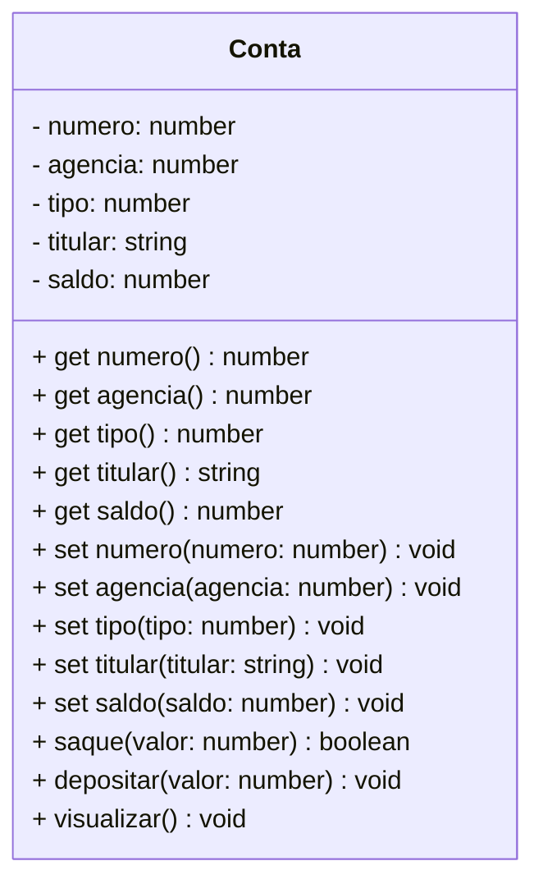

<h1>Programação Orientada a Objetos - Parte 01</h1>

<br />

<h2>1. Classes, Objetos e Encapsulamento</h2>


Em geral, quanto maior o software, maior a complexidade de seu desenvolvimento, devido ao número de partes que o compõem e aos relacionamentos entre essas partes.

Uma das principais dificuldades encontradas na implementação, nos testes e na manutenção de sistemas é que, frequentemente, quando o projeto de software é focado exclusivamente nas funcionalidades, o sistema é estruturado com base no que ele precisa fazer, sem considerar como representar o processo de forma semelhante ao que ocorre no mundo real, ou seja, no cotidiano das empresas.

O problema dessa abordagem é que, com o tempo, os processos e procedimentos das empresas mudam. Isso significa que o software também precisará ser alterado. Se o sistema foi estruturado exclusivamente com base nas funcionalidades que ele precisava executar anteriormente, é possível que agora ele precise ser completamente reestruturado ou até refeito. Caso contrário, o único recurso disponível será a "Programação Orientada a Gambiarras" (POG), para manter o software funcionando, mas com um custo elevado de manutenção.

> **Exemplo Prático**
>
> Vamos imaginar um sistema de gerenciamento bancário, no qual o processo de gestão das contas envolve clientes, funcionários e contas. 
>
> Esse sistema poderia ser estruturado de forma tradicional, focando exclusivamente nas funcionalidades do processo de gestão. No entanto, essa abordagem resultaria em um sistema difícil de manter e modificar, pois tanto o banco quanto as regulamentações governamentais podem alterar com frequência a forma como as contas são abertas, as exigências para os clientes ou até mesmo adicionar novos recursos e serviços. 
>
> Essas mudanças exigiriam ajustes em várias partes do sistema, aumentando sua complexidade e a probabilidade de inconsistências nos processos.

No entanto, há algumas décadas, alguns desenvolvedores começaram a refletir sobre essa questão. Eles pensaram: 

"***Se as funções de uma empresa e de um software mudam com tanta frequência, não podemos usá-las como base para organizar nossa aplicação***". 

Essa foi a primeira grande conclusão. A partir desse raciocínio, surgiu uma nova pergunta que levou à segunda grande conclusão: 

"***O que, em uma empresa e em seus processos, raramente muda?***" 

Felizmente, a resposta apareceu: 

***As Coisas!***

<br />

<h3>1.1. Mas o que são "as coisas"?</h3>


***Simples: tudo aquilo que é físico.*** 

Há uma grande constância no uso de formulários, na produção de determinados produtos, nos funcionários envolvidos em certos processos, entre outros. As entidades, na maioria das vezes, permanecem constantes. Os objetos envolvidos na execução dos processos raramente mudam. A partir dessas observações, surgiu a segunda grande conclusão: 

***"Vamos basear a estrutura do software nos objetos envolvidos nos processos e não nos próprios processos."***

A **Programação Orientada a Objetos (POO)** é um **paradigma de programação que define a estrutura dos programas de computador com base em conceitos do mundo real, sejam esses conceitos reais ou abstratos**. A ideia central é simular as entidades e interações do mundo real dentro do ambiente virtual.

- No mundo real, tudo é composto por objetos que interagem entre si.
- Em um modelo orientado a objetos, a estrutura também é composta por objetos que interagem entre si.

> **Abstrato, segundo o dicionário:**
>
> **Abstrato:** Algo que não é concreto; que resulta da abstração, que lida exclusivamente com ideias ou associações de ideias, sem se referir diretamente à realidade sensível, e que possui um alto grau de generalização.

Na teoria dos sistemas, um sistema é definido como **um conjunto de entidades que interagem entre si para produzir um resultado comum**. A partir dessa definição, podemos concluir que é natural usar "objetos de programa" para compor um sistema computacional.

<br />

<h2>2. Objetos</h2>


No mundo real, objetos podem ser animados ou inanimados, mas **qualquer um deles possui características que podem ser classificadas como atributos ou comportamentos**. Na imagem abaixo, vemos alguns exemplos de objetos:

<div align="center"></div>

Observe que nos exemplos acima cada Objeto foi definido de forma Genérica: Animal, Pessoa, Produto e Conta. 

Analisando o Objeto Conta, por exemplo, nós sabemos que a Conta é de um Banco, mas não sabemos os detalhes da Conta como:

1) Qual é o número da Conta?
2) Qual é o numero da Agência Bancária?
3) Quem é o titular da Conta?
4) Qual é o tipo da Conta?
5) Qual é o Saldo da Conta?

Observe que o Objeto **Conta** foi definido de maneira **Abstrata** e **Genérica**, com poucos ou nenhum detalhe específico. Nesta etapa da modelagem de um sistema orientado a objetos, o foco está apenas em identificar os Objetos Genéricos, ou seja, uma generalização da abstração. Nessa fase, as especificidades não são consideradas; o objetivo é criar um modelo que possa representar qualquer tipo de **Conta Bancária**.

Modelar um sistema baseado em objetos traz diversas vantagens:

- **Simplificação da concepção do sistema:** A transição da realidade para o modelo torna-se mais fácil, uma vez que os objetos refletem as entidades do mundo real.
- **Facilidade de compreensão do modelo:** Como o modelo é baseado em conceitos do mundo real, sua compreensão se torna mais intuitiva para aqueles que estão familiarizados com o problema real, facilitando a comunicação e o entendimento.
- **Simplificação do gerenciamento do sistema:** Assim como na realidade, os objetos são mais estáveis quando se trata de resolver um problema. Ou seja, os objetos mudam muito pouco. Quando surgem problemas ligeiramente diferentes, em vez de modificar os objetos em si, ajusta-se a forma como eles interagem. Isso facilita a manutenção e a evolução do sistema, sem a necessidade de grandes alterações na estrutura do modelo.

<br />

<h3>2.1. O que são Objetos na Programação Orientada a Objetos?</h3>


Na Programação Orientada a Objetos (POO) — e, de certa forma, também na vida real —, um **Objeto** é uma **Entidade** caracterizada por um conjunto de operações e um estado. Esse estado e essas operações são representados, respectivamente, por **atributos** e **métodos**.

- **Atributos** são os campos ou propriedades que armazenam dados sobre o objeto, como o saldo de uma conta bancária ou o nome de um cliente.
- **Métodos** são as funções ou ações que definem o comportamento do objeto, como sacar, depositar ou consultar o saldo de uma conta.

Além disso, um objeto pode ser composto por outros objetos. Ou seja, os **atributos** de um objeto podem ser objetos de outras classes, formando uma estrutura um pouco mais complexa.

É importante observar que um objeto se assemelha a uma **estrutura de dados**, mas vai além, pois, além de armazenar dados, um objeto também pode armazenar funções (métodos). Em resumo, um objeto é composto por:

- **Atributos**: os dados ou propriedades do objeto.
- **Métodos**: as funções que representam o comportamento ou as ações do objeto.

Todo objeto possui três características fundamentais:

- **Identidade**: o nome ou identificação do objeto, que o torna único.
- **Estado**: as propriedades ou atributos do objeto, que descrevem sua condição ou valores no momento.
- **Comportamento**: as ações ou métodos do objeto, que definem o que ele pode fazer ou como ele pode interagir com outros objetos.

<br />

<h2>3. Classes</h2>


As **Classes** podem ser vistas como pequenos programas ou como novos tipos de dados. Elas funcionam como um "molde" para a criação de objetos, ou seja, uma descrição de como um objeto pode ser formado. Uma maneira simples de entender é comparar uma **classe** com a planta de uma casa: a planta define como a casa será construída, mas ela por si só não é a casa. Da mesma forma, a classe descreve as características e comportamentos do objeto, mas, sozinha, não representa um objeto real.

<div align="center"></div>

Vale notar que a **classe** é um conceito abstrato. Ela serve como um modelo, mas para se tornar algo concreto e utilizável, é necessário criar objetos a partir dela. Esse processo de criação de um objeto a partir de uma classe é chamado de **instanciação da classe**.

Quando você instancia uma classe, está utilizando a classe como uma forma para criar múltiplos objetos com as mesmas características e comportamentos descritos nela, mas com seus próprios valores e estados únicos.

<div align="center"></div>

Na analogia da planta da casa, a **classe** funciona como a planta arquitetônica que pode ser usada para construir várias casas. Da mesma forma, uma **classe** pode ser instanciada várias vezes para criar **n** objetos, cada um com suas próprias características e comportamentos.

Assim como toda planta de casa inclui detalhes sobre a construção, uma classe também é composta por dois principais componentes:

1. **Atributos**: São as variáveis que definem as características do objeto. Por exemplo, no caso de uma classe **Casa**, atributos podem ser o número de **quartos**, **banheiros**, **tamanho** e **cor** da casa. Esses atributos identificam as propriedades de cada instância do objeto criado a partir da classe.
2. **Métodos**: São as funções que definem as ações ou comportamentos do objeto. No exemplo de uma casa, um método poderia ser **abrirPorta()**, que define o comportamento de abrir a porta da casa.

Portanto, os **Atributos** são responsáveis por armazenar informações que identificam as características do objeto, enquanto os **Métodos** definem as ações que o objeto pode realizar. Cada instância de uma classe terá seus próprios valores para os atributos, mas todos os objetos daquela classe terão os mesmos métodos. Veja no exemplo abaixo:

<div align="center"></div>

Ao definir os **atributos** de um objeto, conseguimos identificar os detalhes que caracterizam aquele objeto e, automaticamente, podemos responder a várias perguntas sobre ele. Na **classe Conta**, por exemplo, definimos os seguintes atributos:

- **Numero**: o número da conta.
- **Titular**: o nome da pessoa que possui a conta.
- **Tipo**: tipo da conta (corrente, poupança, etc.).
- **Banco**: o banco no qual a conta está registrada.
- **Agência**: a agência do banco onde a conta foi aberta.

Esses atributos ajudam a descrever o conceito da **Conta**, fornecendo os dados necessários para identificar cada instância dessa conta.

Já os **métodos** são responsáveis por definir as **ações** que um objeto pode realizar. No caso da **classe Conta**, os métodos podem ser ações como **sacar()**, **depositar()**, **criar()**, entre outros, como vemos na imagem abaixo:

<div align="center"></div>

Os **métodos** têm a função de **modificar e interagir com os atributos** de um objeto, ou realizar operações específicas. No caso da **classe Conta**, por exemplo, temos diversos métodos que desempenham ações essenciais para o gerenciamento da conta. Esses métodos incluem:

- **criar()**: permite criar uma nova conta bancária.
- **consultar()**: permite consultar os dados de uma conta, como o titular, saldo, tipo e agência.
- **atualizar()**: permite atualizar informações da conta, como alterar o titular da conta.
- **excluir()**: permite excluir uma conta do sistema.
- **depositar()**: permite adicionar dinheiro ao saldo da conta.
- **sacar()**: permite retirar dinheiro da conta, desde que o saldo seja suficiente.

Em resumo, **atributos** definem as **características** do objeto, como o nome do titular ou o saldo da conta, enquanto **métodos** definem as **ações** que podem ser realizadas com esses atributos, como depositar, sacar ou atualizar dados.

Além disso, na nomenclatura de um sistema orientado a objetos, **atributos** costumam ser identificados por **substantivos** (pois representam **coisas** ou **características**, como "titular", "saldo", "agência"), enquanto **métodos** são identificados por **verbos** (pois representam **ações**, como "criar", "consultar", "sacar").

Na **Programação Orientada a Objetos (POO)**, um sistema é visto como um conjunto de **objetos** que são instâncias de **classes**. As **classes** são **modelos estáticos** que definem as características e comportamentos comuns de um conjunto de objetos, enquanto os **objetos** são **entidades dinâmicas**, criadas a partir das classes, que possuem os dados e podem executar os métodos definidos.

Em outras palavras, uma **classe** é uma descrição formal de um conceito, e um **objeto** é a **materialização** desse conceito, com seus próprios dados e comportamentos. Cada objeto é uma instância de uma classe, o que significa que ele compartilha a estrutura da classe, mas com valores e estados próprios.

**Exemplo:** 

<div align="center"></div>

**Conta** **é uma classe que define um modelo de Objeto.**

**A Conta da Maria Joaquina e a Conta do João da Silva são instâncias da Classe Conta, ou seja, Objetos gerados a partir do modelo definido pela Classe.**

<br />

<h3>3.1. Representação Gráfica de uma Classe</h3>


O **Diagrama de Classes** é uma representação gráfica que descreve as classes, seus atributos e métodos, e como elas se relacionam no contexto de um sistema orientado a objetos. Ele faz parte da **UML (Unified Modeling Language)**, uma linguagem padronizada para modelagem de sistemas orientados a objetos. 

O Diagrama de Classes ajuda a visualizar as principais características e comportamentos da classe, facilitando o entendimento do sistema, tanto para os desenvolvedores quanto para outras partes envolvidas no projeto. Veja o Diagrama de Classes da Classe Conta:



Na imagem abaixo, vemos como um Diagrama de Classes é organizado:

<div align="center"></div>

- **Nome da Classe**: O nome da classe é escrito na parte superior do retângulo, representando o tipo de entidade que a classe modela.
- **Atributos**: São os dados ou variáveis que definem o estado de uma classe. Eles são descritos na parte do meio do retângulo e devem ser acompanhados de seu tipo de dado (`string`, `number`, `boolean`, entre outros.). Os atributos representam as propriedades de um objeto.
- **Métodos**: São as ações ou comportamentos que podem ser realizados sobre os objetos daquela classe. Os métodos aparecem na parte inferior do retângulo e devem ser descritos com seu nome, tipo de dado de saída (se houver), e tipo de dado de entrada (se houver).

Note que tanto os **Métodos** quanto os **Atributos** de uma classe possuem símbolos que representam o **nível de acesso**. Esses símbolos indicam a visibilidade ou o acesso permitido para os componentes da classe, controlando se eles podem ser acessados ou modificados de fora da classe ou apenas de dentro dela. Os símbolos mais comuns usados para indicar o nível de acesso no Diagrama de Classes são os seguintes:

- **Público (`+`)**: O componente é **acessível de qualquer lugar** dentro e fora da classe.
- **Privado (`-`)**: O componente é **acessível apenas dentro da classe**. Ele não pode ser acessado diretamente de fora da classe.
- **Protegido (`#`)**: O componente é **acessível dentro da classe e também pelas classes que herdam desta classe** (subclasses).

<br />

<h3>3.2. Declarando Classes e Atributos</h3>


**Sintaxe - Classe**

```ts
export class nome_da_classe{
    // Corpo da Classe
}
```

A palavra reservada **`export`** no TypeScript é utilizada para tornar uma classe, função, variável ou qualquer outro componente acessível fora do arquivo em que foi declarada, ou seja, pública. Ela permite que outros módulos possam importar e utilizar o componente exportado. 

<br />

**Sintaxe - Atributos**

```ts
[modificador_de_visibilidade] nome_do_atributo: tipo_de_dado
```

O tipo de dado são os tipos que vimos no Conteúdo **Introdução ao TypeScript**. Podemos utilizar tanto os tipos primitivos quanto os tipos não primitivos. 

<br />

|  | <div align="left">**DICA:** *Para relembrar os tipos de dados no TypeScript, <a href="09.md">clique aqui</a> e explore os principais tipos de dados que o TypeScript oferece.* </div> |
| ------------------------------------------------------------ | ------------------------------------------------------------ |

<br />

<h2>4. Modificadores de Visibilidade</h2>


No TypeScript, os modificadores de acesso controlam a visibilidade e o acesso aos atributos e métodos de uma classe. Eles definem quais partes do código podem acessar ou modificar esses membros, e ajudam a proteger os dados e a lógica da classe. Ao contrário de outras linguagens como Java ou C#, onde os modificadores de acesso podem ser aplicados também nas classes, no TypeScript, eles são aplicados apenas aos métodos e atributos dentro da classe. 

O TypeScript oferece 3 modificadores de acesso:

| **Modificador** | **Descrição**                                                | UML  |
| --------------- | ------------------------------------------------------------ | :--: |
| **public**      | Um Método ou Atributo public poderá ser acessado por qualquer Classe. |  +   |
| **protected**   | Um Método ou Atributo protected é protegido. Pode ser acessado dentro da própria Classe onde eles foram declarados e por todas as Classes que estendem (Herdam) a Classe onde eles foram declarados. |  #   |
| **private**     | Um Método ou Atributo private possui o acesso restrito. Pode ser acessado somente dentro da própria Classe onde eles foram declarados. |  -   |

<br />

|  | <div align="left"> **ALERTA DE BSM:** *Mantenha a Atenção aos Detalhes ao criar os Métodos e Atributos do projeto. Os modificadores de acesso (public, protected e private) nunca poderão ser combinados.* </div> |
| ------------------------------------------------------------ | ------------------------------------------------------------ |

<br />

Na modelagem de uma classe, conforme observado no **Diagrama UML**, a visibilidade de **métodos** e **atributos** é indicada por símbolos específicos:

- **Público (`+`)**: O componente é **acessível de qualquer lugar** dentro e fora da classe.
- **Privado (`-`)**: O componente é **acessível apenas dentro da classe**. Ele não pode ser acessado diretamente de fora da classe.
- **Protegido (`#`)**: O componente é **acessível dentro da classe e também pelas classes que herdam desta classe** (subclasses).

<br />

> **PONTO DE ATENÇÃO IMPORTANTE**
>
> **Modificadores de acesso** são mecanismos dentro do código de programação que controlam a visibilidade e o acesso a atributos e métodos de uma classe, limitando quem pode interagir com eles.
>
> **Segurança da informação** envolve práticas e políticas para proteger dados contra acessos não autorizados, garantindo sua confidencialidade, integridade e disponibilidade.
>
> Enquanto modificadores de acesso regulam o acesso aos dados dentro do código, a segurança da informação abrange a proteção de dados em todo o ambiente, incluindo redes e sistemas.

<br />

Na imagem abaixo podemos visualizar a hierarquia dos modificadores de visibilidade:

<div align="center"></div>

A imagem acima mostra o nível de visibilidade dos Atributos e Métodos, do nível de acesso mais restrito (Private) ao nível de acesso total e irrestrito (Public). Na tabela abaixo temos um resumo:

| Modificador   | Classe | Sub Classe | Mundo |
| ------------- | :----: | :--------: | :---: |
| **public**    |   ✔    |     ✔      |   ✔   |
| **protected** |   ✔    |     ✔      |   ❌   |
| **private**   |   ✔    |     ❌      |   ❌   |

<br />

|  | <div align="left"> **ATENÇÃO:** *Os Modificadores de acesso de um Atributo definem quais Classes poderão acessar o Atributo, da mesma forma que os Modificadores de acesso de um Método definem quais Classes terão acesso ao Método.* </div> |
| ------------------------------------------------------------ | ------------------------------------------------------------ |

<br />

<div align="left"> <a href="https://www.typescriptlang.org/docs/handbook/2/classes.html#member-visibility" target="_blank"><b>Documentação: Modificadores de visibilidade</b></a></div>

<br />

<h3>4.1. Convenção de Visibilidade</h3>


A convenção mais comum na modelagem de classes em **Programação Orientada a Objetos** (POO) é **manter os atributos como privados** e os **métodos como públicos**, conforme descrito abaixo:

#### **Atributos Privados (-)**

A ideia por trás de manter os atributos privados é **garantir o Encapsulamento**. Isso significa que os dados internos de um objeto não devem ser acessados diretamente por código externo à classe. Em vez disso, o acesso a esses dados deve ser feito por meio de métodos específicos (métodos públicos ou protegidos). Esse controle ajuda a proteger os dados e garante que eles sejam manipulados de forma consistente, validada e segura.

#### **Métodos Públicos (+)**

Os métodos, por outro lado, são **públicos** porque precisam ser acessados por outras partes do sistema para realizar operações, como manipulação de dados ou ações. No caso de nossa classe `Conta`, um método público pode ser utilizado para depositar ou sacar, permitindo que usuários da classe interajam com ela de maneira controlada e segura.

<br />

##  Exemplo 01: Classe Conta com os respectivos Atributos e Modificadores de Acesso

```ts
export class Conta {

    private _numero: number;
    private _agencia: number;
    private _tipo: number;
    private _titular: string;
    private _saldo: number;
  
}
```

Observe que todos os Atributos da Classe iniciam com um **underline** ( _ ), indicando que se tratam de Atributos Privados (private), que possuem **Métodos Get e  Set** (que serão criados na sequência), para acessar e modificar os valores.

A convenção de nomear os atributos com um **underline** ( `_` ) no início do nome é uma prática comum para indicar que um atributo é privado, ou seja, que ele não deve ser acessado diretamente de fora da classe. Embora o **TypeScript** (ou outras linguagens) permita o uso de modificadores de acesso como `private` para controlar a visibilidade de um atributo, o uso do **underline** é uma convenção que ajuda a indicar visualmente que um atributo é privado, mesmo que a linguagem não force isso diretamente.

Essa convenção é amplamente utilizada para destacar que o acesso direto ao atributo não é recomendado, e, em vez disso, deve-se usar os **métodos de acesso** conhecidos como **getters** (para acessar o valor de um atributo) e **setters** (para modificar o valor de um atributo). Os **getters** e **setters** são métodos públicos que atuam como intermediários para acessar e modificar os atributos privados, permitindo **encapsulamento** e **controle sobre as alterações** dos dados da classe.

<br />

<div align="left"> <a href="https://www.typescriptlang.org/docs/handbook/2/classes.html" target="_blank"><b>Documentação: Declaração de Classes</b></a></div>

<div align="left"> <a href="https://www.typescriptlang.org/docs/handbook/2/classes.html#fields" target="_blank"><b>Documentação: Declaração de Atributos</b></a></div>

<br />

<h2>5. Métodos</h2>


A definição de **Método** em Programação Orientada a Objetos (POO) é simples, mas fundamental para estruturar e organizar o código. Um **Método é essencialmente uma função associada a um objeto ou classe que define o comportamento ou as ações que o objeto ou instância da classe pode executar**. No TypeScript, como em outras linguagens orientadas a objetos, métodos são propriedades da classe que armazenam funções e permitem que o objeto ou classe execute operações sobre seus atributos ou interaja com outros objetos.

<br />

<h3>5.1. Características e Benefícios dos Métodos</h3>


- **Reutilização:** Métodos podem ser reutilizados em diferentes partes do programa, o que evita a repetição de código e melhora a manutenção.
- **Encapsulamento:** Eles ajudam a organizar e encapsular o comportamento dos objetos. O que é feito dentro de um método, normalmente, não afeta diretamente outras partes do código.
- **Modularidade:** Quando usados corretamente, métodos dividem a funcionalidade do sistema em tarefas pequenas e bem definidas, facilitando a organização e entendimento do código.

<br />

<h3>5.2. Regras Importantes para Métodos</h3>


- **Simplicidade e Clareza:** Cada método deve realizar apenas uma tarefa específica e bem definida. Isso é importante para garantir que o código seja fácil de entender, manter e modificar.
- **Nomes Descritivos:** O nome de cada método deve ser assertivo, ou seja, o nome deve deixar claro qual é a ação que o método vai realizar. Evite nomes vagos, como `fazerAlgo()` ou `processar()`, e prefira nomes específicos, como  `calcularSaldo()`, que descrevem exatamente a tarefa realizada.
- **Limitação a uma única responsabilidade:** Um bom método deve ser limitado a uma única responsabilidade, o que significa que ele deve realizar apenas uma operação ou tarefa. Isso está alinhado ao princípio **SRP (Single Responsibility Principle)**, que sugere que uma função (ou método) deve ser responsável por uma única parte do comportamento do sistema.

**Exemplos de Métodos:**

- **Objeto Carro:** `acelerar()`, `frear()`, `virar()`, `parar()`
- **Objeto Conta Bancária:** `sacar()`, `depositar()`, `transferir()`
- **Objeto E-commerce:** `pagar()`, `adicionarAoCarrinho()`

<br />

<h3>5.3. Declarando Métodos</h3>


**Sintaxe:**

```ts
[modificadores_de_acesso] nome_do_metodo(argumento: tipo): tipo_de_retorno {
    //Corpo do Método
}
```

Observe que diferente das Funções, ao declarar um Método não se utiliza a palavra reservada **function**.

<br />

<h4>5.3.1. Modificadores de Acesso</h4>


Como visto anteriormente, os Modificadores de acesso alteram a visibilidade dos Métodos e Atributos de uma Classe, ou seja, qual (is) Classes podem chamar um determinado Método de outra Classe e/ou acessar os seus Atributos.

<br />

<h4>5.3.2. Nome do Método</h4>


É o nome ou identificador do Método. Para definir o Nome do Método, deve-se seguir as mesmas boas práticas utilizadas na definição do nome de uma Função.

<br />

<div align="left"> <a href="https://www.typescriptlang.org/docs/handbook/2/classes.html#methods" target="_blank"><b>Documentação: Declaração de Métodos</b></a></div>

<br />

<h4>5.3.3. Argumentos</h4>


Os argumentos do método são os **parâmetros**, ou seja, valores que são passados para o método quando ele é chamado. Esses parâmetros são utilizados dentro do método para realizar operações ou tomar decisões baseadas nos valores fornecidos. No TypeScript (e em outras linguagens de programação orientada a objetos), os parâmetros são definidos de forma similar à declaração de variáveis, mas com a diferença de que são passados para os métodos durante a invocação.

Quando um método é definido, os parâmetros são colocados entre parênteses, logo após o nome do método. Cada parâmetro é representado por uma **variável** que pode ser de qualquer tipo (primitivo, como `string` ou `number`, ou até tipos mais complexos). Os parâmetros são separados por vírgulas.

**Sintaxe:**

```ts
[modificador_de_acesso] nome_do_metodo(identificador: tipo): tipo_de_retorno {
    //Corpo do Método
}
```

- **Identificador:** Nome da variável.
- **Tipo:** Tipo da variável.

<br />

|  | <div align="left"> **ATENÇÃO:** Ao declarar os argumentos do Método não é necessário adicionar as palavras *var ou let* para indicar que os argumentos são variáveis, declare apenas o identificador do argumento, seguido do seu tipo.</div> |
| ------------------------------------------------------------ | ------------------------------------------------------------ |

<br />

<div align="left"> <a href="https://www.typescriptlang.org/docs/handbook/2/everyday-types.html#the-primitives-string-number-and-boolean" target="_blank"><b>Documentação - Tipos de dados</b></a></div>

<br />

<h4>5.3.4. Tipo de Retorno</h4>


É o indicador do Tipo de retorno do Método, ou seja, o tipo do valor que se espera que o Método retorne ao finalizar o processamento dos dados. Assim como as variáveis, os Métodos com tipo de retorno geralmente são declarados com  tipos de dados primitivos, mas eles também podem retornar tipos não primitivos como Objetos, array, entre outros. 

Os Métodos que possuem um tipo de dado, obrigatoriamente precisam retornar um valor equivalente ao seu tipo, ou seja, se o Método for declarado para retornar um valor do tipo **number**, ela precisa retornar um numero ao final do seu processamento. Para retornar este valor, o TypeScript utiliza a palavra reservada **return** seguido do valor de retorno.

Caso o Método **não necessite ter um tipo de dado de retorno, ou seja, um valor que deverá ser retornado ao final da execução do Método**, na assinatura do Método, defina o tipo de retorno como **void**.

<br />

|  | <div align="left"> **ATENÇÃO:** *Ao declarar um Método, caso o tipo de retorno não seja informado, o TypeScript definirá o tipo de retorno por inferência, baseado nos argumentos e no retorno definido no Corpo do Método.* </div> |
| ------------------------------------------------------------ | ------------------------------------------------------------ |

<br />

<h2>6. Métodos Especiais</h2>


Ao construirmos nossas Classes como um modelo para a construção de Objetos, precisamos implementar alguns Métodos especiais:

<br />

<h3>6.1. Método Construtor</h3>


Para criar (ou instanciar) um novo objeto a partir de uma classe, é necessário implementar um método que realize essa tarefa. O método responsável por essa funcionalidade é o **Método Construtor**.

Um **Método Construtor** é um método especial, exclusivo para cada classe, que é invocado automaticamente quando um novo objeto é criado. Ele é responsável por inicializar o objeto, atribuindo valores iniciais aos seus atributos.

<br />

<h4>6.1.1. Principais Características do Método Construtor</h4>


- **Inicialização do Objeto**: O construtor define as ações necessárias para inicializar o objeto assim que ele for instanciado.
- **Invocação Automática**: Sempre que um novo objeto é criado, o método construtor é chamado automaticamente, sem a necessidade de ser explicitamente invocado.
- **Assinatura Especial**: A assinatura de um construtor se diferencia de outros métodos, pois não possui tipo de retorno (nem mesmo **void**).
- **Nome do Método**: No TypeScript, o nome do método construtor é sempre **`constructor`**.
- **Recebe Argumentos**: Assim como outros métodos, o construtor pode receber argumentos. Geralmente, ele recebe parâmetros que correspondem aos atributos da classe, permitindo a atribuição de valores iniciais a eles.
- **Obrigatório**: Toda classe deve ter, no mínimo, um método construtor definido. Caso não seja definido explicitamente, o TypeScript cria um construtor padrão automaticamente.

<br />

##  Exemplo 02: Método Construtor da Classe Conta

```ts
export class Conta {

    private _numero: number;
    private _agencia: number;
    private _tipo: number;
    private _titular: string;
    private _saldo: number;
  
    constructor(numero: number, agencia: number, tipo: number, titular: string, saldo: number) {
        this._numero = numero;
        this._agencia = agencia;
        this._tipo = tipo;
        this._titular = titular;
        this._saldo = saldo;
    }

}
```

Observe que em cada atributo foi adicionada a palavra reservada **this**. O motivo é simples: a palavra reservada **this** é utilizada para **identificar o atributo da Classe**. Observe que os parâmetros do Método Construtor tem o mesmo nome, sem o **underline ( _ )**, e o mesmo tipo de dado dos atributos.

<br />

<div align="left"> <a href="https://www.typescriptlang.org/docs/handbook/2/classes.html#constructors" target="_blank"><b>Documentação: Método Construtor</b></a></div>

<div align="left"> <a href="https://www.typescriptlang.org/docs/handbook/2/classes.html#this-parameters" target="_blank"><b>Documentação: Palavra reservada this</b></a></div>


<br />

<h3>6.2. Métodos Get e Set</h3>


Os métodos **GET** e **SET** são técnicas padronizadas para gerenciar o acesso e a modificação dos atributos de uma classe. Esses métodos permitem controlar como os valores dos atributos privados são acessados e alterados, mantendo a integridade dos dados e a segurança do sistema. Eles oferecem uma maneira limpa e prática de interagir com os atributos, sem a necessidade de expor diretamente os detalhes internos da classe.

### Por que os Métodos GET e SET são importantes?

1. **Encapsulamento**: Ao utilizar os métodos GET e SET, os atributos de uma classe são mantidos privados, ou seja, eles não podem ser acessados ou alterados diretamente de fora da classe. Isso garante que a integridade e a segurança dos dados sejam preservadas.
2. **Validação e Processamento**: O método SET pode ser utilizado para validar ou processar dados antes de atribuí-los ao atributo. Por exemplo, podemos garantir que um valor atribuído ao atributo seja positivo ou dentro de um intervalo válido.
3. **Flexibilidade**: Caso a forma como os atributos devem ser acessados ou modificados mude no futuro, podemos alterar os métodos GET e SET sem precisar modificar diretamente o código em todas as partes do programa que utilizam esses atributos.

<br />

<h4>6.2.1. Métodos SET</h4>


Os métodos SET servem para modificar os dados dos atributos da Classe. Os métodos SET também são chamados de **setters**. Note que o nome do Método será uma combinação da palavra **set** seguida do nome do atributo. Implicitamente, os Métodos Set são do tipo **void**, porque não retornam nenhum valor, apenas modificam o valor do atributo.

**Método Set do Atributo Numero da Classe Conta:**

```ts
	public set numero(numero: number) {
        this._numero = numero;
    }
```

Observe que no atributo **_numero** foi adicionada a palavra reservada **this**, para identificar o atributo da classe. Você deve criar um Método Set para cada Atributo da Classe. Caso você deixe algum atributo sem o método set, o valor do atributo não poderá ser modificado.

<br />

<h4>6.2.2. Métodos GET</h4>


Agora já sabemos como mudar os valores dos atributos, vamos entender como ler os dados dos atributos. Os métodos GET servem para ler os dados dos atributos. Os métodos GET também são chamados de **getters**. Note que o nome do Método será uma combinação da palavra **get** seguida do nome do atributo. Implicitamente, os Métodos Get são do mesmo tipo do atributo que você está lendo os dados.

**Método Get do Atributo Numero da Classe Conta:**

```ts
	public get numero() {
        return this._numero;
    }
```

Observe que foi utilizada a palavra reservada **return**, retornando o valor do atributo **_numero**. No atributo **_numero** foi adicionada a palavra reservada **this**, para identificar o atributo da classe. Você deve criar um Método Get para cada Atributo da Classe. Caso você deixe algum atributo sem o método get, o valor do atributo não poderá ser visualizado.

<br />

##  Exemplo 03: Métodos Get e Set da Classe Conta

```ts
export class Conta {

    private _numero: number;
    private _agencia: number;
    private _tipo: number;
    private _titular: string;
    private _saldo: number;
  
    constructor(numero: number, agencia: number, tipo: number, titular: string, saldo: number) {
        this._numero = numero;
        this._agencia = agencia;
        this._tipo = tipo;
        this._titular = titular;
        this._saldo = saldo;
    }

    public get numero() {
        return this._numero;
    }

    public set numero(numero: number) {
        this._numero = numero;
    }

    public get agencia() {
        return this._agencia;
    }

    public set agencia(agencia: number) {
        this._agencia = agencia;
    }

    public get tipo() {
        return this._tipo;
    }

    public set tipo(tipo: number) {
        this._tipo = tipo;
    }

    public get titular() {
        return this._titular;
    }

    public set titular(titular: string) {
        this._titular = titular;
    }

    public get saldo() {
        return this._saldo;
    }

    public set saldo(saldo: number) {
        this._saldo = saldo;
    }

}
```

<br />

<div align="left"> <a href="https://www.typescriptlang.org/docs/handbook/2/classes.html#getters--setters" target="_blank"><b>Documentação: Métodos GET e SET</b></a></div>

<br />

<h2>7. Encapsulamento</h2>


**Encapsulamento** é o processo de proteger os atributos de uma classe contra acessos externos diretos, permitindo sua manipulação apenas por meio de métodos específicos. Essa prática garante que o acesso e a modificação dos dados sejam realizados de forma controlada e segura.

Ao encapsular os dados de uma aplicação, buscamos evitar que esses dados sofram alterações não autorizadas ou acidentais. Para isso, criamos uma estrutura que oferece métodos de acesso e modificação, que podem ser utilizados por outras classes sem comprometer a integridade e consistência do sistema.

Na prática, o encapsulamento é implementado por meio de dois tipos de métodos: **getters** e **setters**, como visto no tópico anterior. 

O **getter** tem a função de retornar o valor de um atributo de forma controlada, garantindo que a integridade do dado seja preservada. 

Já o **setter** recebe um valor como argumento, permitindo a modificação do atributo, mas com a possibilidade de incluir validações e controles antes de efetuar a alteração. Isso evita o risco de acessos ou modificações indevidas.

Na Classe **Conta**, além dos Métodos Construtor, Getters e Setters, podemos implementar três métodos auxiliares para manipulação dos dados:

- **Sacar**
- **Depositar**
- **Visualizar**

Se a classe permitisse a modificação dos atributos diretamente, sem passar pelos métodos **sacar** ou **depositar**, haveria o risco de o saldo ser alterado sem o devido controle. O cenário ideal é que todas as alterações ou consultas aos dados sejam feitas exclusivamente através dos Métodos **get** e **set**, garantindo maior segurança e consistência. Para isso, declaramos os atributos como **private** (privados) e tornamos os métodos **get** e **set** como **public** (públicos), permitindo o acesso e a modificação dos atributos de forma controlada.

<br />

<h3>7.1 Vantagens do Encapsulamento</h3>


O encapsulamento oferece várias vantagens, principalmente no que diz respeito à proteção dos dados e à organização do código. Entre as principais vantagens, podemos destacar:

- **Facilidade de manutenção:** O encapsulamento facilita a manutenção do código, pois, com o acesso controlado aos dados, fica mais fácil identificar pontos onde o código pode ser melhorado. Sem o encapsulamento, identificar inconsistências no código seria mais difícil e demorado.
- **Reutilização de código:** Com o encapsulamento, o código se torna mais modular e reutilizável. Isso significa que, ao proteger os dados e a lógica de uma classe, ela poderá ser reaproveitada em outros projetos, poupando tempo da equipe de desenvolvimento e aumentando a eficiência.
- **Desenvolvimento acelerado e simplificado:** O encapsulamento transforma certas partes do código em "caixas pretas", ou seja, as classes externas não precisam acessar ou conhecer a implementação interna dos atributos diretamente. Isso simplifica o desenvolvimento, pois a lógica de manipulação dos dados fica centralizada e controlada nos métodos da própria classe. Assim, qualquer ação sobre os dados de um objeto deve passar pelos métodos definidos na classe, garantindo maior controle e consistência.

Em resumo, o encapsulamento é fundamental para garantir a segurança, a integridade e a manutenibilidade dos dados em um sistema, facilitando o desenvolvimento e a colaboração dentro de equipes de programação.

<br />

> **PONTO DE ATENÇÃO IMPORTANTE**
>
> **Encapsulamento** é uma técnica da programação orientada a objetos que visa proteger os dados de uma classe, permitindo seu acesso e modificação apenas por meio de métodos específicos, controlando assim a forma como os dados são manipulados.
>
> Já **segurança da informação** é um campo mais amplo que envolve proteger dados contra acessos não autorizados, perdas ou danos, usando práticas como criptografia, controle de acesso e auditoria, tanto em nível de software quanto em nível de rede e sistemas.
>
> Ambos compartilham o objetivo de proteger os dados, mas o **encapsulamento** é uma prática de design de software, enquanto a **segurança da informação** abrange uma gama mais ampla de medidas de proteção de dados em todos os aspectos da infraestrutura e do processo.

<br />

##  Exemplo 04: Métodos Auxiliares

```ts
export class Conta {

    private _numero: number;
    private _agencia: number;
    private _tipo: number;
    private _titular: string;
    private _saldo: number;
  
    constructor(numero: number, agencia: number, tipo: number, titular: string, saldo: number) {
        this._numero = numero;
        this._agencia = agencia;
        this._tipo = tipo;
        this._titular = titular;
        this._saldo = saldo;
    }

    public get numero() {
        return this._numero;
    }

    public set numero(numero: number) {
        this._numero = numero;
    }

    public get agencia() {
        return this._agencia;
    }

    public set agencia(agencia: number) {
        this._agencia = agencia;
    }

    public get tipo() {
        return this._tipo;
    }

    public set tipo(tipo: number) {
        this._tipo = tipo;
    }

    public get titular() {
        return this._titular;
    }

    public set titular(titular: string) {
        this._titular = titular;
    }

    public get saldo() {
        return this._saldo;
    }

    public set saldo(saldo: number) {
        this._saldo = saldo;
    }
    
	public sacar(valor: number): boolean {

        if (this._saldo < valor) {
            console.log("\n Saldo Insuficiente!");
            return false;
        }

        this._saldo = this._saldo - valor;
        return true;
    }

    public depositar(valor: number): void {
        this._saldo = this._saldo + valor;
    }

    public visualizar(): void {

        let tipo: string = "";

        switch (this._tipo) {
            case 1:
                tipo = "Conta Corrente";
                break;
            case 2:
                tipo = "Conta Poupança";
                break;
        }

        console.log("\n\n*****************************************************");
        console.log("Dados da Conta:");
        console.log("*****************************************************");
        console.log("Numero da Conta: " + this._numero);
        console.log("Agência: " + this._agencia);
        console.log("Tipo da Conta: " + tipo);
        console.log("Titular: " + this._titular);
        console.log("Saldo: " + this._saldo);

    }
}
```

<br />

<h2>8. Instanciando um Objeto</h2>


Instanciar um Objeto é a ação de criar um novo Objeto do mesmo tipo de dado definido em uma Classe.

**Sintaxe**

```ts
const identificador_do_objeto: Classe = new Classe(atributo01, atributo02, ..., atributoN);
```

- O Identificador do Objeto segue os mesmos padrões utilizados para definir o identificador de uma variável.
- Classe é o nome da Classe que será utilizada para definir o tipo do Objeto. 
- A palavra reservada **new** tem a função de chamar o Método Construtor da Classe, que é responsável por criar um novo Objeto.
- Dentro das parênteses atribuiremos valores para cada atributo da Classe, conforme definido no Método Construtor.

**Exemplo:**

```ts
const c1: Conta = new Conta(1, 123, 1, "João da Silva", 1000);
```

Note que os atributos do tipo string são escritos entre aspas.

<br />

Para instanciar os Objetos da Classe Conta, nós utilizaremos a Classe Menu, que funciona como a Classe principal do nosso Projeto:

##  Exemplo 05: Instanciar Objetos da Classe Conta

```ts
import { Conta } from './src/model/Conta';

export function main() {

    const conta: Conta = new Conta(1, 123, 1, "João da Silva", 1000);
    conta.visualizar();
    conta.sacar(500);
    conta.visualizar();
    conta.depositar(1000);
    conta.visualizar();
    
}

main();
```

Note que foi criado 1 Objeto (conta) do tipo Conta. Para instanciar o Objeto, o Método Construtor foi chamado através da palavra reservada **new**, seguido do nome da Classe. Dentro dos parênteses inserimos os dados do Objeto.

Para acessar os Métodos da Classe Conta, utiliza-se o padrão **objeto.método()**. 

**Exemplo:** 

```ts
conta.visualizar();
```

<br />

**Resultado do Código:**

```bash
// Criar a Conta

*****************************************************
Dados da Conta:
*****************************************************
Numero da Conta: 1
Agência: 123
Tipo da Conta: Conta Corrente
Titular: João da Silva
Saldo: 1000

// Saque

*****************************************************
Dados da Conta:
*****************************************************
Numero da Conta: 1
Agência: 123
Tipo da Conta: Conta Corrente
Titular: João da Silva
Saldo: 500

//Depositar

*****************************************************
Dados da Conta:
*****************************************************
Numero da Conta: 1
Agência: 123
Tipo da Conta: Conta Corrente
Titular: João da Silva
Saldo: 1500
```

<br /><br />

------

## 🔑**Pontos chave:**

1. **Programação Orientada a Objetos** (POO) **é um paradigma de programação que ajuda a definir a estrutura de programas de computadores, baseado nos conceitos do mundo real, sejam eles reais ou abstratos.** A ideia é simular as coisas que existem e acontecem no mundo real no mundo virtual.
2. Um **Objeto** é uma abstração utilizada no desenvolvimento de software para representar um objeto da vida real, que possui estados e comportamentos. Os objetos de software costumam ser utilizados para modelar objetos do mundo real encontrados no cotidiano. 
3. Uma **Classe** é uma planta ou protótipo a partir do qual os objetos são criados. Basicamente, as classes modelam as características e as ações de um objeto (estado e comportamento), com **atributos** e **métodos**.
4. Objetos são **instanciados** a partir das classes. Eles têm valores atribuídos a seus atributos e executam ações (ou as ações são executadas neles) por meio de métodos.
5. Para criar (instanciar) um novo Objeto de uma Classe, precisamos implementar um Método para gerar este novo Objeto. O Método responsável por esta tarefa em uma Classe é o **Método Construtor**. 
6. Os métodos **SET** servem para modificar os atributos. Eles são chamados de setters. Se o nome do atributo é nome, o nome do setter será **set idade(idade: number)**.
7. Os métodos **GET** servem para ler os dados dos atributos. Eles também são chamados de getters. Se o nome do atributo é nome, o nome do getter será **get nome()**.
8. **Encapsular**, nada mais é do que proteger membros de uma classe de acesso externo, permitindo somente sua manipulação de forma indireta. 
9. Encapsular os dados de uma aplicação significa evitar que estes sofram acessos indevidos. Para isso, é criada uma estrutura que contém métodos que podem ser utilizados por qualquer outra classe (GET e SET), sem causar inconsistências no desenvolvimento de um código.

<br /><br />

<div align="left"><a href="README.md">Voltar</a></div>
