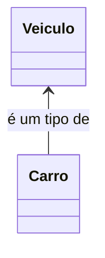
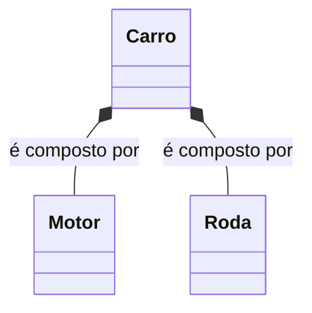
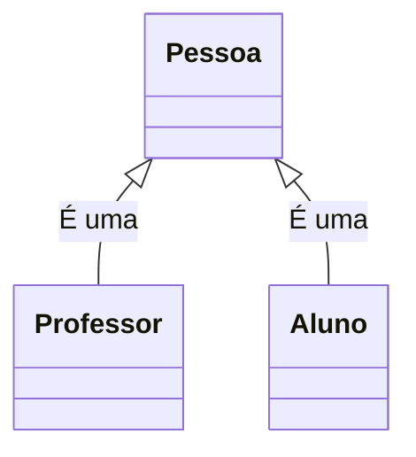
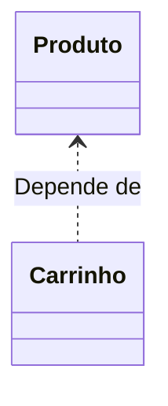
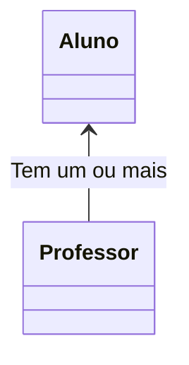
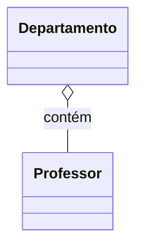
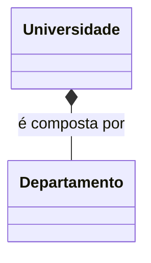
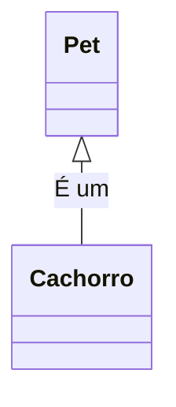
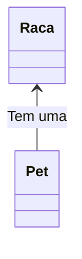
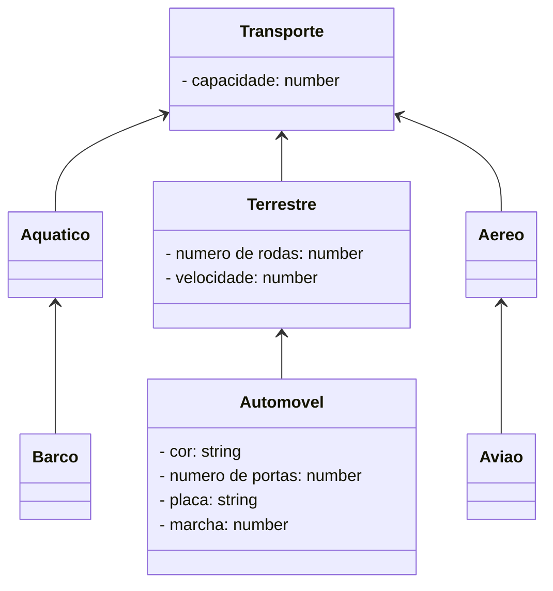

<h1>Programação Orientada a Objetos - Parte 02</h1>
<h2>Herança e Polimorfismo</h2>


Anteriormente, iniciamos nossos estudos sobre os conceitos iniciais da Programação Orientada a Objetos, tais como **Classes, Objetos, Métodos, Atributos e Encapsulamento**. Neste material veremos outros 2 conceitos fundamentais: **Herança e Polimorfismo**. Antes, vamos entender o que é Relacionamento entre Classes:

<br />

<h2>1. Relacionamento entre Classes</h2>


**Os Relacionamentos entre classes no TypeScript** definem os Relacionamentos especiais entre os diferentes tipos de classes.

No exemplo abaixo, existe uma relação especial entre uma classe chamada Veículo e uma classe chamada Carro: Um Carro é um tipo de Veículo, como mostra a figura abaixo:



No próximo exemplo, também existe um tipo diferente de relacionamento entre as classes Carro, Motor e Roda. Um Carro é compostos por Motor e Roda, como mostra a figura abaixo:



Quando projetamos um aplicativo, precisamos explorar os tipos de relacionamentos entre as classes, porque os relacionamentos nos ajudam de várias maneiras.

Por exemplo, suponha que em um aplicativo, temos classes com comportamentos comuns (métodos), então podemos economizar esforço colocando os comportamentos comuns (métodos) dentro de uma única Classe, chamada de superclasse e na sequência poderemos criar outras Classes que herdarão estes Métodos em comum.

Ou ainda, Suponha que algumas classes não estejam relacionadas entre si, então podemos atribuir diferentes programadores para implementar cada uma delas, sem nos preocuparmos que uma delas terá que esperar pela outra. 

Os relacionamentos entre as classes nos ajudam a entender como os objetos em um programa trabalham em conjunto e se comunicam entre si.

<br />

<h3>1.1. Tipos de relacionamento entre classes em TypeScript</h3>


Existem três tipos de relacionamentos mais comuns entre classes em TypeScript que são os seguintes:

- Herança ("Is-A") - É um
- Dependência (“Use-A”) - Usa um
- Associação (“Has-A”) - Tem um

A associação é ainda classificada em 2 categorias:

- Agregação 

- Composição

Veja o resumo no Organograma abaixo:

<div align="center"></div>

<br />

<h4>1.1.1. Relação de Herança</h4>


A herança estabelece um relacionamento entre uma classe mais genérica e abstrata (conhecida como superclasse) e uma classe mais especializada (conhecida como subclasse).

Em outras palavras, define o relacionamento entre duas classes em que uma classe "estende" outra classe, ou simplesmente cria um Relacionamento do tipo **É-Um** (Is-A).



<br />

<h4>1.1.2. Relação de Dependência</h4>


Quando criamos um objeto de uma classe dentro de um método de outra classe, esse relacionamento é chamado **de relacionamento de dependência em TypeScript**, ou simplesmente relacionamento **Usa-Um** (Use-A).

Em outras palavras, quando um método de uma classe usa um objeto de outra classe, ele é chamado de dependência em TypeScript. É o relacionamento mais óbvio e mais geral em java.



No Diagrama acima, em um aplicativo de comércio eletrônico, a classe Carrinho depende da classe Produto porque a classe Carrinho usa a classe Produto como parâmetro para uma operação de adição de itens. 

Esse tipo de Relacionamento deve ser evitado devido ao alto grau de acoplamento gerado pela dependência.

<br />

<h4>1.1.3. Relacionamento de Associação</h4>


A associação é outro tipo de relacionamento fundamental entre classes, que é informalmente conhecido como relacionamento “**Tem-Um**” (Has-A).

Quando um objeto de uma classe é criado como Atributo de uma outra classe, ele é chamado **de relacionamento de associação** ou simplesmente um Relacionamento do tipo Tem-Um.



Neste tipo de relacionamento é importante definir também as cardinalidades, ou seja, o numero de Objetos que podem se relacionar com outros Objetos. Existem basicamente 3 tipos de cardinalidades:

- **One to One:** Um Objeto tem relação com apenas Nenhum ou Um Objeto;
- **One to Many / Many to One:** Um Objeto tem relação com Nenhum, Um ou Mais Objetos;
- **Many to Many:** Muitos Objetos tem relação com Muitos Objetos.

Existem dois tipos de relacionamento de Associação especiais, que são os seguintes:

- Agregação
- Composição

**Agregação:** Uma agregação é uma forma especial de associação que representa um relacionamento de propriedade entre dois objetos, ou seja, dois objetos agregados têm seus próprios ciclos de vida, mas um dos objetos é o proprietário do relacionamento Tem-Um. 

O objeto proprietário é chamado de objeto agregador e sua classe é chamada de classe agregadora. A classe agregadora tem uma referência a outra classe e é a proprietária dessa classe. Ter seu próprio relacionamento significa que destruir um objeto não afetará outro objeto.



No exemplo acima, um Objeto Departamento contém diversos Objetos Professor e ele é o proprietário do Relacionamento. Os Objetos Professor continuam existindo mesmo que o Objeto Departamento seja destruído.

As *palavras chaves* usadas para identificar uma agregação são: *"consiste em", "contém", "é parte de"*.

**Composição :** Uma composição é uma forma especial e mais restritiva de agregação. Ele também representa o relacionamento Tem-Um em que um objeto não pode existir por conta própria. O “todo” é realmente dependente da “parte”.

Em outras palavras, dois objetos compostos não podem ter seu próprio ciclo de vida. Ou seja, um objeto composto não pode existir por conta própria. Se um objeto composto for destruído, todas as suas partes também serão excluídas. Veja o exemplo abaixo:



Por exemplo, uma Universidade é composta por vários Departamentos. Um Departamento é parte de uma Universidade e não pode existir sem a existência da Universidade, assim como nenhum Departamento pode pertencer a duas Universidades diferentes. Se o Objeto Universidade for destruído, todos os Objetos Departamentos serão destruídos automaticamente.

<h3>Como decidir que tipo de relacionamento precisamos?</h3>

Os relacionamentos mais importantes ou mais utilizados no dia a dia são o relacionamento É-Um (Herança) e o relacionamento Tem-Um (Associação). A melhor maneira de decidir que tipo de relacionamento devemos criar é a seguinte:

1. Se o seu problema for definido com a frase: "*O Objeto A é um tipo do Objeto B*", então você deve usar o relacionamento de Herança. **Exemplo:** "*Um cachorro é um Pet*". Não podemos dizer “*Um Cachorro tem um Pet*”, pois não faz o menor sentido. Então, neste caso, vamos criar uma superclasse chamada Pet e uma subclasse derivada chamada Cachorro.



2. Por outro lado, se o seu problema for definido com a frase: "*O Objeto A tem um Objeto B*", então você deve usar o relacionamento de Associação. **Exemplo:**  “*Um Pet tem uma Raça*”. Não podemos dizer: “*Um Pet é uma Raça*”. Esta afirmação não faz o menor sentido. Então, neste caso, vamos criar uma associação entre a Classe chamada Pet e a Classe derivada chamada Cachorro.


<br />

|  | <p align="justify"> **IMPORTANTE:** Neste primeiro momento, iremos focar na Relação de Herança. </p> |
| ------------------------------------------------------------ | ------------------------------------------------------------ |

<br />

<h2>2. Herança</h2>


O que torna a Orientação a Objetos única é o **conceito de herança**. **Herança** é um mecanismo que permite que características comuns a diversas classes sejam fatoradas de uma classe base, ou **superclasse**, ou seja, permite uma Classe herdar todos os Atributos e Métodos de outra Classe. 

<div align="center"></div>

Analisando a imagem acima: 

- Considere **capacidade** como um atributo da **Classe Transporte**, que indica a quantidade de pessoas que o transporte em questão pode transportar.
- Os atributos **numero de rodas** e **velocidade** (KM/h) como atributos da **Classe Terrestre**.
- Os atributos **cor, número de portas, placa e marcha** como atributos da **Classe Automóvel**.
- A imagem acima apresenta um exemplo de Herança, onde:
  - As **Classes Aquático, Terrestre e Aéreo** herdam a **Classe Transporte**.
  - A **Classe Barco** herda a **Classe Aquático**.
  - A **Classe Automóvel** herda a **Classe Terrestre**.
  - A **Classe Avião** herda a **Classe Aéreo**.

A herança é uma forma de reutilização de software em que novas classes são criadas a partir das classes existentes, absorvendo todos os seus atributos e métodos, além de adicionar novos recursos que as novas classes exigem. A partir de uma **classe base**, outras classes podem ser especificadas e cada classe derivada ou **subclasse** apresenta as características (estrutura e métodos) da **superclasse**, além de acrescentar o que for definido como particularidade da subclasse. Cada **subclasse** também se torna uma candidata a ser uma **superclasse** para alguma subclasse futura

Observando o exemplo acima:

- A **Classe Transporte** possui um **atributo chamado capacidade**.
- Como a **Classe Aquático** herda a **Classe Transporte**, pode-se dizer que ela também possui o **atributo capacidade**.
- A **Classe Barco**, como herda a **Classe Aquático**, também possui o **atributo capacidade**.

Abaixo, vemos o Diagrama de Classes do exemplo acima:

**Exemplo 01 - Diagrama de Classes** 



<br />

<h3>2.1. Tipos de Herança</h3>

Existem basicamente 2 tipos de herança:

- **Herança Simples:** Cada classe pode ter apenas uma superclasse. Na linguagem TypeScript usa-se a palavra reservada **extends** para declarar que uma classe é herdeira de outra.
- **Herança Múltipla:** É a capacidade de uma classe possuir mais de uma superclasse e herdar os atributos e métodos
  de todas as superclasses. TypeScript não implementa Herança Múltipla nativamente, como a Linguagem C++, por exemplo. Para simular a herança múltipla em TypeScript, usa-se **Interfaces**, que veremos mais adiante.

<br />

<h3>2.2. Herança em TypeScript</h3>

**Sintaxe:**

```ts
export class nome_da_classe extends nome_da_superclasse{
    //Corpo da Classe
}
```

<br />

<h4>2.2.1 A palavra reservada extends</h4>


A palavra reservada **extends** - indica que uma Classe está sendo criada como uma herança (extensão) de uma classe existente.

A **Classe existente** é a superclasse, classe base ou classe progenitora.

A **Nova classe** é a subclasse, classe derivada ou classe filha.

<br />

<div align="left"> <a href="https://www.typescriptlang.org/docs/handbook/2/classes.html#extends-clauses" target="_blank"><b>Documentação: Palavra reservada extends</b></a></div>


<br />

<h3>2.3 O Método Construtor da Subclasse</h3>


O Método Construtor de uma Subclasse utiliza o Método **super() que tem a função de chamar o Método Construtor da Superclasse**. Ele sempre é chamado e deve ser o primeiro item dentro do Método Construtor da Subclasse. 

No Método super() devem ser passados como parâmetros todos os Atributos da Superclasse. Os Atributos específicos da Subclasse devem ser mantidos no Método Construtor da Subclasse.

<br />

<h3>2.4 A palavra reservada super</h3>


Além do Método super(), existe também a palavra reservada **super**, que faz referência aos Objetos da Superclasse, semelhante a palavra reservada **this**, que faz referência aos Objetos da própria Classe.

A palavra reservada **super** e usada para chamar Métodos da Superclasse. O uso mais comum da palavra reservada super é eliminar a confusão entre superclasses e subclasses que possuem métodos com o mesmo nome.

<br />

## Exemplo 01 - Implementação em TypeScript 

**Classe Transporte**

```ts
export class Transporte {

	private _capacidade: number;

	constructor(capacidade: number) {
		this._capacidade = capacidade;
	}

	public get capacidade() {
		return this._capacidade;
	}

	public set capacidade(capacidade: number) {
		this._capacidade = capacidade;
	}
	
	public visualizar(): void {
		
		console.log("\n\n************************************************************");
		console.log("Dados do Meio de Transporte:");
		console.log("****************************************************************");
		console.log("Capacidade (número de passageiros): " + this._capacidade);
	}
}
```

A Classe Transporte (Superclasse), foi criada com apenas um Atributo (capacidade), conforme o Diagrama de Classes acima. Também foi criado o Método Construtor, os Métodos Get e Set do Atributo e o Método visualizar para exibir os dados do Objeto na tela.

**Classe Terrestre**


```ts
import { Transporte } from "./Transporte";

export class Terrestre extends Transporte {

	private _numeroRodas: number;
	private _velocidade: number;

	constructor(capacidade: number, numeroRodas: number, velocidade: number) {
		super(capacidade);
		this._numeroRodas = numeroRodas;
		this._velocidade = velocidade;
	}

	public get numeroRodas() {
		return this._numeroRodas;
	}

	public set numeroRodas(numeroRodas: number) {
		this._numeroRodas = numeroRodas;
	}

	public get velocidade() {
		return this._velocidade;
	}

	public set velocidade(velocidade: number) {
		this._velocidade = velocidade;
	}

	public visualizar(): void {
		super.visualizar();
		console.log("Número de rodas: " + this.numeroRodas);
		console.log("Velocidade: " + this.velocidade.toFixed(2));
	}
}

```

A Classe Terrestre (Subclasse), foi criada como Herança da Classe Transporte (**extends Transporte**), com dois Atributos (**numeroRodas** e **velocidade**), conforme o Diagrama de Classes acima. Além disso, também foram criados o Método Construtor, os Métodos Get e Set dos Atributos e o Método visualizar para exibir os dados do Objeto na tela. 

Observe que:

- Nos parâmetros do Método Construtor foi adicionado o Atributo **capacidade**, da Classe Transporte. 
- No corpo do Método Construtor foi adicionado o Método **super** para acessar os Atributos da Classe Transporte (**super(capacidade)**). 
- No Método visualizar foi adicionado o Método **super** para executar o Método **visualizar()** (**super.visualizar()**), da Classe Transporte, para listar os dados dos atributos da Classe Transporte.

**Classe Automovel**

```ts
import { Terrestre } from "./Terrestre";

export class Automovel extends Terrestre{

	private _cor: string;
	private _numeroPortas: number;
	private _placa: string;
	private _marcha: number;
	
	constructor(capacidade: number, numeroRodas: number, velocidade: number, cor: string, numeroPortas: number, placa: string, marcha: number) {
		super(capacidade, numeroRodas, velocidade);
		this._cor = cor;
		this._numeroPortas = numeroPortas;
		this._placa = placa;
		this._marcha = marcha;
	}

	public get cor() {
		return this._cor;
	}

	public set cor(cor: string) {
		this._cor = cor;
	}

	public get numeroPortas() {
		return this._numeroPortas;
	}

	public  set numeroPortas(numeroPortas: number) {
		this._numeroPortas = numeroPortas;
	}

	public get placa() {
		return this._placa;
	}

	public set placa(placa: string) {
		this._placa = placa;
	}
	
	public get marcha() {
		return this._marcha;
	}

	public set marcha(marcha: number) {
		this._marcha = marcha;
	}

	public visualizar(): void {

		super.visualizar();
		console.log("cor: " + this._cor);
		console.log("Número de portas: " + this._numeroPortas);
		console.log("Placa: " + this._placa);
		console.log("Marcha: " + this._marcha);
		
	}
}
```

A Classe Automovel (Subclasse), foi criada como Herança da Classe Terrestre (**extends Terrestre**), com os Atributos (**cor, numeroPortas, placa e marcha**), conforme o Diagrama de Classes acima. Além disso, também foram criados o Método Construtor, os Métodos Get e Set dos Atributos e o Método visualizar para exibir os dados do Objeto na tela. 

Observe que:

- No Método Construtor foram adicionados os Atributos **capacidade**, da Classe Transporte, e **numeroRodas**, da Classe Terrestre, nos parâmetros do Método. 
- No corpo do Método Construtor foi adicionado o Método **super** para acessar os Atributos da **Classe Terrestre** e da **Classe Transporte**, que foram herdados na Classe Terrestre (**super(capacidade, numeroRodas, velocidade)**). 
- No Método visualizar também foi adicionado o Método **super** para executar o Método **visualizar()** (**super.visualizar()**), da Classe Terrestre, para listar os dados dos atributos das Classes Terrestre e Transporte.

**Classe TestaTransporte**

```ts
import { Automovel } from "./Automovel";

export function main() {

    const aut1: Automovel = new Automovel(5, 4, 250.00, "Verde", 4, "EBN-0301", 0);

    aut1.visualizar();

}

main();
```

Na Classe TestaTransporte, foi instanciado uma Objeto da Classe Automovel. Observe que devido as Heranças, o Objeto da Classe Automovel possui 7 parâmetros: 

- capacidade (herdado da Classe Transporte)
- numeroRodas e velocidade (Herdado da Classe Terrestre)
- cor, numeroPortas, placa e marcha (Atributos da Classe Automovel)

Abaixo, você confere o resultado do código no Console:

**Resultado do Algoritmo:**

```bash
*********************************************************************
Dados do Meio de Transporte:
*********************************************************************
Capacidade (número de passageiros): 5
Número de rodas: 4
Velocidade: 250.00
cor: Verde
Número de portas: 4
Placa: EBN-0301
Marcha: 0
```

<br />


> **Dicas sobre Herança:**
>
> 1. Sempre coloque os métodos e atributos comuns para todas as Subclasses na **Superclasse**
> 2. Use herança para modelar uma relação de “estar contido em”, ou seja, **um objeto da Subclasse é um objeto da Superclasse**
> 3. Não use herança a menos que todos ou a maioria dos métodos herdados da Superclasse façam sentido na Subclasse

<br />

<h2>3. Polimorfismo</h2>


O **Poliformismo** deriva da palavra polimorfo, que significa multiforme, ou que pode variar a forma.

Para a POO, polimorfismo é a habilidade de objetos de classes diferentes responderem a mesma mensagem de
diferentes maneiras, ou seja, várias formas de responder à mesma mensagem. O Polimorfismo é a capacidade de um objeto decidir que método aplicar a si mesmo, embora a mensagem possa ser a mesma, os objetos podem responder diferentemente.

**Veja as imagens abaixo:**

Um dono de uma fábrica de brinquedos solicitou que seus engenheiros criassem um mesmo controle remoto para todos
os brinquedos de sua fábrica. A única restrição era que cada brinquedo atendesse aos comandos específicos definidos pelo controle.

<div align="center"></div>

Assim quando o brinquedo recebe o sinal MOVER, ele se move de acordo com a sua função:

- Para o avião, mover significa VOAR;
- Para o barco significa NAVEGAR, e
- Para o automóvel CORRER.

<div align="center"></div>

Observe que os brinquedos respondem ao mesmo sinal  de formas diferentes. O Polimorfismo permite que diferentes objetos (avião, barco, automóvel) respondam uma mesma mensagem (mover) de formas diferentes (voar, navegar e correr).

<br />

<h3>3.1. Como funciona na prática?</h3>


- Ao enviar uma mensagem que pede para uma **subclasse** aplicar um **método** usando certos parâmetros, a subclasse verifica se ela tem ou não um método com esse nome e exatamente com os mesmos parâmetros. 
- Se tiver, usa-o.
- Caso contrário: a **superclasse** torna-se responsável pelo processamento da mensagem e procura por um método com esse nome e esses parâmetros. 
- Se encontrar, chama esse método.

<br />

<h3>3.2. Tipos de Polimorfismo</h3>

<br />

<h4>3.2.1. Polimorfismo de Sobreposição (Sobrescrita de Método)</h4>


O ato de sobrescrever um método ou propriedade significa dar uma nova forma ao mesmo, uma nova versão. Em TypeScript, a  **Sobrescrita de Métodos** seria **criar um novo Método na Classe filha contendo a mesma assinatura e o mesmo tipo de retorno do Método Sobrescrito**. (Override). 

A **Sobrescrita** está diretamente relacionada à Orientação a Objetos, mais especificamente com a Herança. Com a **Sobrescrita**, conseguimos especializar os **métodos** herdados das superclasses, alterando o seu comportamento nas subclasses por um comportamento mais específico.

<br />

## Exemplo 02: Polimorfismo de Sobrescrita

O Método **visualizar()** da Classe Transporte, está implementado da seguinte forma:

```ts
	public visualizar(): void {
		
		console.log("\n\n************************************************************");
		console.log("Dados do Meio de Transporte:");
		console.log("****************************************************************");
		console.log("Capacidade (número de passageiros): " + this._capacidade);
	}
```

O Método **visualizar()** da Classe Terrestre, foi reescrito da seguinte forma:

```ts
	public visualizar(): void {
		super.visualizar();
		console.log("Número de rodas: " + this.numeroRodas);
		console.log("Velocidade: " + this.velocidade.toFixed(2));
	}
```

O Método **visualizar()** da Classe Automovel, foi reescrito da seguinte forma:

```ts
	public visualizar(): void {

		super.visualizar();
		console.log("cor: " + this._cor);
		console.log("Número de portas: " + this._numeroPortas);
		console.log("Placa: " + this._placa);
		console.log("Marcha: " + this._marcha);
		
	}
```

Observe que as assinaturas dos 3 Métodos são as mesmas, entretanto o **Método visualizar() das 3 Classes** possuem implementações diferentes, porquê exibem os Atributos das Classes Herdadas e os seu próprios Atributos.

No exemplo acima, para que o Método **visualizar()** funcione diferente nas **Classes Terrestre e Automovel**, ele precisou ser sobrescrito, porque as **Classes Terrestre e Automovel não possuem acesso direto às variáveis de instância privadas da Superclasse**, ou seja, esse método não pode alterar ou acessar diretamente a variável de instância. Por isso eles executam o Método **super.visualizar()**, para receber os Atributos das Classes Herdadas.

Um ponto de atenção importante em relação a sobrescrita é que um **método redefinido em uma subclasse** com o **mesmo nome** e **mesma lista de parâmetros** que o **método em uma de suas classes antecessoras**, automaticamente oculta o método da classe ancestral (superclasse) a partir da subclasse, ou seja, ele passa a usar o Método da subclasse.

<br />

|  | <p align="justify"> **IMPORTANTE:** A Linguagem TypeScript não oferece suporte ao Polimorfismo por Sobrecarga, ou seja, 2 métodos em uma mesma Classe, com o mesmo nome, mas com parâmetros diferentes. </p> |
| ------------------------------------------------------------ | ------------------------------------------------------------ |

<br />

<div align="left"> <a href="https://github.com/rafaelq80/exemplos_js/tree/main/typescript/heranca" target="_blank"><b>Código fonte dos Exemplos</b></a></div>

<br />

------

## 🔑**Pontos chave:**

1. **Os Relacionamentos entre classes no TypeScript** definem os Relacionamentos especiais entre os diferentes tipos de classes. 
2. A Herança é um tipo de Relacionamento entre Classes no TypeScript e uma das maiores vantagens da Programação Orientada a Objetos, permitindo que o código seja reutilizado. Em TypeScript, é possível herdar **atributos** e **comportamentos** (**métodos**) de uma classe para outra. 

3. **Herança Simples:** Cada classe pode ter apenas uma superclasse. Na linguagem TypeScript usa-se a palavra reservada **extends** para declarar que uma classe é herdeira de outra.
4. **Herança Múltipla:** É a capacidade de uma classe possuir mais de uma superclasse e herdar os atributos e métodos de todas as superclasses. TypeScript não implementa Herança Múltipla nativamente.
5. O **Polimorfismo** é considerado um dos recursos mais importantes da Programação Orientada a Objetos, permitindo que uma ação seja executada de diferentes maneiras, fornecendo implementações variadas para métodos e interfaces. A palavra **polimorfismo** significa adquirir muitas formas ou assumir funções diferentes. 
6. **Polimorfismo de Sobreposição:** É a redefinição de métodos em classes descendentes, ou seja, um método de uma classe filha com o mesmo nome de um método de uma classe mãe irá sobrepor esse último. O método redefinido tem precedência em relação a chamadas de método nos objetos da subclasse.

<br /><br />

<div align="left"><a href="README.md">Voltar</a></div>
