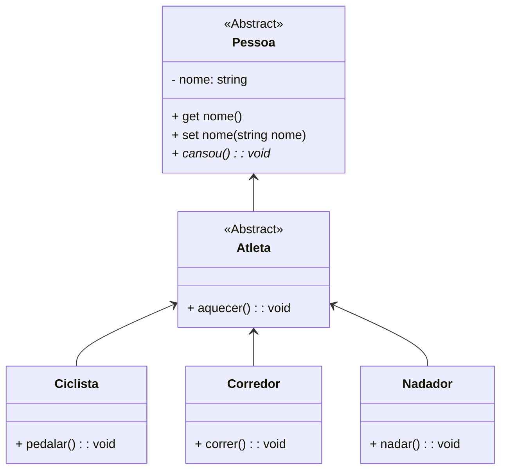

<h1>Classes Abstratas</h1>


Relembrando nossa primeira sessão sobre Orientação a Objetos...

- Um programa escrito em Linguagem Orientada à Objetos representa uma parte do mundo real;
- As partes das quais o modelo é construído são objetos que aparecem no domínio do problema;
- Uma classe descreve de maneira **abstrata** todos os objetos de um tipo em particular.

> **Abstrato:** que não é concreto; que resulta da abstração, que opera unicamente com ideias, com associações de ideias, não diretamente com a realidade sensível, que possui alto grau de generalização. 

Em nosso Projeto Guia (Conta), Conta é uma Classe, entretanto observe que quando definimos o conceito de **“uma Conta”**, estamos generalizando o conceito de uma Conta Bancária, sem definir maiores detalhes, apenas o que é comum para toda e qualquer conta. 

Quando definimos os conceitos de **Conta Corrente** e **Conta Poupança**, estamos definindo um tipo específico de conta, que terá as suas especificidades.

> **Especificidades:** Em nosso exemplo são as características que são exclusivas de cada tipo de conta. 

Nenhum banco possui uma conta genérica, toda e qualquer conta possui um propósito e especificidades, logo não será necessário criar um Objeto do tipo Conta, pois é uma definição muito genérica de Conta Bancária.

Para definirmos uma Classe Genérica, **que não necessita ser instanciada**, que servirá apenas como uma **Superclasse** para geração de outras Classes derivadas, implementaremos a Classe Conta como uma **Classe Abstrata**.

**Classes abstratas** são classes que não podem ser instanciadas, porém podem ser derivadas (herdadas). Geralmente são utilizadas apenas para permitir a derivação de novas classes. Identificamos uma Classe como Abstrata pelo modificador **abstract** na sua assinatura.

**Classe Concreta** é uma classe que pode ser instanciada.

**Sintaxe:**

```ts
export abstract class nome_da_classe{
    // Corpo da Classe
}
```

Utilizamos Classes Abstratas porquê em uma hierarquia de classes, quanto mais alta a classe, mais abstrata é a sua definição. Uma classe no topo da hierarquia pode definir apenas o comportamento e os atributos que são comuns a todas as classes. Na maioria dos casos, a classe não precisa ser instanciada diretamente e cumpre apenas o papel de ser um repositório de comportamentos e atributos em comuns a todas as classes estendidas (herdadas).

<br />

<div align="left"> <a href="https://www.typescriptlang.org/docs/handbook/2/classes.html#abstract-classes-and-members" target="_blank"><b>Documentação: Classes Abstratas</b></a></div>

<br />

<h3>Métodos Abstratos</h3>

A Classe Abstrata também pode ter em sua implementação **Métodos Abstratos**. Métodos abstratos são métodos sem código. Eles são prefixados pelo modificador **abstract**, não apresentam um corpo e sua declaração termina com “**;**” após a declaração dos parâmetros.

Um Método Abstrato indica que a classe não implementa aquele método e que ele deve ser obrigatoriamente implementado em todas as Subclasses que herdam a Classe Abstrata, exceto se a Subclasse também for Abstrata, pois é um comportamento comum das subclasses. **Um Método Abstrato só pode ser criado em uma Classe Abstrata. Classes Concretas apenas implementam os Métodos Abstratos através de Herança.**

<br />

**Sintaxe - Método Abstrato dentro da Classe Abstrata**

```ts
export abstract class nome_da_classe{
    // Corpo da Classe
    
    public abstract nome_do_metodo(): tipo_de_retorno;
}
```

**Sintaxe - Subclasse (Classe estendida ou herdada)**

```ts
export class nome_da_classe extends nome_da_superclasse{
    // Corpo da Classe
    
    public nome_do_metodo(): tipo_de_retorno{
        // Corpo do Método
    }
}
```

<br />

Vamos ao nosso exemplo:

<div align="center"></div>

Observe que a Classe **Atleta** estende (herda) a Classe **Pessoa**. As Classes **Corredor, Nadador e Ciclista** estendem (herdam) a Classe **Atleta**. 

Veja o Diagrama de Classes do nosso exemplo:

**Exemplo 01 - Diagrama de Classes** 



<br />

As Classes Pessoa e Atleta foram definidas como Classes Abstratas, porque a definição de pessoa e atleta são muito genéricas, ou seja, pessoa pode ser qualquer pessoa, seja ela atleta ou não, assim como atleta pode ser qualquer atleta de qualquer modalidade, logo não faz sentido criar Objetos de Classes com alto nível de abstração. As demais Classes foram definidas como Classes Concretas porque possuem especificidades sobre um tipo de pessoa atleta.

Observe na definição dos Métodos da Classe **Pessoa** que o Método **cansou()** está em itálico, o que indica que o Método cansou() é Abstrato, ou seja, ele terá apenas a assinatura do Método, sem nenhum tipo de implementação. Este Método será obrigatoriamente implementado em todas as Classes Concretas que herdarem a Classe **Pessoa**. 

<br />

## Exemplo 01 - Implementação em TypeScript 

**Classe Pessoa**

```ts
export abstract class Pessoa {

    private _nome: string;

    constructor (nome: string){
        this._nome = nome;
    }

    public get nome(){
        return this._nome;
    }

    public set nome(nome: string){
        this._nome = nome;
    }

    public abstract cansou(): void;

    public visualizar(): void{
        console.log("***************************************");
        console.log("           Dados da Pessoa             ");
        console.log("***************************************");
        console.log("Nome da pessoa: ", this._nome);
    }
}
```

Observe que a Classe Pessoa foi implementada como uma Classe Abstrata.

**Classe Atleta**


```ts
import { Pessoa } from "./Pessoa";

export abstract class Atleta extends Pessoa {

    constructor (nome: string){
        super(nome);
    }

    public aquecer(): void{
        console.log("Aquecendo...");
    }
}
```

Observe que a Classe Atleta foi implementada como uma Classe Abstrata. Além disso, ela também é uma Subclasse da Classe Abstrata Pessoa (Herança).

**Classe Ciclista**

```ts
import { Atleta } from "./Atleta";

export class Ciclista extends Atleta {

    constructor (nome: string){
        super(nome);
    }

    public cansou(): void{
        console.log("Cansei de pedalar!");
    }

    public pedalar(): void{
        console.log("Pedalando...");
    }
}
```

Observe que a Classe Ciclista foi implementada como uma Herança da Classe Abstrata Atleta. Note que o Método Abstrato **cansou()**, da Classe **Pessoa** foi implementado.

**Classe Corredor**

```ts
import { Atleta } from "./Atleta";

export class Corredor extends Atleta {

    constructor (nome: string){
        super(nome);
    }

    public cansou(): void{
        console.log("Cansei de correr!");
    }

    public correr(): void{
        console.log("Correndo...");
    }
}
```

Observe que a Classe Corredor foi implementada como uma Herança da Classe Abstrata Atleta. Note que o Método Abstrato **cansou()**, da Classe **Pessoa** foi implementado.

**Classe Nadador**


```ts
import { Atleta } from "./Atleta";

export class Nadador extends Atleta {

    constructor (nome: string){
        super(nome);
    }

    public cansou(): void{
        console.log("Cansei de nadar!");
    }

    public nadar(): void{
        console.log("Nadando...");
    }
}
```

Observe que a Classe Nadador foi implementada como uma Herança da Classe Abstrata Atleta. Note que o Método Abstrato **cansou()**, da Classe **Pessoa** foi implementado.

**Classe TestaAtleta**

```ts
import { Ciclista } from './Ciclista';
import { Corredor } from './Corredor';
import { Nadador } from "./Nadador";

export function main() {

    const ciclista: Ciclista = new Ciclista("Natália");
    ciclista.visualizar();
    ciclista.aquecer();
    ciclista.pedalar();
    ciclista.cansou();
    
    const corredor: Corredor = new Corredor("Mariana");
    corredor.visualizar();
    corredor.aquecer();
    corredor.correr();
    corredor.cansou();

    const nadador: Nadador = new Nadador("Niedja");
    nadador.visualizar();
    nadador.aquecer();
    nadador.nadar();
    nadador.cansou();
    
}

main();

```

Observe que instanciamos Objetos apenas das Classes Concretas. Caso você tente instanciar Objetos das Classes Abstratas, você receberá uma mensagem de erro: *Cannot create an instance of an abstract class.* 

Abaixo, você confere o resultado do código no Console:

**Resultado do Algoritmo:**

```bash
***************************************
           Dados da Pessoa
***************************************
Nome da pessoa:  Natália
Aquecendo...
Pedalando...
Cansei de pedalar!

***************************************
           Dados da Pessoa
***************************************
Nome da pessoa:  Mariana
Aquecendo...
Correndo...
Cansei de correr!

***************************************
           Dados da Pessoa
***************************************
Nome da pessoa:  Niedja
Aquecendo...
Nadando...
Cansei de nadar!
```

<br />

<div align="left"> <a href="" target="_blank"><b>Código fonte dos exemplos</b></a></div>

<br />

------

## 🔑**Pontos chave:**

1. **Classes Abstratas** são classes que não podem ser instanciadas, porém podem ser derivadas (herdadas). Geralmente são utilizadas apenas para permitir a derivação de novas classes. 
2. Identificamos uma Classe como Abstrata pelo modificador **abstract** na sua assinatura.
3. Abstract é um modificador sem acesso que é aplicável para Classes e Métodos. 
4. Classe Abstrata representa uma classe incompleta, que depende de subclasses para sua implementação, ou seja, a criação de pelo menos uma subclasse é obrigatória para uma classe abstrata. 
5. A Classe Abstrata também pode ter em sua implementação **Métodos Abstratos**. 
6. **Métodos abstratos** são métodos sem código. Eles são prefixados pelo modificador **abstract**, não apresentam um corpo e sua declaração termina opcionalmente com “**;**” após a declaração dos parâmetros.
7. Métodos Abstratos **são utilizados somente em classes abstratas.**

<br /><br />

<div align="left"><a href="README.md">Voltar</a></div>