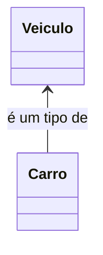
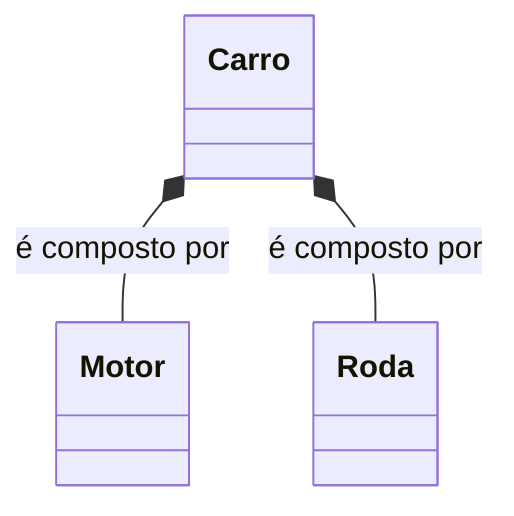
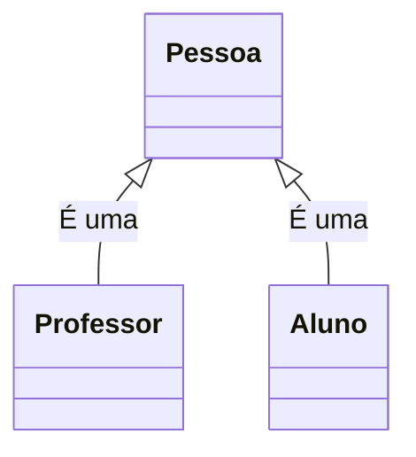
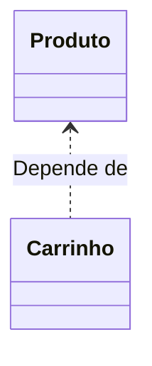
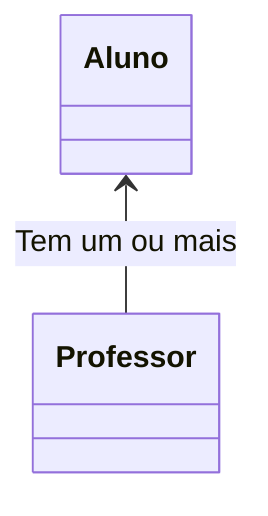
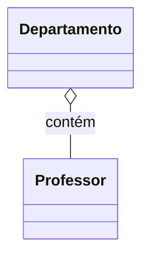
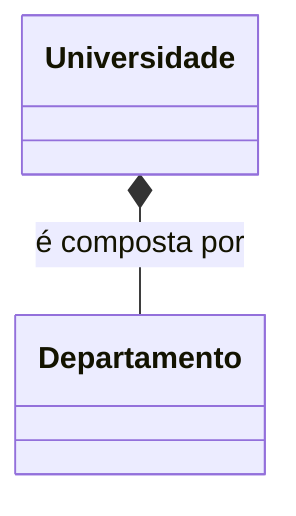
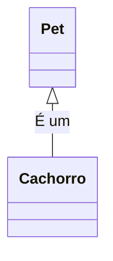
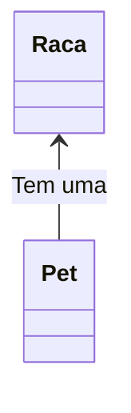
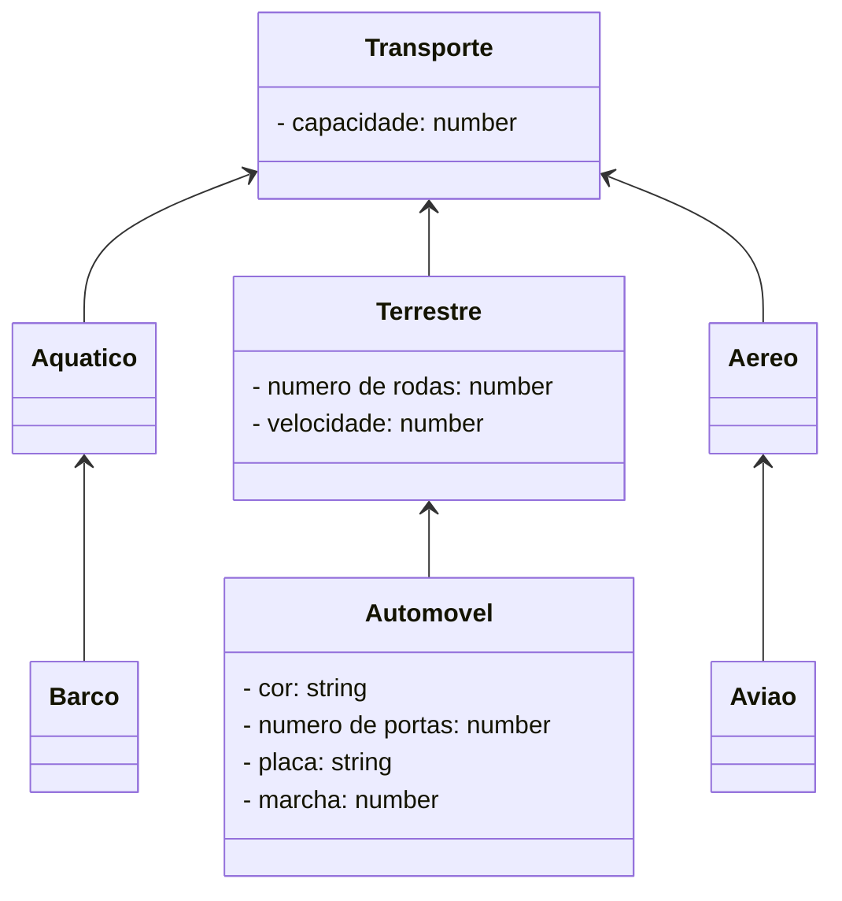

<h1>Programação Orientada a Objetos - Parte 02</h1>

<br />

<h2>Herança e Polimorfismo</h2>


Anteriormente, iniciamos nossos estudos sobre os conceitos iniciais da Programação Orientada a Objetos, tais como **Classes, Objetos, Métodos, Atributos e Encapsulamento**. Neste material veremos outros 2 conceitos fundamentais: **Herança e Polimorfismo**. Antes, vamos entender o que é Relacionamento entre Classes:

<br />

<h2>1. Relacionamento entre Classes</h2>


**Os Relacionamentos entre classes no TypeScript** definem os Relacionamentos especiais entre os diferentes tipos de classes.

No exemplo abaixo, existe uma relação especial entre uma classe chamada Veículo e uma classe chamada Carro: Um Carro é um tipo de Veículo, como mostra a figura abaixo:



No próximo exemplo, também existe um tipo diferente de relacionamento entre as classes Carro, Motor e Roda. Um Carro é compostos por Motor e Roda, como mostra a figura abaixo:



Ao projetar um aplicativo, é essencial explorar os tipos de relacionamentos entre as classes, pois esses relacionamentos oferecem diversos benefícios no desenvolvimento.

Por exemplo, considere um cenário em que várias classes possuem comportamentos comuns (métodos). Nesse caso, podemos otimizar o esforço ao centralizar esses comportamentos em uma única classe, chamada **superclasse**. Posteriormente, outras classes podem herdar esses métodos em comum, promovendo reutilização de código e maior organização.

Além disso, imagine que algumas classes não possuem relação direta entre si. Nesse caso, é possível delegar sua implementação a diferentes programadores, sem a necessidade de interdependência ou bloqueios no processo de desenvolvimento.

Compreender os relacionamentos entre as classes é fundamental para entender como os objetos em um programa interagem e se comunicam, garantindo maior coesão e eficiência no design do sistema.

<br />

<h3>1.1. Tipos de relacionamento entre classes em TypeScript</h3>


Existem três tipos de relacionamentos mais comuns entre classes em TypeScript que são os seguintes:

- Herança ("Is-A") - É um
- Dependência (“Use-A”) - Usa um
- Associação (“Has-A”) - Tem um

A associação é ainda classificada em 2 categorias:

- Agregação 

- Composição

Veja o resumo no Organograma abaixo:

<div align="center"></div>

<br />

<h4>1.1.1. Relação de Herança</h4>


A herança estabelece um relacionamento entre uma classe mais genérica e abstrata, conhecida como **superclasse**, e uma classe mais específica e especializada, chamada de **subclasse**.

Em outras palavras, a herança define a relação entre duas classes em que uma classe "estende" outra, criando um relacionamento do tipo **É-Um** (*Is-A*).



<br />

<h4>1.1.2. Relação de Dependência</h4>


Quando criamos um objeto de uma classe dentro de um método de outra classe, esse relacionamento é conhecido como **relacionamento de dependência em TypeScript**, ou simplesmente um relacionamento **Usa-Um** (*Use-A*).

Em outras palavras, quando um método de uma classe utiliza um objeto de outra classe, isso é chamado de dependência em TypeScript.



No diagrama acima, em um aplicativo de comércio eletrônico, a classe Carrinho depende da classe Produto, já que a classe Carrinho utiliza objetos da classe Produto como parâmetro para a operação de adição de itens.

No entanto, esse tipo de relacionamento deve ser evitado sempre que possível, pois gera um alto grau de acoplamento entre as classes, tornando o sistema menos flexível e mais difícil de manter.

<br />

<h4>1.1.3. Relacionamento de Associação</h4>


A **associação** é outro tipo de relacionamento fundamental entre classes, conhecido informalmente como o relacionamento “**Tem-Um**” (*Has-A*).

Esse relacionamento ocorre quando um objeto de uma classe é criado como atributo de outra classe. Nesse caso, é chamado de **relacionamento de associação**, ou simplesmente um relacionamento do tipo **Tem-Um**.



No contexto de associação, é importante definir também as **cardinalidades**, ou seja, o número de objetos que podem se relacionar com outros objetos. As principais cardinalidades são:

- **One-to-One (Um-para-Um):** Um objeto está relacionado com, no máximo, um outro objeto.
- **One-to-Many / Many-to-One (Um-para-Muitos / Muitos-para-Um):** Um objeto está relacionado com nenhum, um ou vários outros objetos, ou vice-versa.
- **Many-to-Many (Muitos-para-Muitos):** Muitos objetos podem se relacionar com muitos outros objetos.

Além disso, existem dois tipos especiais de associação:

<br />

### **Agregação**

A **agregação** é uma forma especial de associação que representa um relacionamento de propriedade entre dois objetos. Nesse caso, os objetos envolvidos têm seus próprios ciclos de vida, mas um deles é o "proprietário" do relacionamento **Tem-Um**.

O objeto proprietário é chamado de **objeto agregador**, e sua classe é denominada **classe agregadora**. A classe agregadora contém uma referência à outra classe, mas destruir um objeto agregador não afeta o ciclo de vida do objeto associado.



No exemplo acima, um objeto da classe **Departamento** contém vários objetos da classe **Professor** e atua como o proprietário do relacionamento. No entanto, os objetos da classe **Professor** continuam a existir mesmo que o objeto da classe **Departamento** seja destruído.

As **palavras-chave** que ajudam a identificar uma **agregação** são: *"consiste em"*, *"contém"*, *"é parte de"*.

<br />

### **Composição**

A **composição** é uma forma especial e mais restritiva de agregação. Ela também representa o relacionamento **Tem-Um**, mas com uma dependência mais forte, na qual um objeto não pode existir de forma independente. Nesse caso, o “todo” é intrinsecamente dependente das suas “partes”.

Em outras palavras, objetos em um relacionamento de composição compartilham o mesmo ciclo de vida. Se o objeto principal (o “todo”) for destruído, todas as suas partes relacionadas também serão eliminadas.

Por exemplo, considere um objeto da classe **Casa** que contém objetos da classe **Cômodo**. Se a **Casa** for destruída, todos os seus **Cômodos** deixarão de existir, pois não podem existir independentemente da **Casa**. Veja um segundo exemplo abaixo:



Um Objeto da Classe Universidade é composta por vários Objetos da Classe Departamentos. Um Objeto  da Classe Departamento é parte de um Objeto da Classe Universidade e não pode existir sem a existência do Objeto da Classe Universidade, assim como nenhum Objeto da Classe Departamento pode pertencer a dois Objetos da Classe Universidade simultaneamente. Se o Objeto da Classe Universidade for destruído, todos os Objetos da Classe Departamento também serão destruídos automaticamente.

<br />

<h3>Como decidir que tipo de relacionamento precisamos?</h3>


Os relacionamentos mais importantes e amplamente utilizados no dia a dia são o relacionamento **É-Um** (Herança) e o relacionamento **Tem-Um** (Associação). A decisão sobre qual tipo de relacionamento utilizar pode ser guiada por uma análise simples:

1. **Relacionamento É-Um (Herança):**

Se a definição do problema puder ser expressa na forma: *"O Objeto A é um tipo do Objeto B"*, então o relacionamento de herança deve ser utilizado.

**Exemplo:**  *"Um cachorro é um pet."*     

Nesse caso, faz sentido usar herança, pois não seria lógico dizer *"Um cachorro tem um pet."*. Assim, podemos criar uma superclasse genérica chamada **Pet** e uma subclasse derivada chamada **Cachorro**.



2. **Relacionamento É-Um (Herança):**

Por outro lado, se a definição do problema puder ser expressa na forma: *"O Objeto A tem um Objeto B"*, então o relacionamento de associação deve ser utilizado.

**Exemplo:** *"Um pet tem uma raça."*

Nesse caso, seria incorreto dizer "Um pet é uma raça", pois essa afirmação não faz sentido. Assim, devemos criar uma associação entre a classe Pet e uma classe que represente a Raça.



<br />

|  | <p align="justify"> **IMPORTANTE:** Neste primeiro momento, iremos focar na Relação de Herança. </p> |
| ------------------------------------------------------------ | ------------------------------------------------------------ |

<br />

<h2>2. Herança</h2>


O que torna a Orientação a Objetos única é o **conceito de Herança**. A **Herança** é um mecanismo que permite abstrair características comuns de várias classes em uma classe base, também chamada de **superclasse**.

Com a herança, uma classe pode herdar todos os atributos e métodos de outra classe, promovendo reutilização de código e organização. Esse conceito é fundamental para modelar relacionamentos do tipo **É-Um** e reduzir a redundância no desenvolvimento de sistemas.

<div align="center"></div>

Analisando a imagem acima: 

- Considere **capacidade** como um atributo da **Classe Transporte**, que indica a quantidade de pessoas que o transporte em questão pode transportar.
- Os atributos **numero de rodas** e **velocidade** (KM/h) como atributos da **Classe Terrestre**.
- Os atributos **cor, número de portas, placa e marcha** como atributos da **Classe Automóvel**.
- A imagem acima apresenta um exemplo de Herança, onde:
  - As **Classes Aquático, Terrestre e Aéreo** herdam a **Classe Transporte**.
  - A **Classe Barco** herda a **Classe Aquático**.
  - A **Classe Automóvel** herda a **Classe Terrestre**.
  - A **Classe Avião** herda a **Classe Aéreo**.

A herança é uma forma de reutilização de software em que novas classes são criadas a partir das classes existentes, absorvendo todos os seus atributos e métodos, além de adicionar novos recursos que as novas classes exigem. A partir de uma **classe base**, outras classes podem ser especificadas e cada classe derivada ou **subclasse** apresenta as características (estrutura e métodos) da **superclasse**, além de acrescentar o que for definido como particularidade da subclasse. Cada **subclasse** também se torna uma candidata a ser uma **superclasse** para alguma subclasse futura

Observando o exemplo acima:

- A **Classe Transporte** possui um **atributo chamado capacidade**.
- Como a **Classe Aquático** herda a **Classe Transporte**, pode-se dizer que ela também possui o **atributo capacidade**.
- A **Classe Barco**, como herda a **Classe Aquático**, também possui o **atributo capacidade**.

Abaixo, vemos o Diagrama de Classes do exemplo acima:

**Exemplo 01 - Diagrama de Classes** 



<br />

<h3>2.1. Tipos de Herança</h3>


Existem basicamente dois tipos de herança:

- **Herança Simples:** Nesse modelo, cada classe pode ter apenas uma única superclasse. Em TypeScript, utilizamos a palavra-chave **extends** para declarar que uma classe herda de outra.
- **Herança Múltipla:** Este tipo de herança permite que uma classe tenha mais de uma superclasse, herdando os atributos e métodos de todas elas. Embora TypeScript não suporte herança múltipla de forma nativa, como ocorre em linguagens como C++, é possível simulá-la utilizando interfaces, que serão explicadas mais adiante.

<br />

<h3>2.2. Herança em TypeScript</h3>


**Sintaxe:**

```ts
export class nome_da_classe extends nome_da_superclasse{
    //Corpo da Classe
}
```

<br />

<h4>2.2.1 A palavra reservada extends</h4>


A palavra reservada **extends** indica que uma classe está sendo criada como uma herança (ou extensão) de uma classe existente.

- A **classe existente** é chamada de **superclasse**, **classe base** ou **classe progenitora**.
- A **nova classe** que herda os atributos e métodos da classe existente é chamada de **subclasse**, **classe derivada** ou **classe filha**.

<br />

<div align="left"> <a href="https://www.typescriptlang.org/docs/handbook/2/classes.html#extends-clauses" target="_blank"><b>Documentação: Palavra reservada extends</b></a></div>


<br />

<h3>2.3 O Método Construtor da Subclasse</h3>


O método construtor de uma subclasse utiliza o método **super()**, que tem a função de chamar o construtor da superclasse. O **super()** deve sempre ser o primeiro item dentro do construtor da subclasse.

Dentro do método **super()**, devem ser passados como parâmetros os atributos da superclasse. Já os atributos específicos da subclasse devem ser definidos no próprio construtor da subclasse.

<br />

<h3>2.4 A palavra reservada super</h3>


Além do método **super()**, existe também a palavra reservada **super**, que faz referência aos objetos da superclasse, de forma semelhante à palavra reservada **this**, que faz referência aos objetos da própria classe.

A palavra reservada **super** é utilizada para chamar métodos da superclasse. O uso mais comum de **super** ocorre quando há métodos com o mesmo nome tanto na superclasse quanto na subclasse, ajudando a evitar confusão ao acessar o método da superclasse.

<br />

## Exemplo 01 - Implementação em TypeScript 

**Classe Transporte**

```ts
export class Transporte {

	private _capacidade: number;

	constructor(capacidade: number) {
		this._capacidade = capacidade;
	}

	public get capacidade() {
		return this._capacidade;
	}

	public set capacidade(capacidade: number) {
		this._capacidade = capacidade;
	}
	
	public visualizar(): void {
		
		console.log("\n\n************************************************************");
		console.log("Dados do Meio de Transporte:");
		console.log("****************************************************************");
		console.log("Capacidade (número de passageiros): " + this._capacidade);
	}
}
```

A Classe Transporte (Superclasse), foi criada com apenas um Atributo (capacidade), conforme o Diagrama de Classes acima. Também foi criado o Método Construtor, os Métodos Get e Set do Atributo e o Método visualizar para exibir os dados do Objeto na tela.

**Classe Terrestre**


```ts
import { Transporte } from "./Transporte";

export class Terrestre extends Transporte {

	private _numeroRodas: number;
	private _velocidade: number;

	constructor(capacidade: number, numeroRodas: number, velocidade: number) {
		super(capacidade);
		this._numeroRodas = numeroRodas;
		this._velocidade = velocidade;
	}

	public get numeroRodas() {
		return this._numeroRodas;
	}

	public set numeroRodas(numeroRodas: number) {
		this._numeroRodas = numeroRodas;
	}

	public get velocidade() {
		return this._velocidade;
	}

	public set velocidade(velocidade: number) {
		this._velocidade = velocidade;
	}

	public visualizar(): void {
		super.visualizar();
		console.log("Número de rodas: " + this.numeroRodas);
		console.log("Velocidade: " + this.velocidade.toFixed(2));
	}
}

```

A Classe Terrestre (Subclasse), foi criada como Herança da Classe Transporte (**extends Transporte**), com dois Atributos (**numeroRodas** e **velocidade**), conforme o Diagrama de Classes acima. Além disso, também foram criados o Método Construtor, os Métodos Get e Set dos Atributos e o Método visualizar para exibir os dados do Objeto na tela. 

Observe que:

- Nos parâmetros do Método Construtor foi adicionado o Atributo **capacidade**, da Classe Transporte. 
- No corpo do Método Construtor foi adicionado o Método **super** para acessar os Atributos da Classe Transporte (**super(capacidade)**). 
- No Método visualizar foi adicionado o Método **super** para executar o Método **visualizar()** (**super.visualizar()**), da Classe Transporte, para listar os dados dos atributos da Classe Transporte.

**Classe Automovel**

```ts
import { Terrestre } from "./Terrestre";

export class Automovel extends Terrestre{

	private _cor: string;
	private _numeroPortas: number;
	private _placa: string;
	private _marcha: number;
	
	constructor(capacidade: number, numeroRodas: number, velocidade: number, cor: string, numeroPortas: number, placa: string, marcha: number) {
		super(capacidade, numeroRodas, velocidade);
		this._cor = cor;
		this._numeroPortas = numeroPortas;
		this._placa = placa;
		this._marcha = marcha;
	}

	public get cor() {
		return this._cor;
	}

	public set cor(cor: string) {
		this._cor = cor;
	}

	public get numeroPortas() {
		return this._numeroPortas;
	}

	public  set numeroPortas(numeroPortas: number) {
		this._numeroPortas = numeroPortas;
	}

	public get placa() {
		return this._placa;
	}

	public set placa(placa: string) {
		this._placa = placa;
	}
	
	public get marcha() {
		return this._marcha;
	}

	public set marcha(marcha: number) {
		this._marcha = marcha;
	}

	public visualizar(): void {

		super.visualizar();
		console.log("cor: " + this._cor);
		console.log("Número de portas: " + this._numeroPortas);
		console.log("Placa: " + this._placa);
		console.log("Marcha: " + this._marcha);
		
	}
}
```

A Classe Automovel (Subclasse), foi criada como Herança da Classe Terrestre (**extends Terrestre**), com os Atributos (**cor, numeroPortas, placa e marcha**), conforme o Diagrama de Classes acima. Além disso, também foram criados o Método Construtor, os Métodos Get e Set dos Atributos e o Método visualizar para exibir os dados do Objeto na tela. 

Observe que:

- No Método Construtor foram adicionados os Atributos **capacidade**, da Classe Transporte, e **numeroRodas**, da Classe Terrestre, nos parâmetros do Método. 
- No corpo do Método Construtor foi adicionado o Método **super** para acessar os Atributos da **Classe Terrestre** e da **Classe Transporte**, que foram herdados na Classe Terrestre (**super(capacidade, numeroRodas, velocidade)**). 
- No Método visualizar também foi adicionado o Método **super** para executar o Método **visualizar()** (**super.visualizar()**), da Classe Terrestre, para listar os dados dos atributos das Classes Terrestre e Transporte.

**Classe TestaTransporte**

```ts
import { Automovel } from "./Automovel";

export function main() {

    const aut1: Automovel = new Automovel(5, 4, 250.00, "Verde", 4, "EBN-0301", 0);

    aut1.visualizar();

}

main();
```

Na Classe TestaTransporte, foi instanciado uma Objeto da Classe Automovel. Observe que devido as Heranças, o Objeto da Classe Automovel possui 7 parâmetros: 

- capacidade (herdado da Classe Transporte)
- numeroRodas e velocidade (Herdado da Classe Terrestre)
- cor, numeroPortas, placa e marcha (Atributos da Classe Automovel)

Abaixo, você confere o resultado do código no Console:

**Resultado do Algoritmo:**

```bash
*********************************************************************
Dados do Meio de Transporte:
*********************************************************************
Capacidade (número de passageiros): 5
Número de rodas: 4
Velocidade: 250.00
cor: Verde
Número de portas: 4
Placa: EBN-0301
Marcha: 0
```

<br />


> **Dicas sobre Herança:**
>
> 1. Sempre coloque os métodos e atributos comuns para todas as Subclasses na **Superclasse**
> 2. Use herança para modelar uma relação de “estar contido em”, ou seja, **um objeto da Subclasse é um objeto da Superclasse**
> 3. Não use herança a menos que todos ou a maioria dos métodos herdados da Superclasse façam sentido na Subclasse

<br />

<h2>3. Polimorfismo</h2>


O **polimorfismo** deriva da palavra *polimorfo*, que significa multiforme, ou seja, algo que pode variar de forma.

Na Programação Orientada a Objetos (POO), o polimorfismo é a capacidade de objetos de diferentes classes responderem à mesma mensagem de maneiras distintas. Em outras palavras, é a habilidade de um objeto decidir qual método aplicar a si mesmo, mesmo que a mensagem seja a mesma. Assim, diferentes objetos podem reagir de formas diferentes, mesmo quando recebem a mesma solicitação.

**Exemplo:**

*Um dono de uma fábrica de brinquedos solicitou que seus engenheiros criassem um mesmo controle remoto para todos os brinquedos de sua fábrica. A única restrição era que cada brinquedo atendesse aos comandos específicos definidos pelo controle.*

<div align="center"></div>

Assim quando o brinquedo recebe o sinal **MOVER**, ele se move de acordo com a sua função:

- Para o avião, mover significa **VOAR**;
- Para o barco significa **NAVEGAR**, e
- Para o automóvel **CORRER**.

<div align="center"></div>

Observe que os brinquedos respondem ao mesmo sinal  de formas diferentes. O Polimorfismo permite que diferentes objetos (avião, barco, automóvel) respondam uma mesma mensagem (mover) de formas diferentes (voar, navegar e correr).

<br />

<h3>3.1. Como funciona na prática?</h3>


- Quando uma mensagem é enviada para uma **subclasse** solicitando a aplicação de um **método** com certos parâmetros, a subclasse verifica se possui um método com esse nome e parâmetros exatos.
- Se a subclasse tiver esse método, ela o utiliza para processar a mensagem.
- Caso contrário, a **superclasse** assume a responsabilidade pelo processamento da mensagem e busca um método com o mesmo nome e parâmetros.
- Se a superclasse encontrar o método, ela o chama para processar a mensagem.

<br />

<h3>3.2. Tipos de Polimorfismo</h3>

<br />

<h4>3.2.1. Polimorfismo de Sobreposição (Sobrescrita de Método)</h4>


O ato de **sobrescrever** um método ou propriedade significa dar uma nova versão ou forma a ele. Em **TypeScript**, a **sobrescrita de métodos** ocorre quando criamos um novo método na classe filha com a mesma assinatura e o mesmo tipo de retorno do método da classe pai (também conhecido como **Override**).

A **sobrescrita** está diretamente relacionada à **Orientação a Objetos**, especialmente à **herança**. Com a **sobrescrita**, é possível especializar os **métodos** herdados das superclasses, alterando seu comportamento nas subclasses para algo mais específico.

<br />

## Exemplo 02: Polimorfismo de Sobrescrita

O Método **visualizar()** da Classe Transporte, está implementado da seguinte forma:

```ts
	public visualizar(): void {
		
		console.log("\n\n************************************************************");
		console.log("Dados do Meio de Transporte:");
		console.log("****************************************************************");
		console.log("Capacidade (número de passageiros): " + this._capacidade);
	}
```

O Método **visualizar()** da Classe Terrestre, foi reescrito da seguinte forma:

```ts
	public visualizar(): void {
		super.visualizar();
		console.log("Número de rodas: " + this.numeroRodas);
		console.log("Velocidade: " + this.velocidade.toFixed(2));
	}
```

O Método **visualizar()** da Classe Automovel, foi reescrito da seguinte forma:

```ts
	public visualizar(): void {

		super.visualizar();
		console.log("cor: " + this._cor);
		console.log("Número de portas: " + this._numeroPortas);
		console.log("Placa: " + this._placa);
		console.log("Marcha: " + this._marcha);
		
	}
```

Observe que as assinaturas dos três métodos são as mesmas, entretanto, o método visualizar() nas três classes possui implementações diferentes, pois ele exibe os atributos das classes herdadas e os seus próprios atributos.

No exemplo acima, para que o método visualizar() funcione de forma diferente nas classes Terrestre e Automovel, ele precisou ser sobrescrito. Isso ocorre porque as classes Terrestre e Automovel não possuem acesso direto às variáveis de instância privadas da superclasse. Ou seja, o método não pode alterar ou acessar diretamente essas variáveis de instância. Por isso, elas executam o método super.visualizar() para acessar os atributos das classes herdadas.

Um ponto de atenção importante sobre a sobrescrita é que um método redefinido em uma subclasse com o mesmo nome e mesma lista de parâmetros que o método da classe ancestral (superclasse) automaticamente oculta o método da classe ancestral na subclasse. Ou seja, o método da subclasse passa a ser usado em vez do método da superclasse

<br />

|  | <p align="justify"> **IMPORTANTE:** A Linguagem TypeScript não oferece suporte ao Polimorfismo por Sobrecarga, ou seja, 2 métodos em uma mesma Classe, com o mesmo nome, mas com parâmetros diferentes. </p> |
| ------------------------------------------------------------ | ------------------------------------------------------------ |

<br />

<div align="left"> <a href="https://github.com/rafaelq80/exemplos_js/tree/main/typescript/heranca" target="_blank"><b>Código fonte dos Exemplos</b></a></div>

<br />

------

## 🔑**Pontos chave:**

1. **Os Relacionamentos entre classes no TypeScript** definem os Relacionamentos especiais entre os diferentes tipos de classes. 
2. A Herança é um tipo de Relacionamento entre Classes no TypeScript e uma das maiores vantagens da Programação Orientada a Objetos, permitindo que o código seja reutilizado. Em TypeScript, é possível herdar **atributos** e **comportamentos** (**métodos**) de uma classe para outra. 

3. **Herança Simples:** Cada classe pode ter apenas uma superclasse. Na linguagem TypeScript usa-se a palavra reservada **extends** para declarar que uma classe é herdeira de outra.
4. **Herança Múltipla:** É a capacidade de uma classe possuir mais de uma superclasse e herdar os atributos e métodos de todas as superclasses. TypeScript não implementa Herança Múltipla nativamente.
5. O **Polimorfismo** é considerado um dos recursos mais importantes da Programação Orientada a Objetos, permitindo que uma ação seja executada de diferentes maneiras, fornecendo implementações variadas para métodos e interfaces. A palavra **polimorfismo** significa adquirir muitas formas ou assumir funções diferentes. 
6. **Polimorfismo de Sobreposição:** É a redefinição de métodos em classes descendentes, ou seja, um método de uma classe filha com o mesmo nome de um método de uma classe mãe irá sobrepor esse último. O método redefinido tem precedência em relação a chamadas de método nos objetos da subclasse.

<br /><br />

<div align="left"><a href="README.md">Voltar</a></div>
