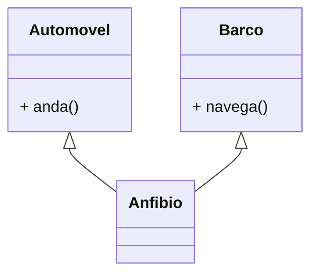
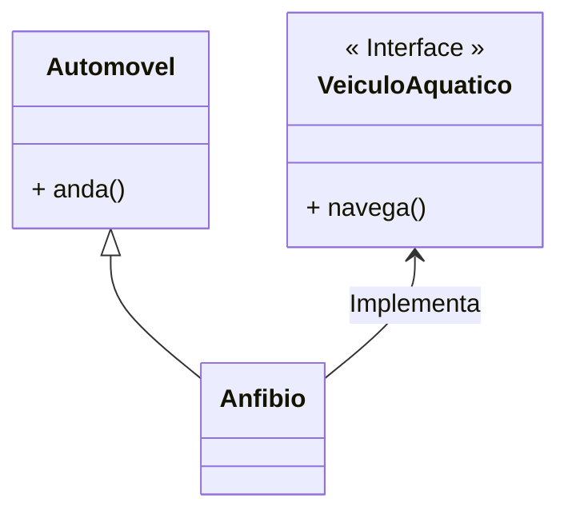
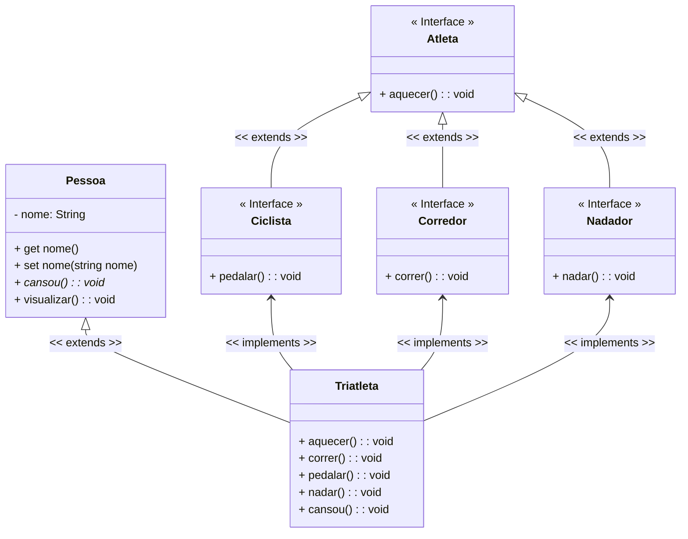

<h1>Interfaces</h1>


Como vimos no conteúdo sobre  Herança, o TypeScript permite a criação de uma Classe herdando as características de outra Classe, chamada Superclasse, com objetivo de simplificar o processo de desenvolvimento através da reutilização de código.

Entretanto, a linguagem TypeScript não permite que uma classe seja derivada de duas ou mais classes, como no exemplo demonstrado na figura abaixo, ou seja, TypeScript não permite a utilização do conceito de **Herança Múltipla**.



> •**Herança Simples** é o princípio, implementado em todas as linguagens de programação orientadas a objetos, que possibilita o compartilhamento de atributos e operações de apenas uma classe em uma subclasse. 
>
> •**Herança Múltipla** é o princípio, implementado em algumas linguagens de programação orientadas a objetos, como a liguagem C++ por exemplo, que possibilita o compartilhamento de atributos e operações de duas ou mais classes em uma subclasse, ou seja, uma classe pode ter mais de um superclasse.

Para contornar este fato, a Linguagem TypeScript oferece uma solução elegante para este fim: o conceito de **Interfaces**, onde um Objeto "implementa" as características de outro Objeto.



**Interface** é uma estrutura que representa uma **Classe abstrata "pura"** em TypeScript, que **não têm atributos de dados**, exceto quando utilizada para definir um tipo de dado, **não tem construtor**, **todos os métodos são abstratos** e **não é declarada como Classe, e sim como Interface**.

Uma Classe pode implementar várias Interfaces, entretanto não é recomendável implementar mais do que 3 Interfaces, porquê pode criar uma complexidade desnecessária ao projeto.

A Interface estabelece **um conjunto de Métodos apenas assinados, ou seja, sem o corpo, que obrigatoriamente devem ser implementados nas Subclasses que a utiliza**. Abaixo vemos a sintaxe de como criar uma Interface:

```ts
export Interface nome_da_interface{
    // Métodos da Interface
}
```

Abaixo vemos a sintaxe de como implementar uma Interface em uma Classe. Observe que as classes utilizam a palavra reservada **implements** na sua assinatura para implementar uma Interface.

```ts
export class nome_da_classe implements nome_da_interface{
    // Corpo da Classe
}
```

Vamos retomar o nosso exemplo, utilizado no conteúdo sobre Classes Abstratas:

<div align="center"></div>

Observe que **Corredor, Nadador e Ciclista** estendem (herdam) a Classe Atleta. 

Vamos acrescentar a **Classe Triatleta**.

<div align="center"></div>

Na imagem acima, vemos que a Classe **Triatleta** estenderia (herdaria) as 3 Classes: **Corredor, Nadador e Ciclista**.

Teoricamente isto funcionaria, mas na prática não, pois TypeScript **NÃO ACEITA HERANÇA MÚLTIPLA**. Para resolvermos o problema, teríamos que implementar o conceito de **Interfaces**, onde **Atleta, Nadador, Corredor e Ciclista**, seriam as nossas **Interfaces**, enquanto **Pessoa e Triatleta** seriam as únicas classes, como vemos na imagem abaixo:

<div align="center"></div>

<br />

Abaixo, vemos o Diagrama de Classes do exemplo acima:

**Exemplo 01 - Diagrama de Classes** 



<br />

**Exemplo 01 - Implementação em TypeScript:** 

**Classe Pessoa**

```ts
export abstract class Pessoa {

    private _nome: string;

    constructor (nome: string){
        this._nome = nome;
    }

    public get nome(){
        return this._nome;
    }

    public set nome(nome: string){
        this._nome = nome;
    }

    public abstract cansou(): void;

    public visualizar(): void{
        console.log("***************************************");
        console.log("           Dados da Pessoa             ");
        console.log("***************************************");
        console.log("Nome da pessoa: ", this._nome);
    }
}
```

A Classe Pessoa (Superclasse), foi criada com apenas um Atributo (nome), conforme o Diagrama de Classes acima. Também foi criado o Método Construtor, os Métodos Get e Set do Atributo, o Método visualizar() e o Método abstrato cansou().

**Interface Atleta**


```ts
export Interface Atleta {

    aquecer(): void;
    
}
```

A Interface Atleta foi criada com apenas um Método (aquecer()), conforme o Diagrama de Classes acima. 

**Interface Ciclista**


```ts
import { Atleta } from "./Atleta";

export Interface Ciclista extends Atleta{

    pedalar(): void;
    
}
```

A Interface Ciclista foi criada como uma Herança da Classe Atleta, com apenas um Método (pedalar()), conforme o Diagrama de Classes acima. 

**Interface Corredor**


```ts
import { Atleta } from "./Atleta";

export Interface Corredor extends Atleta{

    correr(): void;
    
}
```

A Interface Corredor foi criada como uma Herança da Classe Atleta, com apenas um Método (correr()), conforme o Diagrama de Classes acima. 

**Interface Nadador**


```ts
import { Atleta } from "./Atleta";

export Interface Nadador extends Atleta{

    nadar(): void;
    
}
```

A Interface Nadador foi criada como uma Herança da Classe Atleta, com apenas um Método (nadar()), conforme o Diagrama de Classes acima. 

**Classe Triatleta**


```ts
import { Ciclista } from "./Ciclista";
import { Corredor } from "./Corredor";
import { Nadador } from "./Nadador";
import { Pessoa } from "./Pessoa";

export class Triatleta extends Pessoa implements Ciclista, Corredor, Nadador{
    
    constructor(nome: string){
        super(nome);
    }
       
    aquecer(): void {
        console.log("Aquecendo...");
    }
    
    correr(): void {
        console.log("Correndo...");
    }
    
    pedalar(): void {
        console.log("Pedalando...");
    }
     
    nadar(): void {
        console.log("Nadando...");
    }
    
    public cansou(): void {
        console.log("Cansou!");
    }
    
}
```

A Classe Triatleta foi criada como Herança da Classe Pessoa e Implementa as Interfaces: Nadador, Corredor e Ciclista, conforme o Diagrama de Classes acima. Além disso, também foi criado o Método Construtor. 

Observe que todos os Métodos das 3 Interfaces foram implementados. Quando uma Classe Implementa uma Interface, ela "assina um contrato" com a Interface, que a obriga a implementar ou minimamente inserir as assinaturas de todos os Métodos da Interface no Corpo da Classe.

**Classe TestaTriatleta**

```ts
import { Triatleta } from "./Triatleta";

export function main() {

    const triatleta: Triatleta = new Triatleta("Natália");
    triatleta.visualizar();
    triatleta.aquecer();
    triatleta.pedalar();
    triatleta.correr();
    triatleta.nadar();
    triatleta.cansou();
    
}

main();

```

Na Classe TestaTriatleta, foi instanciado um Objeto da Classe Triatleta. Observe que graças a Herança e as Interfaces implementadas, o Objeto da Classe Triatleta consegue executar os Métodos das 4 Interfaces e da Classe Pessoa. Abaixo, você confere o resultado do código no Console:

**Resultado do Algoritmo:**

```bash
***************************************           
Dados da Pessoa
***************************************
Nome da pessoa:  Natália

Aquecendo...
Pedalando...
Correndo...
Nadando...
Cansou!
```

<br />

<h2>2. Interfaces x Classes Abstratas</h2>

| Classes Abstratas                                           | Interfaces                                                   |
| ----------------------------------------------------------- | ------------------------------------------------------------ |
| Agrupa objetos com implementações compartilhadas            | Agrupa objetos com implementações diferentes                 |
| Define novas classes através de herança (simples) de código | Define novas interfaces através de herança (múltipla) de **assinaturas** |
| Uma Classe pode ter apenas uma Superclasse (herança).       | Uma Classe pode implementar várias Interfaces.               |

<br />

<h2>3. Regras para utilizar Interface</h2>


Aqui estão alguns pontos-chave para definir uma Interface com Métodos Abstratos em TypeScript, que devem ser mantidos em mente. As regras são as seguintes:

1. Uma Interface não pode ser instanciada diretamente como uma Classe.

2. Uma classe que implementa uma Interface deve fornecer suas próprias implementações de todos os métodos definidos na Interface.

3. Não podemos reduzir a visibilidade de um método da Interface durante a substituição, ou seja, quando implementamos um método da Interface, ele obrigatoriamente será public (público).

4. Um Método da Interface também pode ser implementado em uma Classe com o corpo vazio. 

5. Todos os métodos definidos em uma Interface são abstratos e públicos por definição. 

6. Se você adicionar qualquer novo método na Interface, todas as classes concretas que implementam essa Interface devem fornecer implementações para o método recém-adicionado, porque todos os métodos na Interface são abstratos por definição.

<br />

<h2>4. Interfaces e definição de tipos de dados</h2>


Além de definir Métodos que serão implementados por uma Classe, como vimos anteriormente, uma Interface, na Linguagem TypeScript, também pode ser utilizada para definir tipos de dados complexos, como funções e objetos, de forma que possam ser utilizados para restringir um tipo de dado. 

Assim como nos objetos definidos por uma Classe, uma Interface pode ser utilizada para definir um tipo de objeto no TypeScript, que em sua forma mais básica, se parece muito com um objeto literal (Objeto gerado por uma Classe).

Uma Interface TypeScript que define um tipo de dado é a essência de um tipo literal de Objeto. Ela é um conjunto de Métodos e Propriedades que descrevem um Objeto, porém não inicializa e muito menos os implementam como as Classes. 

**Sintaxe:**

```ts
export interface nome_da_interface{
    atributo1: tipo;
    atributo2: tipo;
    ...
    atributoN: tipo;
}
```

Note que, diferente de um objeto literal criado por uma Classe, o objeto definido a partir de uma Interface separa os campos usando ponto e vírgula, e não vírgulas. Essa sintaxe é semelhante ao formato **JSON - JavaScript Object Notation**, que veremos mais adiante no Bloco 02.

<br />

**Exemplo 02 - Criar uma Interface para definição de Objeto:**

```ts
export interface Pessoa{
    nome: string;
    sobrenome: string;
}
```

No exemplo acima, foi criada a **Interface Pessoa**, composta por 2 atributos: `nome` e `sobrenome`. 

Observe que qualquer objeto que for criado a partir do tipo `Pessoa`, definido pela Interface Pessoa, deve conter valores atribuídos nos dois atributos.

**Exemplo 03 - Criando Objetos da Interface Pessoa:**

```ts
export interface Pessoa{
    nome: string;
    sobrenome: string;
}

const pessoa1: Pessoa = {
    nome: 'Maria',
    sobrenome: 'Simões'
}

const pessoa2: Pessoa = {
    nome: 'Juliana',
    sobrenome: 'Silva'
}

console.log(pessoa1);
console.log(pessoa2);
```

**Resultado do Algoritmo:**

```bash
{ nome: 'Maria', sobrenome: 'Simões' }
{ nome: 'Juliana', sobrenome: 'Silva' }
```

<br />

No exemplo acima, foram criados 2 Objetos baseados na **Interface Pessoa**. Note que, diferente de um objeto criado por uma Classe, no objeto criado a partir de uma Interface, o nome do atributo seguido por 2 pontos foi acrescentado antes do valor que será atribuído ao atributo.

As Interfaces também podem herdar outras Interfaces para compor tipos mais complexos, assim como as Classes:

**Exemplo 04 - Criando uma Interface Composta:**

```ts
import { Pessoa } from "./Pessoa";

export interface PessoaJuridica extends Pessoa {
    conta: number;
    cnpj: number;
}

const pessoaJuridica: PessoaJuridica = {
    nome: 'Maria',
    sobrenome: 'Simões',
    conta: 12345,
    cnpj: 123456000123
}

console.log(pessoaJuridica);
```

**Resultado do Algoritmo:**

```bash
{
  nome: 'Maria',
  sobrenome: 'Simões',
  conta: 13635686,
  cnpj: 99551026000195
}
```

No exemplo acima, foi criado 1 Objeto baseados na **Interface PessoaJuridica**, que herda a Interface **Pessoa**. Note que foram adicionados os atributos de ambas as Interfaces, não foi criado um Método Construtor, assim como nas Classes.

As Interfaces também podem ter atributos com valores opcionais:

**Exemplo 05 - Interface com atributos opcionais:**

```typescript
import { Pessoa } from "./Pessoa";

export interface PessoaFisica extends Pessoa {
    conta: number;
    cpf: number;
    telefone?: number;
}

const pessoaFisica01: PessoaFisica = {
    nome: 'Maria',
    sobrenome: 'Simões',
    conta: 16753432,
    cpf: 34981106084
}

const pessoaFisica02: PessoaFisica = {
    nome: 'Juliana',
    sobrenome: 'Silva',
    conta: 11847743,
    cpf: 82177048052,
    telefone: 21345678
}

console.log(pessoaFisica01);
console.log(pessoaFisica02);
```

**Resultado do Algoritmo:**

```bash
{
  nome: 'Maria',      
  sobrenome: 'Simões',
  conta: 16753432,    
  cpf: 34981106084    
}
{
  nome: 'Juliana',
  sobrenome: 'Silva',
  conta: 11847743,
  cpf: 82177048052,
  telefone: 21345678
}
```

Note que no primeiro Objeto não foi passado um valor para o atributo opcional **telefone** e mesmo assim o Objeto foi criado.

Este recurso de criar um tipo de dado a partir de uma Interface é muito utilizado nas Bibliotecas e Frameworks JavaScript/TypeScript, voltados para o Desenvolvimento de aplicações Frontend, como o Angular e o React por exemplo, para criar um modelo de verificação do modelo de dados do Backend da aplicação, como veremos no decorrer do Bloco 03.

<br />

<div align="left"> <a href="https://www.typescriptlang.org/docs/handbook/2/everyday-types.html#interfaces" target="_blank"><b>Documentação - TypeScript: Interfaces</b></a></div>

<br />

<div align="left"> <a href="" target="_blank"><b>Código fonte dos exemplos</b></a></div>

<br />

------

## 🔑**Pontos chave:**

1.  **Interface** é uma estrutura que representa uma **Classe abstrata "pura"** em TypeScript, que **não têm atributos de dados** (só pode ter constantes estáticas - tipo final), **não tem construtor**, **todos os métodos são abstratos** e **não é declarada como Classe, e sim como Interface**.
2.  Uma Classe pode implementar várias Interfaces, entretanto não é recomendável implementar mais do que 3 Interfaces, porquê pode criar uma complexidade desnecessária ao projeto.
3.  A Interface estabelece **um conjunto de Métodos apenas assinados, ou seja, sem o corpo, que obrigatoriamente devem ser implementados nas Subclasses que a utiliza**.
4.  Uma Interface, na Linguagem TypeScript, também pode ser utilizada para definir tipos de dados complexos, como funções e objetos, de forma que possam ser utilizados para restringir um tipo de dado.

<br />

<div align="left"><a href="README.md">Voltar</a></div>

