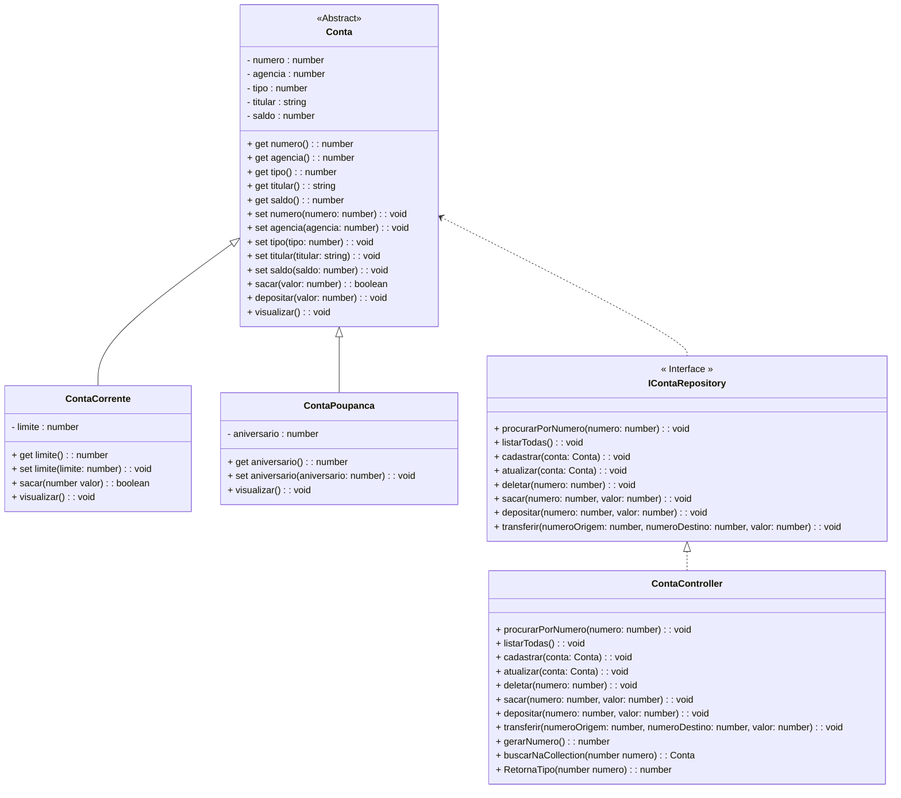

<h1>Projeto 01 - Conta Bancária - Iniciando o Projeto TypeScript</h1>

<br />

<h2>1. O Projeto Conta Bancária</h2>


O Projeto Conta Bancária será o nosso Projeto Guia no aprendizado dos Conceitos e aplicação da Orientação a Objetos. Todo o código que implementarmos no projeto Conta Bancária servirá de base para a construção do Projeto Final (Performance Goal Check), que marca o final do Bloco 01. O Projeto Conta Bancária receberá novas funcionalidades a cada nova Sessão e depois que você concluir o projeto, você aplicará os conhecimentos adquiridos no Projeto Final. Veja o Diagrama de Classes do Projeto Conta Bancária completo na figura abaixo:



<br />

O Projeto será composto pelas seguintes Classes e Interfaces:

| Classe/Interface    | Descrição                                                    |
| ------------------- | ------------------------------------------------------------ |
| **Menu**            | Classe principal, que conterá o Método main, responsável por criar o Menu inicial da aplicação com todas as funcionalidades do sistema. |
| **Conta**           | Classe responsável por definir o Objeto Conta genérico.      |
| **ContaCorrente**   | Classe responsável por definir o Objeto Conta Corrente.      |
| **ContaPoupanca**   | Classe responsável por definir o Objeto Conta Poupanca.      |
| **ContaRepository** | Interface responsável por encapsular os Métodos que serão utilizados no Menu da aplicação |
| **ContaController** | Classe responsável por implementar a Interface ContaRepository. |

Antes de começar a criar as nossas Classes, vamos criar o nosso Projeto no Visual Studio Code.

<br />

 <h2>👣 Passo 01 - Criar o Projeto</h2>


1. Crie uma pasta na **Área de Trabalho**, chamada **conta_bancaria**.
2. Abra o Visual Studio IDE.
3. Ao iniciar o Visual Studio Code IDE, será aberta a tela abaixo, perguntando o que você deseja fazer?

<div align="center"></div>

4. No VSCode, abra a pasta **conta_bancaria**, criada na **Área de Trabalho**, através do menu **File 🡪 Open Folder...**

   <div align="center"></div>

5. Localize na **Área de Trabalho do seu Computador** a pasta **conta_bancaria** e na sequência, abra a pasta e clique no botão **Selecionar pasta**.

<div align="center">
  
</div>


6. Depois de abrir a pasta, abra o **Terminal** do VSCode através do menu **Terminal 🡪 New Terminal**

   <div align="center"></div>

7. Será aberta a tela do **Terminal** na parte inferior da janela do VSCode.


   <div></div>

8. Digite o comando abaixo para instalar o **TypeScript**:

```bash
npm install -g typescript
```

9. Na sequência, digite o comando abaixo para checar se o TypeScript foi instalado corretamente:

```bash
tsc -v
```

10. Será exibido na tela a versão do TypeScript:

```bash
Version 5.0.4
```

<br />

|  | <p align="justify"> **ATENÇÃO:** No momento em que este material foi escrito, a versão mais atual do TypeScript era a versão 5.0.4. Ao utilizar este material no futuro, pode ser que a versão mais atual seja outra.</p> |
| ------------------------------------------------------------ | ------------------------------------------------------------ |

<br />

11. TypeScript instalado, vamos instalar a Biblioteca **ts-node**, para simplificar o uso do **TypeScript**, através do comando:

```bash
npm install -g ts-node
```

12. Na sequência, digite o comando abaixo para checar se o ts-node foi instalado corretamente:

```bash
ts-node -v
```

13. Será exibido na tela a versão do ts-node:

```bash
v10.9.1
```

<br />

|  | <p align="justify"> **ATENÇÃO:** No momento em que este material foi escrito, a versão mais atual do TS-Node era a versão 10.9.1. Ao utilizar este material no futuro, pode ser que a versão mais atual seja outra.</p> |
| ------------------------------------------------------------ | ------------------------------------------------------------ |

<br />

<h2>👣 Passo 02 - Criar a Classe Menu</h2>


Vamos implementar o código da Classe **Menu** - versão monocromática (sem as cores), no arquivo **Menu.ts**:

1. Na **Guia Explorer**, selecione a pasta **conta_bancaria** e clique no botão **New File** (Novo Arquivo), indicado na imagem abaixo:  

<div align="center"></div>

2. O nome do arquivo será **Menu.ts**, como mostra a figura abaixo. Após digitar o nome do arquivo, pressione a tecla **enter** do seu teclado para concluir. 

 <div align="center"></div>

Na sequência, vamos implementar e analisar o código abaixo:

 <div align="left"></div>

**Linha 01:** Importamos a Biblioteca **readline-sync**, responsável por fazer a entrada de dados via teclado.

**Linha 03:** Criamos função **main()**, que será a função principal do nosso projeto. Foi adicionada a plavra **export**, para tornar a função acessível fora da Classe Menu.

**Linha 05:** Criamos a variável do tipo **number**, chamada **opcao**, que receberá o número da opção do Menu, que deverá ser executada.

**Linha 07:** Iniciamos o Laço de Repetição while, responsável por gerar o Menu e repeti-lo na tela. Na condição do laço, inserimos a opção **true** para que o loop seja infinito, desta forma, o loop será finalizado apenas se a opção 9 for digitada.

 <div align="left"></div>

**Linhas 09 a 26:** Construímos a parte visual do nosso Menu. Os espaços em branco antes e depois dos itens do menu e as linhas em branco não foram construídos com tabulações (tecla Tab do teclado) e sim com espaços em branco simples.

**Linhas 28 e 29:** Através do Método de entrada de dados via teclado **readlinesync.questionInt("")**, vamos ler um número inteiro e armazenar na variável **opcao**, ou seja, qual a opção do Menu que desejamos executar.

 <div align="left"></div>

**Linhas 31 a 35:** Através do Laço Condicional if, verificamos se o valor da variável opcao é 9. Caso seja, será exibida a mensagem de saída (linha 32), será executado o Método **Sobre()** (linha 33), que exibe na tela os dados da pessoa desenvolvedora e o programa será finalizado (linha 34).

 <div align="left"></div>

**Linhas 37 a 74:** Através do Laço Condicional case, checaremos se o valor da variável opcao está no intervalo entre 1 e 8. Conforme o numero, será exibida uma mensagem diferente na tela. Caso o numero esteja fora do intervalo 1 a 8 e seja diferente de 9, será exibida na tela a mensagem **Opção Inválida!**

 <div align="left"></div>

**Linhas 81 a 87:** Implementação da Função **Sobre()**, que exibe na tela os dados da pessoa desenvolvedora. **Substitua as informações contidas nas linhas 84 e 85 pelos seus dados pessoais (Nome, E-mail e Link do Github)**.

 <div align="left"></div>

**Linha 88:** Chamada d Função **main()**. Sem esta linha a nossa aplicação não será inicializada.

<br />

|  | <div align="left"> **ALERTA DE BSM:** *Mantenha a Atenção aos Detalhes ao criar o Método Sobre(). Não esqueça de inserir os seus dados pessoais no Método Sobre().* </div> |
| ------------------------------------------------------------ | ------------------------------------------------------------ |

<br />

Execute o projeto no Terminal do VSCode, através do comando abaixo:

```bash
ts-node Menu.ts
```

O visual do Menu deve ser semelhante ao da figura abaixo:

 <div align="center"></div>

Ao digitar a **opção 9**, será exibida uma mensagem semelhante a imagem abaixo, contendo os seus dados pessoais.

 <div align="center"></div>

O código completo, você confere abaixo:

```ts
import readlinesync from 'readline-sync';

export function main() {

    let opcao: number;

    while (true) {

        console.log("*****************************************************");
        console.log("                                                     ");
        console.log("                BANCO DO BRAZIL COM Z                ");
        console.log("                                                     ");
        console.log("*****************************************************");
        console.log("                                                     ");
        console.log("            1 - Criar Conta                          ");
        console.log("            2 - Listar todas as Contas               ");
        console.log("            3 - Buscar Conta por Numero              ");
        console.log("            4 - Atualizar Dados da Conta             ");
        console.log("            5 - Apagar Conta                         ");
        console.log("            6 - Sacar                                ");
        console.log("            7 - Depositar                            ");
        console.log("            8 - Transferir valores entre Contas      ");
        console.log("            9 - Sair                                 ");
        console.log("                                                     ");
        console.log("*****************************************************");
        console.log("                                                     ");

        console.log("Entre com a opção desejada: ");
        opcao = readlinesync.questionInt("");

        if (opcao == 9) {
            console.log("\nBanco do Brazil com Z - O seu Futuro começa aqui!");
            sobre();
            process.exit(0);
        }

        switch (opcao) {
            case 1:
                console.log("\n\nCriar Conta\n\n");

                break;
            case 2:
                console.log("\n\nListar todas as Contas\n\n");

                break;
            case 3:
                console.log("\n\nConsultar dados da Conta - por número\n\n");

                break;
            case 4:
                console.log("\n\nAtualizar dados da Conta\n\n");

                break;
            case 5:
                console.log("\n\nApagar uma Conta\n\n");

                break;
            case 6:
                console.log("\n\nSaque\n\n");

                break;
            case 7:
                console.log("\n\nDepósito\n\n");

                break;
            case 8:
                console.log("\n\nTransferência entre Contas\n\n");

                break;
            default:
                console.log("\nOpção Inválida!\n");

                break;
        }
    }

}

/* Função com os dados da pessoa desenvolvedora */

export function sobre(): void {
    console.log("\n*****************************************************");
    console.log("Projeto Desenvolvido por: ");
    console.log("Generation Brasil - generation@generation.org");
    console.log("github.com/conteudoGeneration");
    console.log("*****************************************************");
}

main();
```

<br />

<div align="left"> <a href="https://github.com/rafaelq80/conta_bancaria_typescript/tree/01_Menu_Mono" target="_blank"><b>Código fonte: Projeto Conta Bancária</b></a></div>

<br /><br />


<div align="left"><a href="README.md">Voltar</a></div>