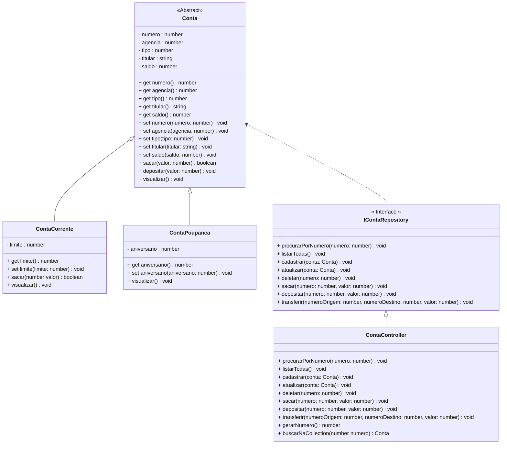

<h1>Projeto 01 - Conta Bancária - Colorindo o Menu </h1>


Na etapa anterior, criamos o Projeto Conta Bancária, que será o nosso Projeto Guia no aprendizado dos Conceitos e aplicação da Orientação a Objetos. Veja o Diagrama de Classes do Projeto Conta Bancária completo na figura abaixo:



<br />

Além de criar o projeto, criamos também a Classe Menu, que é Classe principal do Projeto, que contém o Método main(). Ao executar o Menu, temos o seguinte resultado:

 <div align="center"></div>

Nesta etapa, vamos deixar o nosso Menu colorido, através da Classe **Colors**. Antes, vamos entender como funcionam as cores no Console do TypeScript:

<br />

<h2>1. Cores no Console do TypeScript</h2>


Os Terminais (console) tradicionalmente recebem uma entrada de bytes e os exibem como texto branco em um fundo preto. Se a entrada contiver “caracteres de controle” específicos, o terminal poderá alterar certas propriedades de exibição do texto, como cor ou fonte. Os terminais conseguem exibir no máximo 16 cores. No entanto, as telas de computador modernas são capazes de exibir cores RGB de 24 bits, que fica inviável para o console exibir tantas cores. Para trabalhar com as 16 cores básicas dentro do Console, utilizaremos o padrão ANSI Escape Code.

As sequências de escape ANSI são um padrão adotados pelos terminais para controlar a localização do cursor, cor, estilo de fonte e outras opções em terminais de texto de vídeo e emuladores de terminal. Certas sequências de caracteres, a maioria começando com um caractere de escape ASCII e um caractere de colchete, quando incorporadas ao texto, fazem o terminal interpretar essas sequências como comandos, em vez de texto para exibição literal. 

No caso das Cores, utilizamos um conjunto de códigos específicos que aplicam as cores na fonte (caracteres) e um segundo conjunto de códigos específicos que aplicam as cores no background (plano de fundo)  do texto. Estes códigos são inseridos coma parâmetros do comando **console.log()**.

Veja os principais códigos de cores na tabela abaixo:

| **Nome da Cor** | **Código da cor - texto** | **Nome da Cor de fundo** | **Código da cor - fundo** |
| --------------- | :-----------------------: | ------------------------ | :-----------------------: |
| TEXT_BLACK      |        \ x1b [30m         | BLACK_BACKGROUND         |        \ x1b [40m         |
| TEXT_RED        |        \ x1b [31m         | RED_BACKGROUND           |        \ x1b [41m         |
| TEXT_GREEN      |        \ x1b [32m         | GREEN_BACKGROUND         |        \ x1b [42m         |
| TEXT_YELLOW     |        \ x1b [33m         | YELLOW_BACKGROUND        |        \ x1b [43m         |
| TEXT_BLUE       |        \ x1b [34m         | BLUE_BACKGROUND          |        \ x1b [44m         |
| TEXT_MAGENTA    |        \ x1b [35m         | MAGENTA_BACKGROUND       |        \ x1b [45m         |
| TEXT_CYAN       |        \ x1b [36m         | CYAN_BACKGROUND          |        \ x1b [46m         |
| TEXT_WHITE      |        \ x1b [37m         | FUNDO BRANCO             |        \ x1b [47m         |

Dentro destas 8 cores, existem algumas variações. No caso de texto, temos as opções **STRONG** ( cor na sua versão mais escura, ou seja, menos iluminada) e **BRIGHT** (a cor na sua versão mais clara, ou seja mais iluminada).

Além disso, temos a opção **RESET**, que retira as cores tanto do texto, quanto do fundo da tela, retornando ao esquema de cores padrão do console.

Para simplificar a aplicação das Cores no Menu, vamos Criar a Classe Colors, dentro pasta **src/util**, que conterá um Objeto Literal, composto por diversos atributos, onde cada um representará uma cor específica.

> **Objeto Literal (Object Literal)** é um tipo de dado usado para definir objetos no TypeScript/JavaScript. É uma sintaxe para criar um objeto que é  composto por pares chave-valor, além de permitir a declaração de funções. É uma forma leve e eficiente de criar e armazenar dados relacionados de forma organizada e estruturada.
>
> Objetos Literais são usados para armazenar coleções de dados e também podem ser usados para representar estruturas de dados complexas, como objetos, matrizes, funções e até expressões regulares. Os Objetos Literais também são utilizados para armazenar informações sobre uma instância específica de um objeto, como seu estado ou comportamento.
>
> Os Objetos Literais são escritos na forma de pares chave-valor, onde cada chave é uma string e cada valor pode ser qualquer tipo de dado TypeScript válido.
>
> **Exemplo:**
>
> ```ts
> const pessoa = {
>   nome: 'João Pedro',
>   idade: 30,
>   visualizar: function() {
>     console.log('Olá! Meu nome é: ' + this.nome);
>   }
> };
> ```
>
> Uma vez que um Objeto Literal foi criado, você pode acessar os atributos usando a sintaxe `nome_do_objeto.propriedade` e acessar os métodos usando a sintaxe `nome_do_objeto.metodo()`.
>
> **Exemplo:**
>
> ```ts
> // Acessa o atributo nome
> console.log(pessoa.nome);
> 
> // Acessa o método visualizar()
> pessoa.visualizar();
> ```
>
> <br />
>
> <div align="left"> <a href="https://developer.mozilla.org/pt-BR/docs/Web/JavaScript/Reference/Operators/Object_initializer" target="_blank"><b>Documentação: Objeto Literal</b></a></div>
>
> <br />

<br />

 <h2>👣 Passo 01 - Criar a pasta src/util</h2>


Vamos criar a pasta **src** dentro da pasta do Projeto Conta Bancária e dentro da pasta **src**, vamos criar a pasta **util**:

1. Na **Barra Explorer**, selecione a pasta **contabancaria** e clique no botão **New Folder** (Nova Pasta), indicado na imagem abaixo: 

<div align="center"></div>

2. O nome da pasta será **src**, como mostra a imagem abaixo. Após digitar o nome da pasta, pressione a tecla **enter** do seu teclado para concluir. 

<div align="center"></div>

3. Na **Barra Explorer**, selecione a pasta **src** e clique no botão **New Folder** (Nova Pasta), indicado na imagem abaixo: 

<div align="center"></div>

4. O nome da pasta será **util**, como mostra a imagem abaixo. Após digitar o nome da pasta, pressione a tecla **enter** do seu teclado para concluir. 

<div align="center"></div>

<br />

<h2>👣 Passo 02 - Criar a Classe Colors</h2>


Na sequência, vamos criar o arquivo **Colors.ts**, dentro da nossa pasta **util**:

1. Selecione a pasta **util** e clique no botão **New File** (Novo Arquivo), indicado na imagem abaixo:  

<div align="center"></div>

2. O nome do arquivo será **Colors.ts**, como mostra a figura abaixo. Após digitar o nome do arquivo, pressione a tecla **enter** do seu teclado para concluir. 

<div align="center"></div>

<br />


Vamos implementar o código da Classe Colors e analisar o código abaixo:

```ts
export const colors = {
    reset: "\x1b[0m",  
    fg: {
        black: "\x1b[30m",
        red: "\x1b[31m",
        green: "\x1b[32m",
        yellow: "\x1b[33m",
        blue: "\x1b[34m",
        magenta: "\x1b[35m",
        cyan: "\x1b[36m",
        white: "\x1b[37m",
        gray: "\x1b[90m",
        crimson: "\x1b[38m",
        blackstrong : "\x1b[1;30m",
        redstrong : "\x1b[1;31m",
	    greenstrong : "\x1b[1;32m",
	    yellowstrong : "\x1b[1;33m", 
	    bluestrong : "\x1b[1;34m",
	    magentastrong : "\x1b[1;35m",
	    cyanstrong : "\x1b[1;36m",
        whitestrong: "\x1b[1;37m",
    },
    bg: {
        black: "\x1b[40m",
        red: "\x1b[41m",
        green: "\x1b[42m",
        yellow: "\x1b[43m",
        blue: "\x1b[44m",
        magenta: "\x1b[45m",
        cyan: "\x1b[46m",
        white: "\x1b[47m",
        gray: "\x1b[100m",
        crimson: "\x1b[48m",
        blackbright: "\x1b[0;100m",
        redbright: "\x1b[0;101m",
        greenbright: "\x1b[0;102m",
        yellowbright: "\x1b[0;103m",
        bluebright: "\x1b[0;104m",
        magentabright: "\x1b[0;105m",
        cyanbright: "\x1b[0;106m",
        whitebright: "\x1b[0;107m"
    }
};
```

Na **Classe Colors** foi criado um Objeto Literal, chamado **colors**, composto por 3 atributos:

- **reset:** Restaura as cores padrões do Terminal;
- **fg:** Objeto Literal que contém as cores do texto (foreground);
- **bg:** Objeto Literal que contém as cores do plano de fundo (background).

<br />

<h2>👣 Passo 03 - Atualizar a Classe Menu</h2>


Neste passo, vamos atualizar o código da Classe Menu adicionando cores. Vamos analisar as alterações no código abaixo:

 <div align="left"></div>

**Linha 2:** Importamos a **Classe Colors**, que permite adicionar Cores nos comandos de saída de dados.

**Linha 10:** No comando de saída de dados **console.log()**, adicionamos dois parâmetros **colors.bg.black** e **colors.fg.yellow**, definindo que o texto será exibido na cor amarela e o plano de fundo do texto será preto.

<br />

|  | <div align="left"> **IMPORTANTE:** *Ao aplicar a cor de fundo, esta cor será aplicada apenas no texto, ou seja, ela não será aplicada em toda a tela. Para aplicar na tela será necessário inserir vários espaços em brancos (como fizemos no Menu) para preencher áreas da tela antes e depois do texto.* </div> |
| ------------------------------------------------------------ | ------------------------------------------------------------ |

 <br />

<div align="left"></div>

**Linha 29:** Depois do conteúdo do comando de saída de dados **console.log()**, adicionamos o parâmetro **colors.reset**,  definindo que ao finalizar o Menu, o texto e o plano de fundo voltarão a ter as cores padrão.

**Linha 35:** No comando de saída de dados **console.log()**, adicionamos o parâmetro **colors.fg.greenstrong**, definindo que o texto será exibido na cor verde, em negrito.

**Linha 38:** No comando de saída de dados **console.log()**, adicionamos o parâmetro **colors.reset**,  definindo que ao finalizar o Método **sobre()**, o texto e o plano de fundo voltarão a ter as cores padrão.

 <div align="left"></div>

**Linhas 44, 50, 56, 62, 68, 74, 80, 86 e 92:** No comando de saída de dados **console.log()**, adicionamos o parâmetro **colors.reset**,  definindo que ao finalizar o Método **sobre()**, o texto e o plano de fundo voltarão a ter as cores padrão.

**Linhas 45, 51, 57, 63, 69, 75, 81, 87 e 93:** No comando de saída de dados **console.log()**, adicionamos o parâmetro **colors.reset**, definindo que depois de exibir o título da opção selecionada, o texto e o plano de fundo voltarão a ter as cores padrão.

**Linhas 47, 53, 59, 65, 71, 77, 83, 89 e 95:** Foram adicionadas as chamadas para o Método **keyPress()**, que veremos abaixo.

<br />

|  | <div align="left">**DICA:** *Quando implementarmos as funcionalidades da aplicação aproveite para personalizar as cores da aplicação, apenas evite usar muitas cores.* </div> |
| ------------------------------------------------------------ | ------------------------------------------------------------ |

<br />

 <div align="left"></div>

**Linhas 109 a 113:** Implementação do **Método KeyPress()**.

**Linhas 110:** Antes do conteúdo do comando de saída de dados **console.log()**, adicionamos o parâmetro **colors.reset**,  definindo que ao executar o método **keyPress()**, o texto e o plano de fundo voltarão a ter as cores padrão. 

**Linhas 111:** Exibe a mensagem na tela, requisitando que o usuário pressione a tecla **enter**. 

**Linha 112:** Através do Método **readlinesync.prompt()**, o Console aguardará até que uma tecla seja pressionada, gerando uma pausa, na aplicação. Se a tecla enter for pressionada, a aplicação seguirá o seu fluxo normal, recarregando o Menu. 

<br />

Execute o projeto no Terminal do VSCode, através do comando abaixo:

```bash
ts-node Menu.ts
```

O visual do Menu deve ser semelhante ao da figura abaixo:

 <div align="center"></div>

Ao digitar a **opção 9**, será exibida uma mensagem semelhante a imagem abaixo, contendo os seus dados pessoais, na cor verde.

 <div align="center"></div>

O código completo, você confere abaixo:

```ts
import readlinesync = require("readline-sync");
import { colors } from './src/util/Colors';

export function main() {

    let opcao: number;

    while (true) {

        console.log(colors.bg.black, colors.fg.yellow, 
                    "*****************************************************");
        console.log("                                                     ");
        console.log("                BANCO DO BRAZIL COM Z                ");
        console.log("                                                     ");
        console.log("*****************************************************");
        console.log("                                                     ");
        console.log("            1 - Criar Conta                          ");
        console.log("            2 - Listar todas as Contas               ");
        console.log("            3 - Buscar Conta por Numero              ");
        console.log("            4 - Atualizar Dados da Conta             ");
        console.log("            5 - Apagar Conta                         ");
        console.log("            6 - Sacar                                ");
        console.log("            7 - Depositar                            ");
        console.log("            8 - Transferir valores entre Contas      ");
        console.log("            9 - Sair                                 ");
        console.log("                                                     ");
        console.log("*****************************************************");
        console.log("                                                     ", 
        colors.reset);

        console.log("Entre com a opção desejada: ");
        opcao = readlinesync.questionInt("");

        if (opcao == 9) {
            console.log(colors.fg.greenstrong, 
                "\nBanco do Brazil com Z - O seu Futuro começa aqui!");
            sobre();
            console.log(colors.reset, "");
            process.exit(0);
        }

        switch (opcao) {
            case 1:
                console.log(colors.fg.whitestrong, 
                    "\n\nCriar Conta\n\n", colors.reset);
                
                keyPress()
                break;
            case 2:
                console.log(colors.fg.whitestrong, 
                    "\n\nListar todas as Contas\n\n", colors.reset);

                keyPress()
                break;
            case 3:
                console.log(colors.fg.whitestrong, 
                    "\n\nConsultar dados da Conta - por número\n\n", colors.reset);

                keyPress()
                break;
            case 4:
                console.log(colors.fg.whitestrong, 
                    "\n\nAtualizar dados da Conta\n\n", colors.reset);

                keyPress()
                break;
            case 5:
                console.log(colors.fg.whitestrong, 
                    "\n\nApagar uma Conta\n\n", colors.reset);

                keyPress()
                break;
            case 6:
                console.log(colors.fg.whitestrong, 
                    "\n\nSaque\n\n", colors.reset);

                keyPress()
                break;
            case 7:
                console.log(colors.fg.whitestrong, 
                    "\n\nDepósito\n\n", colors.reset);

                keyPress()
                break;
            case 8:
                console.log(colors.fg.whitestrong, 
                    "\n\nTransferência entre Contas\n\n", colors.reset);

                keyPress()
                break;
            default:
                console.log(colors.fg.whitestrong, 
                    "\nOpção Inválida!\n", colors.reset);

                keyPress()
                break;
        }
    }

}

/* Função com os dados da pessoa desenvolvedora */
function sobre(): void {
    console.log("\n*****************************************************");
    console.log("Projeto Desenvolvido por: ");
    console.log("Generation Brasil - generation@generation.org");
    console.log("github.com/conteudoGeneration");
    console.log("*****************************************************");
}

function keyPress(): void {
    console.log(colors.reset, "");
    console.log("\nPressione enter para continuar...");
    readlinesync.prompt();
}

main();
```

<br />

<div align="left"> <a href="https://github.com/rafaelq80/conta_bancaria_typescript/tree/02_Menu_Colorido" target="_blank"><b>Código fonte: Projeto Conta Bancária</b></a></div>

<br /><br />

<div align="left"><a href="README.md">Voltar</a></div>