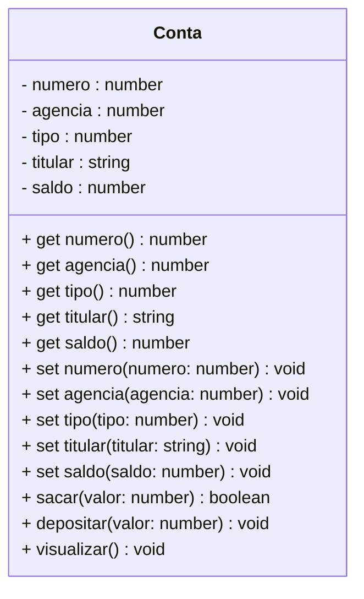

<h1>Projeto 01 - Conta Bancária - Classe Model Conta</h1>


Na etapa anterior, implementamos o Menu na Classe **Menu.ts**, com as respectivas opções para manipular os Objetos da Classe Conta. 

Nesta etapa, vamos criar a Classe Conta no **Namespace conta_bancaria.Model** da nossa aplicação. O Diagrama de Classes do nossa Classe Conta ficará da seguinte forma:



<br />

Durante o Desenvolvimento do Projeto Conta Bancária, vamos criar dentro da pasta **src**, 3 pastas, que também podem ser chamadas de **Camadas**. Dentro destas pastas, iremos criar as Classes e as Interfaces da nossa aplicação. As 3 pastas que serão criadas, respectivamente são:

| Namespace      | Descrição                                                    |
| -------------- | ------------------------------------------------------------ |
| **Model**      | Camada responsável pela abstração dos nossos Objetos. As Classes criadas nesta pasta representam os Objetos da nossa aplicação, que serão compostos por seus Atributos (características) e Métodos (ações). |
| **Repository** | Camada responsável por implementar a Interface, que contém diversos Métodos pré-implementados para a manipulação dos dados de um Objeto, entre eles os Métodos salvar, deletar, listar e atualizar dados do Objeto (CRUD). |
| **Controller** | Camada responsável por criar a Classe que implementará os Métodos criados na Interface Repository. Lembre-se que em uma Interface não é possível implementar Métodos, apenas assiná-los. |

<br />

<h2>👣 Passo 01 - Criar a pasta Model</h2>


Dentro do projeto **conta_bancaria**, vamos criar a pasta **model**:

1. Na **Barra Explorer**, selecione a pasta **src** e clique no botão **New Folder** (Nova Pasta), indicado na imagem abaixo: 

<div align="center"></div>

2. O nome da pasta será **model**, como mostra a imagem abaixo. Após digitar o nome da pasta, pressione a tecla **enter** do seu teclado para concluir. 

<div align="center"></div>

<br />

<h2>👣 Passo 02 - Criar a Classe Conta</h2>


Agora vamos criar a **Classe Conta** na **pasta model**:

1. Selecione a pasta **model** e clique no botão **New File** (Novo Arquivo), indicado na imagem abaixo:  

<div align="center"></div>

2. O nome do arquivo será **Conta.ts**, como mostra a figura abaixo. Após digitar o nome do arquivo, pressione a tecla **enter** do seu teclado para concluir. 

<div align="center"></div>

<br />

Vamos implementar e analisar o código da Classe Conta, começando pelos atributos:

 <div align="left"></div>

**Linhas 03 a 07:** Criamos as variáveis que representam os Atributos da Classe Conta, que foram definidos no Diagrama de Classes acima. Observe que todos os Atributos possuem o modificador de acesso **private**, ou seja, são acessíveis apenas dentro da Classe Conta. Eles foram criados desta forma para implementar o **Encapsulamento**, ou seja, os dados de um Objeto somente poderão ser alterados e recuperados por uma outra Classe através dos Métodos Get e Set, que serão criados logo abaixo.

<br />

<h2 >👣 Passo 03 - Criar o Método Construtor na Classe Conta</h2>


Depois de criarmos os Atributos, precisamos criar o **Método Construtor** da Classe Conta. Através destes Método, poderemos criar novos Objetos da Classe Conta. 

Vamos implementar e analisar o código do Método Construtor da Classe Conta:

 <div align="left"></div>

**Linha 09:** O Método Construtor foi criado com os respectivos parâmetros. Observe que as variáveis inseridas possuem os mesmos nomes e tipos dos Atributos da Classe Conta. Ao instanciar uma novo Objeto, o Método Construtor receberá todos os dados do Objeto através deste parâmetros, que serão atribuídos aos Atributos do Objeto da Classe Conta.

**Linhas 10 a 14:** Os dados recebidos nos parâmetros do Método Construtor são atribuídos aos respectivos Atributos da Classe Conta. Como os parâmetros possuem os mesmos nomes do Atributos da Classe, foi utilizada a palavra reservada **this** para diferenciar o Atributo da Classe Conta do parâmetro do Método Construtor da Classe Conta.

 <div align="center"></div>

<br />

<h2>👣 Passo 04 - Criar os Métodos Get e Set</h2>


Depois de criarmos os Atributos e o Método Construtor, precisamos criar os **Métodos Get e Set** para todos os Atributos da Classe Conta. Através destes Métodos, poderemos acessar e modificar os Atributos da Classe Conta, a partir de outras Classes. Desta forma, manteremos os nosso Atributos protegidos através do Encapsulamento.

Vamos implementar e analisar o código dos Métodos **Get e Set** da Classe Conta:

 <div align="left"></div>

Observe que foi criado um Método Get para cada Atributo da Classe Conta e cada um implicitamente possui o mesmo tipo de dado do respectivo Atributo, porquê o valor armazenado no Atributo será retornado, através do comando **return**. Se o Atributo é do tipo string, o comando return obrigatoriamente retornará um dado do tipo string, por exemplo.

Da mesma forma, foi criado um Método Set para cada Atributo da Classe Conta, entretanto todos os Métodos são implicitamente do tipo **void** (sem retorno de valor), porquê o valor do Atributo será alterado e o Método não irá retornar nenhum valor. Como o valor do Atributo será modificado, na assinatura de cada Método Set foi adicionado um parâmetro com o mesmo nome e tipo do respectivo Atributo, e a modificação será efetuada através de uma atribuição, onde o Atributo, identificado pela palavra reservada **this**, receberá o valor recebido através do parâmetro do Método.

<br />

<h2>👣 Passo 05 - Criar os Métodos Específicos</h2>


Vamos criar 3 Métodos Específicos na Classe Conta:

1. **Sacar:** Método responsável por efetuar a operação de saque na Conta;
2. **Depositar:** Método responsável por efetuar a operação de depósito na Conta;
3. **Visualizar:** Método responsável por efetuar a operação de visualizar todos os dados da Conta.

 <div align="left"></div>

**Linha 57:** O Método Sacar, do tipo **boolean**, foi criado contendo o parâmetro **valor: number**, que receberá o valor a ser sacado da conta. O parâmetro valor é do tipo number porquê o Atributo saldo é do tipo number.

**Linha 59:** Através do laço condicional if, verifica se o valor do saque é menor do que o saldo disponível na conta. Para obter o saldo atual da conta, foi utilizado a referência **this._saldo**. A palavra reservada **this** foi utilizada para fazer referência ao atributo **_saldo** do Objeto da Classe Conta, que será efetuado o saque.

**Linha 60:** Caso o saldo seja insuficiente, será exibida a mensagem de **Saldo Insuficiente** no console.

**Linha 61:** Como se trata de um Método do tipo boolean, é necessário retornar uma resposta `true` ou `false`. Como o saque nesta condição não pode ser efetuado, retornaremos **false**. O comando **return** tem a função de retornar um valor após o Método finalizar o processamento, exceto em métodos do tipo void.

**Linha 64:** Caso a condição anterior seja falsa (o saldo é suficiente), o saque será efetuado. Para atualizar o saldo, foi utilizado a referência **this._saldo**, que receberá o resultado da operação **this._saldo - valor**.

**Linha 65:** Como o saque foi efetuado, retornaremos **true**. 

------

💰 **Exemplo - Saque bem sucedido:**

**Saldo atual:** *R$ 1000.00*

**Valor do Saque:** *R$ 100.00*

*Saldo = 1000.00 - 100.00*

**Saldo atualizado:** *R$ 900.00*

------

💰 **Exemplo - Saque mal sucedido:**

**Saldo atual:** *R$ 1000.00*

**Valor do Saque:** *R$ 2000.00*

*2000.00 é maior do que 1000.00*

**Mensagem:** *Saldo Insuficiente!*

**Saldo atual:** *R$ 1000.00*

------

<br />

 <div align="left"></div>

**Linha 68:** O Método Depositar, do tipo void, foi criado contendo o parâmetro **valor: number**, que receberá o valor a ser depositado na conta. O parâmetro valor é do tipo number porquê o Atributo saldo é do tipo number. O Método Depositar foi definido como void porquê ele não precisa retornar uma confirmação, pois diferente do Método Sacar, não é necessário efetuar nenhuma verificação no saldo da conta antes de efetuar o depósito.

**Linha 69:** Para atualizar o saldo, foi utilizado a referência **this._saldo**, que receberá o resultado da operação **this._saldo + valor**.

------

💰 **Exemplo - Depósito bem sucedido:**

**Saldo atual:** *R$ 1000.00*

**Valor do Depósito:** *R$ 500.00*

*Saldo = 1000.00 + 500.00*

**Saldo atualizado:** *R$ 1500.00*

------

<br />

 <div align="left"></div>

**Linha 72:** O Método Visualizar, do tipo void, foi criado sem parâmetros. O Método Visualizar foi definido como void porquê ele não precisa retornar uma confirmação, apenas exibir os dados de um Objeto da Classe Conta no console.

**Linha 74:** Foi criada a variável string, chamada **tipo**, para receber textualmente o tipo da Conta. Como o Atributo tipo armazena um numero, que representa o código do tipo da conta, vamos criar um laço condicional, para ao invés de exibir no console o código numérico, vamos exibir uma descrição para o código. 

**Linhas 76 a 83:** Através do laço condicional switch/case, vamos checar se o tipo da conta é 1 ou 2. Caso seja 1, exibe Conta Corrente, caso seja 2 exibe Conta Poupança. Como parâmetro do comando switch, foi passado o Atributo **_tipo**. A palavra reservada **this** foi utilizada para fazer referência ao Atributo **_tipo**.

**Linhas 85 a 92:** Através do comando de Saída **console.log()**, foi construída a exibição dos dados do Objeto Conta no console. Para obter os dados de cada Atributo do Objeto conta, foi utilizada a palavra reservada **this**, para fazer referência aos atributos do Objeto Conta, que terá os dados exibidos no console, seguido do nome do Atributo que será exibido em cada linha. Observe que na **linha 90**, foi inserida a variável string **tipo**, contendo a descrição do tipo da conta, ao invés do Atributo _tipo, que possui o código numérico do tipo da conta.

O código completo da Classe Conta, você confere abaixo:

```ts
export class Conta {

    private _numero: number;
    private _agencia: number;
    private _tipo: number;
    private _titular: string;
    private _saldo: number;

    constructor(numero: number, agencia: number, tipo: number, titular: string, saldo: number) {
        this._numero = numero;
        this._agencia = agencia;
        this._tipo = tipo;
        this._titular = titular;
        this._saldo = saldo;
    }

    public get numero() {
        return this._numero;
    }

    public set numero(numero: number) {
        this._numero = numero;
    }

    public get agencia() {
        return this._agencia;
    }

    public set agencia(agencia: number) {
        this._agencia = agencia;
    }

    public get tipo() {
        return this._tipo;
    }

    public set tipo(tipo: number) {
        this._tipo = tipo;
    }

    public get titular() {
        return this._titular;
    }

    public set titular(titular: string) {
        this._titular = titular;
    }

    public get saldo() {
        return this._saldo;
    }

    public set saldo(saldo: number) {
        this._saldo = saldo;
    }

    public sacar(valor: number): boolean {

        if (this._saldo < valor) {
            console.log("\n Saldo Insuficiente!");
            return false;
        }

        this._saldo = this._saldo - valor;
        return true;
    }

    public depositar(valor: number): void {
        this._saldo = this._saldo + valor;
    }

    public visualizar(): void {

        let tipo: string = "";

        switch (this._tipo) {
            case 1:
                tipo = "Conta Corrente";
                break;
            case 2:
                tipo = "Conta Poupança";
                break;
        }

        console.log("\n\n*****************************************************");
        console.log("Dados da Conta:");
        console.log("*****************************************************");
        console.log("Numero da Conta: " + this._numero);
        console.log("Agência: " + this._agencia);
        console.log("Tipo da Conta: " + tipo);
        console.log("Titular: " + this._titular);
        console.log("Saldo: " + this._saldo.toFixed(2));

    }

}
```


<br />

<h2>👣 Passo 06 - Atualizar a Classe Menu</h2>


Neste passo, vamos atualizar o código da Classe Menu adicionando algumas linhas para testar a Classe Conta. Vamos analisar as alterações no código abaixo:

 <div align="left"></div>

**Linha 3:** Através do comando **import** importamos a Classe **Conta**, permitindo criar novos Objetos Conta e utilizar os seus Métodos.

**Linha 09:** Foi instanciado um Objeto chamado **conta**, da Classe Conta, através do **Método Construtor**. Para chamar o Método Construtor, foi utilizada a palavra reservada **new**.

**Linha 10:** O Objeto conta, da Classe Conta, chama o **Método visualizar()**, que exibirá no console todos os dados do Objeto.

**Linha 11:** O Objeto conta, da Classe Conta, chama o **Método sacar()**, que tentará fazer um saque na conta. Como o valor passado é maior que o saldo, o saque não será efetuado e será exibida a mensagem: **Saldo Insuficiente!**.

**Linha 12:** O Objeto cconta, da Classe Conta, chama novamente o **Método visualizar()**, para confirmar que o valor do saldo não foi alterado.

**Linha 13:** O Objeto conta, da Classe Conta, chama o **Método depositar()**, que fará um depósito na conta.

**Linha 14:** O Objeto conta, da Classe Conta, chama novamente o **Método visualizar()**, para confirmar que o valor do saldo foi alterado.

Execute o projeto no Terminal do VSCode, através do comando abaixo:

```bash
ts-node Menu.ts
```

O resultado, você confere abaixo:

```bash
*********************************************************************
Dados da Conta:
*********************************************************************
Numero da Conta: 1
Agência: 123
Tipo da Conta: Conta Corrente
Titular: Adriana
Saldo: 10000.0

 Saldo Insuficiente!


*********************************************************************
Dados da Conta:
*********************************************************************
Numero da Conta: 1
Agência: 123
Tipo da Conta: Conta Corrente
Titular: Adriana
Saldo: 10000.0


*********************************************************************
Dados da Conta:
*********************************************************************
Numero da Conta: 1
Agência: 123
Tipo da Conta: Conta Corrente
Titular: Adriana
Saldo: 15000.0

menu...
```

<br />


|  | <div align="left"> **ALERTA DE BSM:** *Mantenha a Atenção aos Detalhes ao executar o projeto. Observe que as linhas acima, serão exibidas antes do Menu, logo você precisará rolar a tela do Console para cima, para visualizar os testes com a Classe Conta.* </div> |
| ------------------------------------------------------------ | ------------------------------------------------------------ |

<br />

O código completo da Classe Menu, você confere abaixo:

```ts
import readlinesync from 'readline-sync';
import { colors } from './src/util/Colors';
import { Conta } from './src/model/Conta';

export function main() {

    let opcao: number;

    // Objeto da Classe Conta (Teste)
    const conta: Conta = new Conta(1, 123, 1, "Adriana", 10000);
    conta.visualizar();
    conta.sacar(10500);
    conta.visualizar();
    conta.depositar(5000);
    conta.visualizar();

    while (true) {

        console.log(colors.bg.black, colors.fg.yellow, 
                    "*****************************************************");
        console.log("                                                     ");
        console.log("                BANCO DO BRAZIL COM Z                ");
        console.log("                                                     ");
        console.log("*****************************************************");
        console.log("                                                     ");
        console.log("            1 - Criar Conta                          ");
        console.log("            2 - Listar todas as Contas               ");
        console.log("            3 - Buscar Conta por Numero              ");
        console.log("            4 - Atualizar Dados da Conta             ");
        console.log("            5 - Apagar Conta                         ");
        console.log("            6 - Sacar                                ");
        console.log("            7 - Depositar                            ");
        console.log("            8 - Transferir valores entre Contas      ");
        console.log("            9 - Sair                                 ");
        console.log("                                                     ");
        console.log("*****************************************************");
        console.log("                                                     ", 
        colors.reset);

        console.log("Entre com a opção desejada: ");
        opcao = readlinesync.questionInt("");

        if (opcao == 9) {
            console.log(colors.fg.greenstrong, "\nBanco do Brazil com Z - O seu Futuro começa aqui!");
            sobre();
            console.log(colors.reset, "");
            process.exit(0);
        }

        switch (opcao) {
            case 1:
                console.log(colors.fg.whitestrong, "\n\nCriar Conta\n\n", colors.reset);
                
                keyPress()
                break;
            case 2:
                console.log(colors.fg.whitestrong, "\n\nListar todas as Contas\n\n", colors.reset);

                keyPress()
                break;
            case 3:
                console.log(colors.fg.whitestrong, "\n\nConsultar dados da Conta - por número\n\n", colors.reset);

                keyPress()
                break;
            case 4:
                console.log(colors.fg.whitestrong, "\n\nAtualizar dados da Conta\n\n", colors.reset);

                keyPress()
                break;
            case 5:
                console.log(colors.fg.whitestrong, "\n\nApagar uma Conta\n\n", colors.reset);

                keyPress()
                break;
            case 6:
                console.log(colors.fg.whitestrong, "\n\nSaque\n\n", colors.reset);

                keyPress()
                break;
            case 7:
                console.log(colors.fg.whitestrong, "\n\nDepósito\n\n", colors.reset);

                keyPress()
                break;
            case 8:
                console.log(colors.fg.whitestrong, "\n\nTransferência entre Contas\n\n", colors.reset);

                keyPress()
                break;
            default:
                console.log(colors.fg.whitestrong, "\nOpção Inválida!\n", colors.reset);

                keyPress()
                break;
        }
    }

}

/* Função com os dados da pessoa desenvolvedora */
function sobre(): void {
    console.log("\n*****************************************************");
    console.log("Projeto Desenvolvido por: ");
    console.log("Generation Brasil - generation@generation.org");
    console.log("github.com/conteudoGeneration");
    console.log("*****************************************************");
}

function keyPress(): void {
    console.log(colors.reset, "");
    console.log("\nPressione enter para continuar...");
    readlinesync.prompt();
}

main();
```

<br />

<div align="left"> <a href="https://github.com/rafaelq80/conta_bancaria_typescript/tree/03_Model_Conta" target="_blank"><b>Código fonte: Projeto Conta Bancária</b></a></div>

<br /><br />

<div align="left"><a href="README.md">Voltar</a></div>