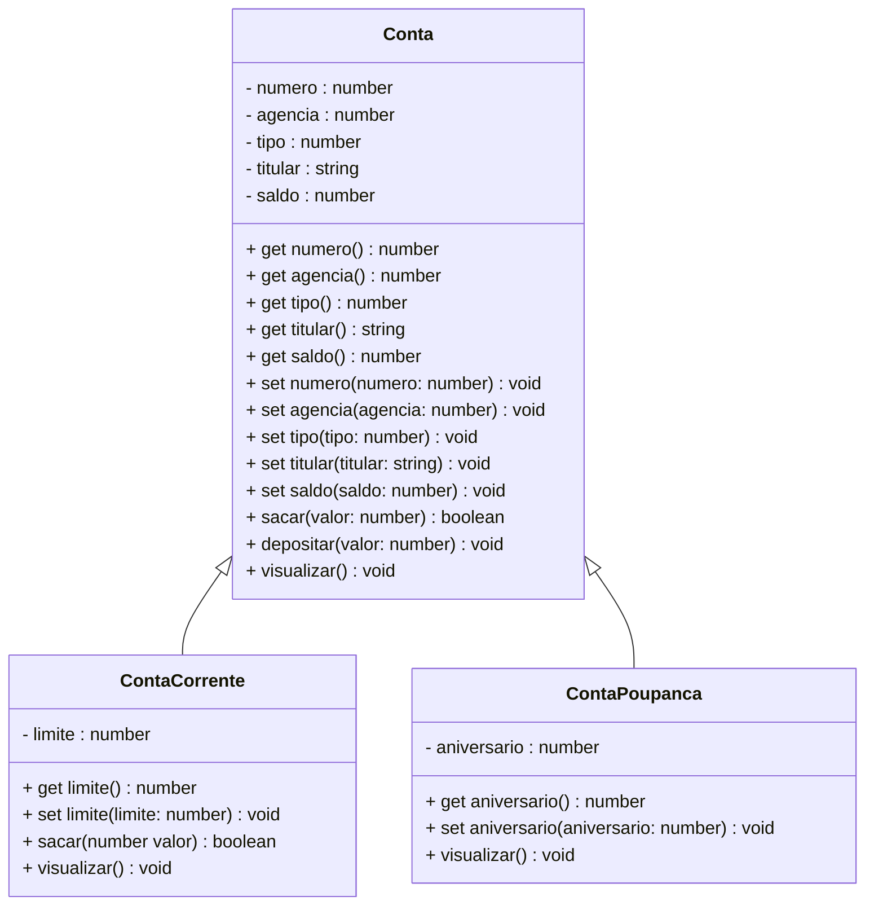

<h1>Projeto 01 - Conta Bancária - Heranças - Classe Conta</h1>


Na etapa anterior, implementamos a nossa primeira Classe Model, a Classe Conta, que define uma Conta Bancária genérica, com os Atributos comuns a toda e qualquer tipo de conta.

Nesta etapa, vamos implementar as Classes Model **ContaCorrente** e **ContaPoupanca** como **Heranças da Classe Conta**. O Diagrama de Classes do nosso Projeto ficará da seguinte forma:



<br />

<h2>👣 Passo 01 - Criar a Classe ContaCorrente herdando a Classe Conta</h2>


Agora vamos criar a **Classe ContaCorrente** na **pasta model**.

1. Selecione a pasta **model** e clique no botão **New File** (Novo Arquivo), indicado na imagem abaixo:  

<div align="center"></div>

2. O nome do arquivo será **ContaCorrente.ts**, como mostra a figura abaixo. Após digitar o nome do arquivo, pressione a tecla **enter** do seu teclado para concluir. 

<div align="center"></div>

<br />

Vamos implementar e analisar o código da **Classe ContaCorrente herdando a Classe Conta**:

 <div align="left"></div>

**Linha 01:** Através da palavra reservada **import**, importamos a Classe Model **Conta**.

**Linha 02:** Observe que na assinatura da Classe **ContaCorrente**, vamos adicionar a palavra reservada **extends** e na sequência o nome da Classe que será herdada (**Conta**). 

**Linha 05:** Adicionamos o atributo **_limite**, específico da Classe **ContaCorrente**.

**Linha 07:** O Método Construtor foi criado com os respectivos parâmetros herdados da Classe Conta e os seus parâmetros específicos. Observe que as variáveis inseridas possuem o mesmo nome e tipo dos Atributos da Classe Conta e ContaCorrente. Ao instanciar uma novo Objeto, o Método Construtor receberá todos os dados do Objeto através deste parâmetros, que serão atribuídos aos Atributos do Objeto

**Linha 09:** Observe que os Atributos da Classe Conta são acessados e modificados através do Método **super()**. Nos argumentos do Método super(), foram adicionados apenas os parâmetros do Método Construtor ContaCorrente, que serão recebidos do Método Construtor da Classe Conta. A reutilização do código da Classe Conta, na Classe ContaCorrente é possível graças ao conceito de Herança.

**Linha 10:** Vamos adicionar a variável **_limite**, que representa um Atributo específico da Classe ContaCorrente, que foram definidos no Diagrama de Classes acima. Observe que o Atributo possui o modificador de acesso **private**, ou seja, é acessível apenas dentro da Classe ContaCorrente. 

> **Observações Importantes!** 
>
> A palavra-chave **super** refere-se a uma **superclasse**. Ela indica a chamada ao Método Construtor da **superclasse**. Caso a **superclasse** não possua um Método Construtor e o Método Construtor da **subclasse** não chamar nenhum outro Método Construtor da **superclasse** explicitamente o TypeScript vai informar um erro.
>
> Observe que na **Classe ContaCorrente** foram declaradas apenas **as diferenças (Métodos e Atributos)** entre a **subclasse** e **superclasse**, ou seja, o reuso é automático.

<br />

<h2>👣 Passo 02 - Criar os Métodos Get e Set</h2>


Depois de criarmos os Atributos e o Método Construtor, precisamos criar os **Métodos Get e Set** para o Atributo limite da Classe ContaCorrente. Através destes Métodos, poderemos acessar e modificar os Atributos da Classe ContaCorrente a partir de outras Classes e mantermos o nosso Atributo protegido através do Encapsulamento.

A implementação dos Métodos ficarão semelhantes a imagem abaixo:

 <div align="left"></div>

<br />

|  | <div align="left"> **ATENÇÃO:** *Observe que foram implementados Métodos Get e Set apenas do atributo limite. Os demais atributos herdarão os Métodos Get e Set da Superclasse.* </div> |
| ------------------------------------------------------------ | ------------------------------------------------------------ |

<br />

<h2>👣 Passo 03 - Criar os Métodos Específicos</h2>


Vamos criar 2 Métodos Específicos na Classe ContaCorrente:

1. **Sacar:** Método responsável por efetuar a operação de saque na ContaCorrente. Este Método será implementado sobrescrevendo o Método Sacar da Classe Conta;
2. **Visualizar:** Método responsável por efetuar a operação de Visualizar todos os dados da ContaCorrente. Este Método será implementado sobrescrevendo o Método Visualizar da Classe Conta

 <div align="left"></div>

**Linha 21:** Observe que a assinatura do Método será igual ao do Método **sacar()** da Classe Conta.

**Linhas 23 a 29:** O Método **sacar()** da Classe ContaCorrente é praticamente igual ao Método sacar() da Classe Conta. A única mudança será no laço condicional if (linha 23), que verifica se o valor do saque é menor do que o saldo disponível na conta somado com o limite da conta.

 <div align="left"></div>

**Linha 32:** Observe que a assinatura do Método será igual ao do Método **visualizar()** da Classe Conta.

**Linha33:** Foi adicionado o comando **super.visualizar()**, que executa o Método visualizar() da Classe Conta. O comando super pode ser utilizado na Classe filha pra chamar qualquer Método da Classe mãe.

**Linha 34:** Através do comando de Saída **console.log()**, foi adicionado o Atributo **_limite**. Para obter os dados do Atributo limite da Classe ContaCorrente, foi utilizada a palavra reservada **this**, para fazer referência ao Objeto que exibirá os dados no console, seguido do nome do Atributo que será exibido em cada linha.

> **Observações Importantes!**
>
> Observe que as assinaturas dos Métodos **Sacar e Visualizar** da Classe ContaCorrente são praticamente as mesmas da Classe Conta, entretanto eles possuem uma implementação diferente da Classe Conta, logo os Métodos **Sacar e Visualizar** da Classe Conta foram Sobrescritos na Classe ContaCorrente.
>
> Os Métodos **Sacar e Visualizar** da Classe ContaCorrente foram sobrescritos por um simples motivo: A Classe ContaCorrente **não possui acesso direto** às variáveis de instância privadas (Atributos) da **Superclasse**, ou seja, esses métodos não podem alterar diretamente uma variável de instância, embora cada objeto da Classe **ContaCorrente** tenha uma variável de instância igual a da Superclasse, logo para executarem um processamento diferente da Superclasse, eles precisam ser Sobrescritos.
>
> Um ponto de atenção importante em relação a Sobrescrita é que um **método redefinido em uma Subclasse** com o **mesmo nome** e **mesma lista de parâmetros** que o **método em uma de suas classes antecessoras**, automaticamente oculta o método da classe ancestral (superclasse) a partir da Subclasse, ou seja, ele passa a usar o Método da Subclasse.

O código completo da Classe ContaCorrente, você confere abaixo:

```ts
import { Conta } from "./Conta";

export class ContaCorrente extends Conta {

    private _limite: number;

    constructor(numero: number, agencia: number, tipo: number, titular: string, 
        saldo: number, limite: number) {
        super(numero, agencia, tipo, titular, saldo);
        this._limite = limite;
    }
    
    public get limite() {
        return this._limite;
    }

    public set limite(limite: number) {
        this._limite = limite;
    }

    public sacar(valor: number): boolean {

        if ((this.saldo + this._limite) < valor) {
            console.log("\n Saldo Insuficiente!");
            return false;
        }

        this.saldo = this.saldo - valor;
        return true;
    }

    public visualizar(): void {
        super.visualizar();
        console.log("Limite: " + this._limite.toFixed(2));
    }

}
```

<br />


<h2>👣 Passo 04 - Criar a Classe ContaPoupanca herdando a Classe Conta</h2>


Agora vamos criar a **Classe ContaPoupanca** na **pasta model**.


1. Selecione a pasta **model** e clique no botão **New File** (Novo Arquivo), indicado na imagem abaixo:  

<div align="center"></div>

2. O nome do arquivo será **ContaPoupanc.ts**, como mostra a figura abaixo. Após digitar o nome do arquivo, pressione a tecla **enter** do seu teclado para concluir. 

<div align="center"></div>

<br />

Vamos implementar o código da Classe ContaPoupanca herdando a Classe Conta, conforme o código abaixo:


```ts
import { Conta } from "./Conta";

export class ContaPoupanca extends Conta {

    private _aniversario: number;

    constructor(numero: number, agencia: number, tipo: number, titular: string, 
        saldo: number, aniversario: number) {
        super(numero, agencia, tipo, titular, saldo);
        this._aniversario = aniversario;
    }
    public get aniversario() {
        return this._aniversario;
    }

    public set aniversario(aniversario: number) {
        this._aniversario = aniversario;
    }

    public visualizar(): void {
        super.visualizar();
        console.log("Dia do aniversário: " + this._aniversario);
    }

}
```

Observe que na **Classe ContaPoupanca** foram declaradas apenas **as diferenças (Métodos e Atributos)** entre a **subclasse** e **superclasse**, ou seja, o reuso é automático. Além disso, apenas o Método **Visualizar()** foi Sobrescrito.

<br />

<h2>👣 Passo 05 - Atualizar a Classe Menu</h2>


1. Abra a Classe **Menu**;
2. Adicione os testes das **Classes ContaCorrente e ContaPoupanca**, como mostra a imagem abaixo:

<div align="center"></div>

Observe que foi instanciado um Objeto da Classe ContaCorrente e outro Objeto da Classe ContaPoupanca, chamando os respectivos Métodos de cada Classe. 

Execute o projeto no Terminal do VSCode, através do comando abaixo:

```bash
ts-node Menu.ts
```

O resultado, você confere abaixo:

```bash
*****************************************************
Dados da Conta:
*****************************************************
Numero da Conta: 1
Agência: 123
Tipo da Conta: Conta Corrente
Titular: Adriana
Saldo: 10000.00

 Saldo Insuficiente!


*****************************************************
Dados da Conta:
*****************************************************
Numero da Conta: 1
Agência: 123
Tipo da Conta: Conta Corrente
Titular: Adriana
Saldo: 10000.00


*****************************************************
Dados da Conta:
*****************************************************
Numero da Conta: 1
Agência: 123
Tipo da Conta: Conta Corrente
Titular: Adriana
Saldo: 15000.00


*****************************************************
Dados da Conta:
*****************************************************
Numero da Conta: 2
Agência: 123
Tipo da Conta: Conta Corrente
Titular: Mariana
Saldo: 15000.00
Limite: 1000.00


*****************************************************
Dados da Conta:
*****************************************************
Numero da Conta: 2
Agência: 123
Tipo da Conta: Conta Corrente
Titular: Mariana
Saldo: 13000.00
Limite: 1000.00


*****************************************************
Dados da Conta:
*****************************************************
Numero da Conta: 2
Agência: 123
Tipo da Conta: Conta Corrente
Titular: Mariana
Saldo: 14000.00
Limite: 1000.00


*****************************************************
Dados da Conta:
*****************************************************
Numero da Conta: 3
Agência: 123
Tipo da Conta: Conta Poupança
Titular: Victor
Saldo: 1000.00
Dia do aniversário: 10


*****************************************************
Dados da Conta:
*****************************************************
Numero da Conta: 3
Agência: 123
Tipo da Conta: Conta Poupança
Titular: Victor
Saldo: 800.00
Dia do aniversário: 10


*****************************************************
Dados da Conta:
*****************************************************
Numero da Conta: 3
Agência: 123
Tipo da Conta: Conta Poupança
Titular: Victor
Saldo: 1800.00
Dia do aniversário: 10

Menu...
```

<br />

Observe que as Operações de Saque e Depósito, efetuadas nos Objetos das Classes ContaCorrente e ContaPoupanca, foram efetuados com sucesso.

<br />


|  | <div align="left"> **ALERTA DE BSM:** *Mantenha a Atenção aos Detalhes ao executar o projeto. Observe que as linhas acima, serão exibidas antes do Menu, logo você precisará rolar a tela do Console para cima, para Visualizar os testes.* </div> |
| ------------------------------------------------------------ | ------------------------------------------------------------ |

<br />

O código completo da Classe Menu, você confere abaixo:

```ts
import readlinesync from 'readline-sync';
import { colors } from './src/util/Colors';
import { Conta } from './src/model/Conta';
import { ContaCorrente } from './src/model/ContaCorrente';
import { ContaPoupanca } from './src/model/ContaPoupanca';

export function main() {

    let opcao: number;
    
   // Objeto da Classe Conta (Teste)
    const conta: Conta = new Conta(1, 123, 1, "Adriana", 10000);
    conta.visualizar();
    conta.sacar(10500);
    conta.visualizar();
    conta.depositar(5000);
    conta.visualizar();

   // Objeto da Classe ContaCorrente (Teste)
    const contacorrente: ContaCorrente = new ContaCorrente(2, 123, 1, "Mariana", 15000, 1000);
    contacorrente.visualizar();
    contacorrente.sacar(2000);
    contacorrente.visualizar();
    contacorrente.depositar(1000);
    contacorrente.visualizar();

    // Objeto da Classe ContaPoupanca (teste)
    const contapoupanca: ContaPoupanca = new ContaPoupanca(3, 123, 2, "Victor", 1000, 10);
    contapoupanca.visualizar();
    contapoupanca.sacar(200);
    contapoupanca.visualizar();
    contapoupanca.depositar(1000);
    contapoupanca.visualizar();

    while (true) {

        console.log(colors.bg.black, colors.fg.yellow, 
                    "*****************************************************");
        console.log("                                                     ");
        console.log("                BANCO DO BRAZIL COM Z                ");
        console.log("                                                     ");
        console.log("*****************************************************");
        console.log("                                                     ");
        console.log("            1 - Criar Conta                          ");
        console.log("            2 - Listar todas as Contas               ");
        console.log("            3 - Buscar Conta por Numero              ");
        console.log("            4 - Atualizar Dados da Conta             ");
        console.log("            5 - Apagar Conta                         ");
        console.log("            6 - Sacar                                ");
        console.log("            7 - Depositar                            ");
        console.log("            8 - Transferir valores entre Contas      ");
        console.log("            9 - Sair                                 ");
        console.log("                                                     ");
        console.log("*****************************************************");
        console.log("                                                     ", colors.reset);

        console.log("Entre com a opção desejada: ");
        opcao = readlinesync.questionInt("");

        if (opcao == 9) {
            console.log(colors.fg.greenstrong, "\nBanco do Brazil com Z - O seu Futuro começa aqui!");
            sobre();
            console.log(colors.reset, "");
            process.exit(0);
        }

        switch (opcao) {
            case 1:
                console.log(colors.fg.whitestrong, "\n\nCriar Conta\n\n", colors.reset);
                
                keyPress()
                break;
            case 2:
                console.log(colors.fg.whitestrong, "\n\nListar todas as Contas\n\n", colors.reset);

                keyPress()
                break;
            case 3:
                console.log(colors.fg.whitestrong, "\n\nConsultar dados da Conta - por número\n\n", colors.reset);

                keyPress()
                break;
            case 4:
                console.log(colors.fg.whitestrong, "\n\nAtualizar dados da Conta\n\n", colors.reset);

                keyPress()
                break;
            case 5:
                console.log(colors.fg.whitestrong, "\n\nApagar uma Conta\n\n", colors.reset);

                keyPress()
                break;
            case 6:
                console.log(colors.fg.whitestrong, "\n\nSaque\n\n", colors.reset);

                keyPress()
                break;
            case 7:
                console.log(colors.fg.whitestrong, "\n\nDepósito\n\n", colors.reset);

                keyPress()
                break;
            case 8:
                console.log(colors.fg.whitestrong, "\n\nTransferência entre Contas\n\n", colors.reset);

                keyPress()
                break;
            default:
                console.log(colors.fg.whitestrong, "\nOpção Inválida!\n", colors.reset);

                keyPress()
                break;
        }
    }

}

/* Função com os dados da pessoa desenvolvedora */
function sobre(): void {
    console.log("\n*****************************************************");
    console.log("Projeto Desenvolvido por: ");
    console.log("Generation Brasil - generation@generation.org");
    console.log("github.com/conteudoGeneration");
    console.log("*****************************************************");
}

function keyPress(): void {
    console.log(colors.reset, "");
    console.log("\nPressione enter para continuar...");
    readlinesync.prompt();
}

main();
```

<br />

<div align="left"> <a href="https://github.com/rafaelq80/conta_bancaria_typescript/tree/05_Model_ContaPoupanca" target="_blank"><b>Código fonte: Projeto Conta Bancária</b></a></div>

<br /><br />

<div align="left"><a href="README.md">Voltar</a></div>