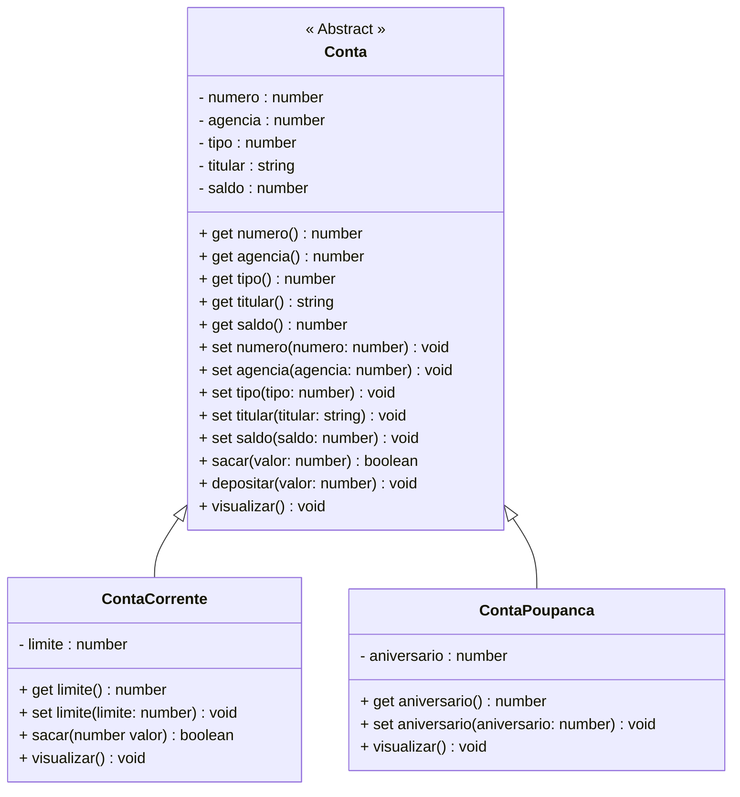

<h1>Projeto 01 - Conta Bancária - Classes Abstratas - Classe Conta</h1>


Na etapa anterior, implementamos as Classes Model **ContaCorrente** e **ContaPoupanca** como **Heranças da Classe Conta**. 

Nesta etapa, vamos transformar a Classe **Conta** em uma **Classe Abstrata**. O Diagrama de Classes do nosso Projeto ficará da seguinte forma:



<br />

<h2>👣 Passo 01 - Implementar a Classe Conta como Classe Abstrata</h2>


1. Abra a Classe **Conta**:

2. Adicione o modificador **abstract** na assinatura da Classe **Conta**, conforme indicado na imagem abaixo:

<div align="center"></div>

3. O código completo da Classe **Conta**, você confere abaixo:

```ts
export abstract class Conta {

    private _numero: number;
    private _agencia: number;
    private _tipo: number;
    private _titular: string;
    private _saldo: number;

    constructor(numero: number, agencia: number, tipo: number, titular: string, saldo: number) {
        this._numero = numero;
        this._agencia = agencia;
        this._tipo = tipo;
        this._titular = titular;
        this._saldo = saldo;
    }

    public get numero() {
        return this._numero;
    }

    public set numero(numero: number) {
        this._numero = numero;
    }

    public get agencia() {
        return this._agencia;
    }

    public set agencia(agencia: number) {
        this._agencia = agencia;
    }

    public get tipo() {
        return this._tipo;
    }

    public set tipo(tipo: number) {
        this._tipo = tipo;
    }

    public get titular() {
        return this._titular;
    }

    public set titular(titular: string) {
        this._titular = titular;
    }

    public get saldo() {
        return this._saldo;
    }

    public set saldo(saldo: number) {
        this._saldo = saldo;
    }

    public sacar(valor: number): boolean {

        if (this._saldo < valor) {
            console.log("\n Saldo Insuficiente!");
            return false;
        }

        this._saldo = this._saldo - valor;
        return true;
    }

    public depositar(valor: number): void {
        this._saldo = this._saldo + valor;
    }

    public visualizar(): void {

        let tipo: string = "";

        switch (this._tipo) {
            case 1:
                tipo = "Conta Corrente";
                break;
            case 2:
                tipo = "Conta Poupança";
                break;
        }

        console.log("\n\n*****************************************************");
        console.log("Dados da Conta:");
        console.log("*****************************************************");
        console.log("Numero da Conta: " + this._numero);
        console.log("Agência: " + this._agencia);
        console.log("Tipo da Conta: " + tipo);
        console.log("Titular: " + this._titular);
        console.log("Saldo: " + this._saldo.toFixed(2));

    }

}
```

Observe que a única alteração implementada na Classe Conta foi a adição do modificador **abstract** na assinatura da Classe.

<br />

<h2>👣 Passo 02 - Remover o Objeto da Classe Conta da Classe Menu</h2>


Como a Classe Conta se tornou uma Classe Abstrata, **não é possível instanciar Objetos desta Classe**. Observe na imagem abaixo, que depois de salvar a alteração na Classe Conta, automaticamente a Classe Menu apresentou uma indicação de erro:

<div align="center"></div>

Para corrigir o erro, precisamos remover o Objeto da Classe Conta, que foi criado na Classe Menu, para testes. Apague o Objeto da Classe Conta, que foi criado na Classe Menu, conforme indicado na imagem abaixo:

<div align="center"></div>

O código completo da Classe Menu, você confere abaixo:

```ts
import readlinesync from 'readline-sync';
import { ContaCorrente } from './src/model/ContaCorrente';
import { ContaPoupanca } from './src/model/ContaPoupanca';
import { colors } from './src/util/Colors';

export function main() {

    let opcao: number;

    // Objeto da Classe ContaCorrente (Teste)
    const contacorrente: ContaCorrente = new ContaCorrente(2, 123, 1, "Mariana", 15000, 1000);
    contacorrente.visualizar();
    contacorrente.sacar(2000);
    contacorrente.visualizar();
    contacorrente.depositar(1000);
    contacorrente.visualizar();

    // Objeto da Classe ContaPoupanca (teste)
    const contapoupanca: ContaPoupanca = new ContaPoupanca(3, 123, 2, "Victor", 1000, 10);
    contapoupanca.visualizar();
    contapoupanca.sacar(200);
    contapoupanca.visualizar();
    contapoupanca.depositar(1000);
    contapoupanca.visualizar();

    while (true) {

        console.log(colors.bg.black, colors.fg.yellow, 
                    "*****************************************************");
        console.log("                                                     ");
        console.log("                BANCO DO BRAZIL COM Z                ");
        console.log("                                                     ");
        console.log("*****************************************************");
        console.log("                                                     ");
        console.log("            1 - Criar Conta                          ");
        console.log("            2 - Listar todas as Contas               ");
        console.log("            3 - Buscar Conta por Numero              ");
        console.log("            4 - Atualizar Dados da Conta             ");
        console.log("            5 - Apagar Conta                         ");
        console.log("            6 - Sacar                                ");
        console.log("            7 - Depositar                            ");
        console.log("            8 - Transferir valores entre Contas      ");
        console.log("            9 - Sair                                 ");
        console.log("                                                     ");
        console.log("*****************************************************");
        console.log("                                                     ", colors.reset);

        console.log("Entre com a opção desejada: ");
        opcao = readlinesync.questionInt("");

        if (opcao == 9) {
            console.log(colors.fg.greenstrong, "\nBanco do Brazil com Z - O seu Futuro começa aqui!");
            sobre();
            console.log(colors.reset, "");
            process.exit(0);
        }

        switch (opcao) {
            case 1:
                console.log(colors.fg.whitestrong, "\n\nCriar Conta\n\n", colors.reset);
                
                keyPress()
                break;
            case 2:
                console.log(colors.fg.whitestrong, "\n\nListar todas as Contas\n\n", colors.reset);

                keyPress()
                break;
            case 3:
                console.log(colors.fg.whitestrong, "\n\nConsultar dados da Conta - por número\n\n", colors.reset);

                keyPress()
                break;
            case 4:
                console.log(colors.fg.whitestrong, "\n\nAtualizar dados da Conta\n\n", colors.reset);

                keyPress()
                break;
            case 5:
                console.log(colors.fg.whitestrong, "\n\nApagar uma Conta\n\n", colors.reset);

                keyPress()
                break;
            case 6:
                console.log(colors.fg.whitestrong, "\n\nSaque\n\n", colors.reset);

                keyPress()
                break;
            case 7:
                console.log(colors.fg.whitestrong, "\n\nDepósito\n\n", colors.reset);

                keyPress()
                break;
            case 8:
                console.log(colors.fg.whitestrong, "\n\nTransferência entre Contas\n\n", colors.reset);

                keyPress()
                break;
            default:
                console.log(colors.fg.whitestrong, "\nOpção Inválida!\n", colors.reset);

                keyPress()
                break;
        }
    }

}

/* Função com os dados da pessoa desenvolvedora */
function sobre(): void {
    console.log("\n*****************************************************");
    console.log("Projeto Desenvolvido por: ");
    console.log("Generation Brasil - generation@generation.org");
    console.log("github.com/conteudoGeneration");
    console.log("*****************************************************");
}

function keyPress(): void {
    console.log(colors.reset, "");
    console.log("\nPressione enter para continuar...");
    readlinesync.prompt();
}

main();
```

Execute o projeto no Terminal do VSCode, através do comando abaixo:

```bash
ts-node Menu.ts
```

O resultado, você confere abaixo:

```bash
*****************************************************
Dados da Conta:
*****************************************************
Numero da Conta: 2
Agência: 123
Tipo da Conta: Conta Corrente
Titular: Mariana
Saldo: 15000.00
Limite: 1000.00


*****************************************************
Dados da Conta:
*****************************************************
Numero da Conta: 2
Agência: 123
Tipo da Conta: Conta Corrente
Titular: Mariana
Saldo: 13000.00
Limite: 1000.00


*****************************************************
Dados da Conta:
*****************************************************
Numero da Conta: 2
Agência: 123
Tipo da Conta: Conta Corrente
Titular: Mariana
Saldo: 14000.00
Limite: 1000.00


*****************************************************
Dados da Conta:
*****************************************************
Numero da Conta: 3
Agência: 123
Tipo da Conta: Conta Corrente
Titular: Victor
Saldo: 1000.00
Dia do aniversário: 10


*****************************************************
Dados da Conta:
*****************************************************
Numero da Conta: 3
Agência: 123
Tipo da Conta: Conta Corrente
Titular: Victor
Saldo: 800.00
Dia do aniversário: 10


*****************************************************
Dados da Conta:
*****************************************************
Numero da Conta: 3
Agência: 123
Tipo da Conta: Conta Corrente
Titular: Victor
Saldo: 1800.00
Dia do aniversário: 10

Menu...
```

<br />

Observe que o Objeto da Classe Conta foi removido.

<br />


|  | <div align="left"> **ALERTA DE BSM:** *Mantenha a Atenção aos Detalhes ao executar o projeto. Observe que as linhas acima, serão exibidas antes do Menu, logo você precisará rolar a tela do Console para cima, para visualizar os testes.* </div> |
| ------------------------------------------------------------ | ------------------------------------------------------------ |

<br />

<div align="left"> <a href="https://github.com/rafaelq80/conta_bancaria_typescript/tree/06_Conta_Abstrata" target="_blank"><b>Código fonte: Projeto Conta Bancária</b></a></div>

<br /><br />

<div align="left"><a href="README.md">Voltar</a></div>