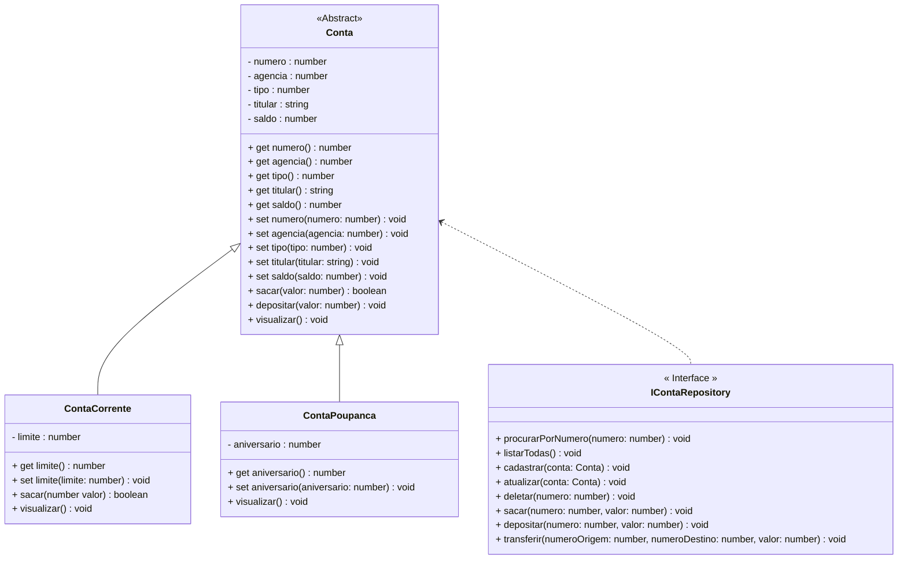

<h1>Projeto 01 - Conta Bancária - Interface - Interface ContaRepository</h1>


Na etapa anterior, implementamos a Classe **Conta** como uma Classe **Abstrata**. 

Nesta etapa, vamos criar a Interface **ContaRepository**, que fornecerá a assinatura dos Métodos necessários para manipular os Objetos das Classes **ContaCorrente** e **ContaPoupanca**, que posteriormente serão armazenados em um Array. 

Os Métodos da Interface ContaRepository, posteriormente, serão implementados em uma Classe, de modo a manter os detalhes da implementação (Métodos Construtores, Get e Set, por exemplo), encapsulados na nova Classe. A Interface fornece apenas as assinaturas dos Métodos. O Diagrama de Classes do nosso Projeto ficará da seguinte forma:



<br />

<h2>👣 Passo 01 - Criar a pasta Repository</h2>


Dentro da pasta do projeto **conta_bancaria**, vamos criar a pasta **repository**:

1. Na **Guia Explorer**, selecione a pasta **src** e clique no botão **New Folder** (Nova Pasta), indicado na imagem abaixo: 

<div align="center"></div>

2. O nome da pasta será **repository**, como mostra a imagem abaixo. Após digitar o nome da pasta, pressione a tecla **enter** do seu teclado para concluir. 

<div align="center"></div>

<br />

<h2>👣 Passo 02 - Criar a Interface ContaRepository</h2>


Agora vamos criar a **Interface ContaRepository** na **pasta repository**.

1. Selecione a pasta **repository** e clique no botão **New File** (Novo Arquivo), indicado na imagem abaixo:  

<div align="center"></div>

2. O nome do arquivo será **ContaRepository.ts**, como mostra a figura abaixo. Após digitar o nome do arquivo, pressione a tecla **enter** do seu teclado para concluir. 

<div align="center"></div>

<br />

Vamos implementar e analisar o código da **Interface ContaRepository**:

 <div align="left"></div>

**Linhas 6 a 10:** Criamos as assinaturas dos 5 Métodos do CRUD (criar, listar todas, consultar pelo numero, atualizar e deletar), da Classe Conta. Estes Métodos serão implementados na **Classe ContaController**, que será implementada nas próximas Tarefas do Projeto Conta Bancária. 

**Linhas 13 a 15:** Criamos as assinaturas dos 3 Métodos de Operações Bancárias (sacar, sepositar e transferir), da Classe Conta. Estes Métodos também serão implementados na **Classe ContaController**, que será implementada nas próximas Tarefas do Projeto Conta Bancária. 

O Código completo da Interface **ContaRepository**, você confere abaixo:

```ts
import { Conta } from "../model/Conta";

export interface ContaRepository {

	// CRUD da Conta
	procurarPorNumero(numero: number): void;
	listarTodas(): void;
	cadastrar(conta: Conta): void;
	atualizar(conta: Conta): void;
	deletar(numero: number): void;
	
	// Métodos Bancários
	sacar(numero: number, valor: number): void;
	depositar(numero: number, valor: number): void;
	transferir(numeroOrigem: number, numeroDestino: number, valor: number): void;
	
}

```

<br />

Execute o projeto no Terminal do VSCode, através do comando abaixo:

```bash
ts-node Menu.ts
```

Observe que não houve nenhuma mudança visível no projeto. Nas próximas tarefas, os Métodos assinados na Interface ContaRepository serão implementados na Classe ContaController.

<br />

<div align="left"> <a href="https://github.com/rafaelq80/conta_bancaria_typescript/tree/07_Conta_Repository" target="_blank"><b>Código fonte: Projeto Conta Bancária</b></a></div>

<br /><br />

<div align="left"><a href="README.md">Voltar</a></div>