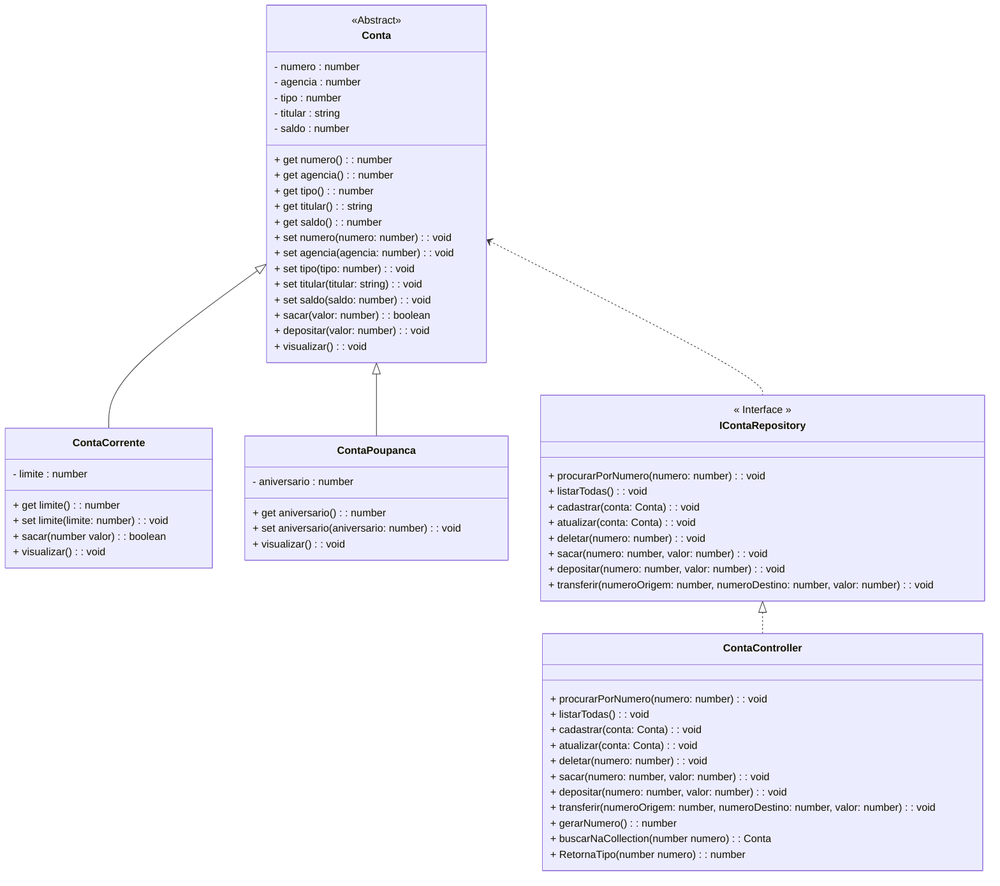

<h1>Projeto 01 - Conta Bancária - ContaController - Parte I</h1>


Na etapa anterior, implementamos a Interface **ContaRepository**, onde foram assinados 5 Métodos do CRUD (Criar Conta, Consultar todas as Contas, Consultar Conta pelo número, Atualizar dados da Conta e Apagar Conta) e 3 Métodos Bancários (Sacar, Depositar e Transferir). 

Nesta etapa, vamos criar a Classe **ContaController**, que implementará a Interface **ContaRepository**, que possui a assinatura dos Métodos necessários para manipular os Objetos das Classes **ContaCorrente** e **ContaPoupanca**, e armazená-los em um Array. Além dos Métodos da Interface **IContaRepository**, também serão implementados 3 Métodos auxiliares (Gerar Numero da Conta, Buscar Conta no Array e Retornar Tipo da Conta).

O Diagrama de Classes do nosso Projeto ficará da seguinte forma:



<br />

<h2>👣 Passo 01 - Criar a Pasta Controller</h2>


Dentro do projeto **conta_bancaria**, vamos criar a pasta **controller**:

1. Na **Guia Explorer**, selecione a pasta **src** e clique no botão **New Folder** (Nova Pasta), indicado na imagem abaixo: 

<div align="center"></div>

2. O nome da pasta será **controller**, como mostra a imagem abaixo. Após digitar o nome da pasta, pressione a tecla **enter** do seu teclado para concluir. 

<div align="center"></div>

<br />

<h2>👣 Passo 02 - Criar a Classe ContaController</h2>


Agora vamos criar a **Classe ContaController** no **Namespace Controller**.

1. Selecione a pasta **controller** e clique no botão **New File** (Novo Arquivo), indicado na imagem abaixo:  

<div align="center"></div>

2. O nome do arquivo será **ContaController.ts**, como mostra a figura abaixo. Após digitar o nome do arquivo, pressione a tecla **enter** do seu teclado para concluir. 

<div align="center"></div>

<br />

Vamos implementar o código da Classe **ContaController** aos poucos, Método a Método. Após a implementação de cada Método, faremos as alterações necessárias na Classe **Menu**, para utilizar os Métodos e faremos os respectivos testes.

Vamos começar implementando a Interface **ContaRepository** na Classe **ContaController**, através do código abaixo:

 <div align="left"></div>

**Linha 03:** Observe que depois de implementar a Interface **ContaRepository**, será exibido um erro na Classe ContaController (indicado pela seta verde no código). 

A mensagem de erro, informa que a Classe ContaController deve implementar todos os Métodos da Interface ContaRepository, independente de utilizá-los ou não. 

Vamos implementar todos os Métodos da Interface ContaRepository através do **Quick Fix** do VSCode, clicando sobre o nome da Classe. 

> A Ferramenta **Quick Fix ou Correções Rápidas** tem por objetivo principal corrigir e/ou sugerir correções para erros no código que podem fazer com que o build (compilar e gerar o executável) da aplicação falhe.

A animação abaixo mostra como implementar todos os Métodos da Interface ContaRepository na Classe ContaController:

 <div align="left"></div>

*Ao posicionar o cursor do mouse sobre o erro, o Visual Studio Code exibirá uma lista sugerindo correções. Clique no link **Quick Fix...** para exibir a lista e na sequência, clique na sugestão: **Implements Interface - Implementar a Interface**. Observe que todos os 8 Métodos da Interface serão inseridos na Classe ContaController, com uma implementação básica.*

Na sequência, vamos criar o Array que irá armazenar os dados de todas as Contas, funcionando como um Banco de dados em Memória da nossa aplicação.

 <div align="left"></div>

**Linha 06:** Criamos um **Array**, do tipo Conta (Classe Abstrata), chamado **listaContas**. 

**Linha 07:** Criamos uma variável do tipo **number** chamada **numero**, que armazenará o numero da última conta que foi criada, funcionando como uma Chave Primária auto incremental. 

<br />

<h2>Como o Array irá armazenar os dados?</h2>

Na imagem abaixo, temos uma representação gráfica do Array **listaContas**:

 <div align="left"></div>

Observe que o Array **listaContas**, será do tipo **Conta** (Super Classe) e cada novo Objeto das suas respectivas Sub-Classes, que estendem (herdam) a Classe Conta, será adicionado em uma linha do Array. Cada linha do Array é identificado por um número inteiro (índice).

O Array irá respeitar a ordem em que o Objeto foi inserido, ou seja, a cada novo Objeto inserido, uma nova linha será criada após o último Objeto adicionado.

|  | <div align="left"> **ATENÇÃO:** Embora o Array listaContas seja do tipo Conta (Classe Abstrata), ela consegue armazenar Objetos do tipo ContaCorrente e ContaPoupanca, por se tratarem de Classes que Herdam as características da Classe Conta. Esse conceito é chamado de Polimorfismo de Inserção.</div> |
| ------------------------------------------------------------ | ------------------------------------------------------------ |

<br />

<h2>👣 Passo 03 - Implementar o Método Listar todas as Contas</h2>


Na sequência, vamos implementar o Método Listar todas as Contas, através do código abaixo:

<div align="center"></div>

**Linha 13:** Observe que na assinatura do Método não foi inserido nenhum parâmetro, porque o Método exibirá todos os  Objetos da Classe Conta, armazenados no Array **listaContas**.

**Linha 14:** Através do Laço de Repetição **for...of**, percorremos todo o **Array listaContas**. 

Observe que a variável local **conta**, será utilizada para receber um Objeto da Classe Conta a cada iteração da Collection, definida pelo Laço de repetição, foi criada através da palavra reservada **let**.


No código do Método **listarTodas()**, como o Laço de Repetição está percorrendo o Array listaContas, que armazena Objetos da Classe Conta, a palavra reservada **let** entende por inferência, que a variável **conta** deve ser criada como um Objeto da Classe Conta.

**Linha 15:** Exibe os dados do Objeto da Classe Conta armazenado na variável **conta**, através do Método **visualizar()**, que foi criado na Classe Model **Conta** e Herdado pelas Classes **ContaCorrente** e **ContaPoupanca**.

<br />

<h2>👣 Passo 04 - Inserir o Método Listar todas as Contas na Classe Menu</h2>


Agora que implementamos o Método Listar todas as Contas e inserir uma chamada para este Método no Menu:

1. Na Classe Menu, Insira a linha de código abaixo (indicado por uma seta verde), no início do Método main():

<div align="center"></div>

**Linha 10:** Cria um Objeto da Classe **ContaController**, para armazenar os dados das contas no Array listaContas e executar os Métodos implementados na Classe (Métodos do CRUD e Métodos Bancários).

2. Ainda na Classe Menu, localize o trecho de código abaixo:

<div align="center"></div>

3. Insira a linha de código abaixo (indicado por uma seta verde):

<div align="center"></div>

**Linha 69:** Executa o Método **listarTodas()**, da Classe **ContaController**, para listar os dados de todas as contas armazenadas no Array **listaContas**.

<br />

Execute o projeto no Terminal do VSCode, através do comando abaixo:

```bash
ts-node Menu.ts
```

<br />

1. Será aberto o Menu, que deve ser semelhante ao da figura abaixo:

<div align="center"></div>

2. Digite a opção **2** (indicado com uma seta verde na imagem acima) e veja o resultado abaixo:

```bash
Listar todas as Contas


Pressione Enter para Continuar...

```

Observe que não foram exibidos os dados de nenhuma conta, porque as contas que nós criamos para teste não foram inseridas no Array **listaContas**, logo o Array está vazio. Para inserirmos dados no Array **listaContas**, precisamos implementar o Método **cadastrar(conta)**.

<br />

<h2>👣 Passo 05 - Criar o Método Cadastrar Conta</h2>


Na sequência, vamos implementar o Método **Cadastrar Conta**, na Classe ContaController, através do código abaixo:

<div align="center"></div>

**Linha 20:** Observe que na assinatura do Método, foi inserido como parâmetro um Objeto da Classe Conta, chamado **conta**. Este Objeto será adicionado no Array **listaContas**.

**Linha 21:** Para inserir um novo Objeto da Classe Conta, utilizamos o Método **push()**, do Objeto **Array**, passando como parâmetro o Objeto da Classe Conta, chamado **conta**.

**Linha 22:** Exibe uma mensagem no console, indicando que o Objeto da Classe Conta, chamado **conta** foi adicionado no Array **listaContas**. Para identificar a conta que foi criada, inserimos o atributo **numero**, da Classe Model Conta, dentro da mensagem para visualizarmos o número da conta.

Para gerar automaticamente o número da conta, vamos criar o Método auxiliar **gerarNumero()**, no final da Classe ContaController, através do código abaixo:

<div align="center"></div>

**Linha 49:** Observe que na assinatura do Método não foi inserido nenhum parâmetro, porque o Método tem como único Objetivo retornar o número da conta todas as vezes que uma nova conta for cadastrada.

**Linha 50:** Como a variável numero foi inicializada com zero (0), vamos incrementar a variável através do operador de **pré-incremento (++)**, incrementando de 1 em 1, a cada nova conta que for criada. Este número será retornado como o número da nova Conta. Desta forma, automatizaremos o processo de geração do número da conta, através de uma sequência:

- **1º conta criada** 🡒 *numero = 1*
- **2º conta criada** 🡒 *numero = 2*
- ...
- **N conta criada** 🡒 *numero = N*

<br />

|  | <div align="left"> **IMPORTANTE:** Na prática, este Método simula a Chave Primária de um Banco de dados, do tipo auto incremental, que será tema de estudo do Bloco 2.</div> |
| ------------------------------------------------------------ | ------------------------------------------------------------ |

<br />

Para gerar o Objeto da Classe Conta, precisamos receber os dados da Conta, via teclado. Para receber os dados via teclado, precisamos criar um "formulário" para cadastrar os dados da Conta através dos Comandos de Entrada e Saída.

<br />

<h2>👣 Passo 06 - Inserir o Método Cadastrar Conta na Classe Menu</h2>


Agora que implementamos o Método Cadastrar Conta, vamos inserir uma chamada para este Método na Classe Menu:

Para Criar uma nova conta, precisamos criar as entradas de dados, ou seja, criar um formulário de cadastro. Para começar, vamos criar algumas variáveis, que irão armazenar temporariamente os dados da nova conta.

1. Crie as novas variáveis na Classe Menu, como mostra o trecho de código abaixo:

<div align="center"></div>

Note que na linha 15 foi criado um Array chamado **tiposContas**, que contém os tipos de Contas que o Banco oferece. Esse Array será utilizado no formulário, para escolher o tipo da conta.

<br />

|  | <div align="left"> **ALERTA DE BSM:** *Mantenha a Atenção aos Detalhes ao criar as novas  variáveis na Classe Menu. A variável *opcao*, já havia sido criada na construção da Classe Menu.* </div> |
| ------------------------------------------------------------ | ------------------------------------------------------------ |

<br />

2. O trecho acima, cria as seguintes variáveis:

| Nome        | Tipo   | Descrição                                                    |
| ----------- | ------ | ------------------------------------------------------------ |
| numero      | number | Numero da conta                                              |
| agencia     | number | Numero da agência                                            |
| tipo        | number | Tipo da conta:<br />**1**: *Conta Corrente*<br />**2**: *Conta Poupança* |
| aniversario | number | Dia do aniversário da Conta Poupança                         |
| titular     | string | Nome do titular da conta                                     |
| saldo       | number | Saldo disponível na conta                                    |
| limite      | number | Limite de crédito da conta corrente                          |

<br />

Variáveis criadas, vamos criar o formulário de cadastro e criar a chamada para o Método Cadastrar na Classe Menu

1. Na Classe Menu, localize o trecho de código abaixo:

<div align="center"></div>

2. Insira o trecho de código abaixo:

<div align="center"></div>

**Linhas 67 a 71:** Foram criadas as entradas de dados via teclado para as variáveis **agencia** e **titular**.

**Linhas 73 a 74:** Foi utilizado o Método **keyInSelect**, para garantir que a variável **tipo** receba via teclado somente os números **1** - *Conta Corrente* ou **2** - *Conta Poupança*.

**Linhas 76 a 77:** Foi criada a entrada de dados via teclado para a variável **saldo**.

**Linhas 79 a 92:** Foi criado um Laço condicional do tipo **Switch**, que checará qual o tipo da conta. 

- Caso a conta seja do tipo **Conta Corrente (tipo 1)**, solicita a entrada de dados via teclado para a variável **limite** e executa o Método **cadastrar** da Classe **ContaController**.
- Caso a conta seja do tipo **Conta Poupança (tipo 2)**, solicita a entrada de dados via teclado para a variável **aniversario** e executa o Método **cadastrar** da Classe **ContaController**.

**Linha 83:** Observe que dentro do Método **cadastrar** foi criado um Objeto da Classe **ContaCorrente**, composto pelos valores das variáveis auxiliares, que receberam dados via teclado. O Atributo **numero**, foi preenchido com o Método auxiliar **gerarNumero()**, criado na Classe **ContaController**.

**Linha 90:** Observe que dentro do Método **cadastrar** foi criado um Objeto da Classe **ContaPoupanca**, composto pelos valores das variáveis auxiliares, que receberam dados via teclado. O Atributo **numero**, foi preenchido com o Método auxiliar **gerarNumero()**, criado na Classe **ContaController**.

<br />

Execute o projeto no Terminal do VSCode, através do comando abaixo:

```bash
ts-node Menu.ts
```

<br />

1. Será aberto o Menu, semelhante ao da figura abaixo:

<div align="center"></div>

2. Digite a opção **1** e faça o Cadastro de uma nova Conta Corrente, como mostra o console abaixo:

```bash
Criar Conta


Digite o Número da agência:
123
Digite o Nome do Titular da conta: 
Maria Vieira

Digite o tipo da Conta: 

[1] Conta Corrente
[2] Conta Poupanca

1

Digite o Saldo da conta (R$):
2000
Digite o Limite da Conta (R$): 
200
 
A Conta número: 1 foi criada com sucesso!


Pressione enter para continuar...
```

3. Observe que a Conta foi Cadastrada com sucesso. Pressione a tecla enter e crie uma Conta Poupança:

```bash
Criar Conta


Digite o Número da agência:
123
Digite o Nome do Titular da conta: 
Paulo Souza

Digite o tipo da Conta: 

[1] Conta Corrente
[2] Conta Poupanca

2

Digite o Saldo da conta (R$):
1000
Digite o Dia do aniversário da Conta Poupança: 
10
 
A Conta número: 2 foi criada com sucesso!


Pressione enter para continuar...
```

4. Digite a opção 2 (indicado com uma seta verde na imagem abaixo):

<div align="center"></div>

5. Veja o resultado abaixo:

```bash
Listar todas as Contas

*****************************************************
Dados da Conta:
*****************************************************
Numero da Conta: 1
Agência: 123
Tipo da Conta: Conta Corrente
Titular: Maria Vieira
Saldo: 2000.00
Limite: 200.00


*****************************************************
Dados da Conta:
*****************************************************
Numero da Conta: 2
Agência: 123
Tipo da Conta: Conta Poupança
Titular: Paulo Souza
Saldo: 1000.00
Dia do aniversário: 10


Pressione enter para continuar...
```

Observe que desta vez foram exibidos os dados das 2 contas cadastradas, porque as contas foram inseridas no Array **listaContas**.

<br />

|  | <div align="left"> **ATENÇÃO:** *Observe que a Biblioteca readline-sync, não lida corretamente com caracteres acentuados. Não se preocupe com isso agora, porque no final do projeto, depois que aprendermos a trabalhar com Programação Assíncrona, faremos a correção da acentuação da Biblioteca readline-sync.*</div> |
| ------------------------------------------------------------ | ------------------------------------------------------------ |

<br />

Como o Array **listaContas** não persiste (grava) os dados de forma definitiva, como um Banco de dados, daria muito trabalho criar novas contas todas as vezes que precisarmos testar a aplicação. Para simplificar, vamos substituir os dados de teste atuais (criados logo depois das variáveis auxiliares), que não estão utilizando o Array **listaContas**, pelo trecho de código abaixo:

```c#
console.log("\nCriar Contas\n");

let cc1: ContaCorrente = new ContaCorrente(contas.gerarNumero(), 123, 1, "João da Silva", 1000, 100.0);
contas.cadastrar(cc1);

let cc2: ContaCorrente = new ContaCorrente(contas.gerarNumero(), 124, 1, "Maria da Silva", 2000, 100.0);
contas.cadastrar(cc2);

let cp1: ContaPoupanca = new ContaPoupanca(contas.gerarNumero(), 125, 2, "Mariana dos Santos", 4000, 12);
contas.cadastrar(cp1);

let cp2: ContaPoupanca = new ContaPoupanca(contas.gerarNumero(), 125, 2, "Juliana Ramos", 8000, 15);
contas.cadastrar(cp2);

contas.listarTodas();
```

O trecho de código acima, cria 2 Objetos da Classe ContaCorrente e 2 Objetos da Classe ContaPoupanca, dentro da Collection **listaContas**, todas as vezes que o projeto for executado.

<br />

|  | **DESAFIO:** Após inserir o trecho de código acima, experimente o Método Listar todas as contas e verifique se os dados das 4 contas foram listadas. A melhor forma de aprender uma Linguagem de Programação é praticando! |
| ------------------------------------------------------------ | :----------------------------------------------------------- |

<br />

A implementação dos Métodos do CRUD, continua na parte II...

<br /><br />

<div align="left"><a href="README.md">Voltar</a></div>