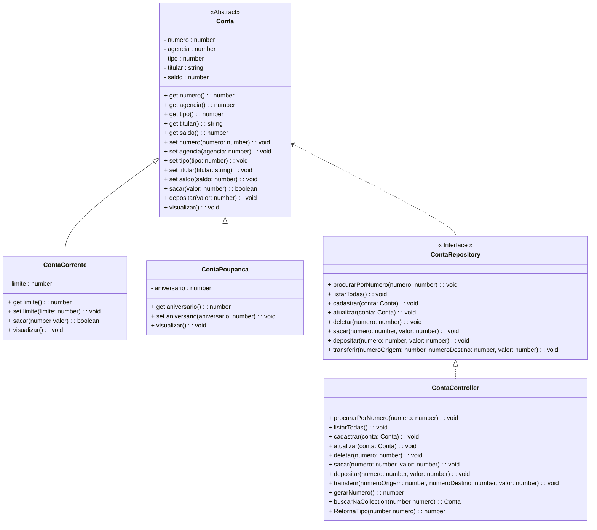

<h1>Projeto 01 - Conta Bancária - ContaController - Parte II</h1>


Na etapa anterior, criamos a Classe **ContaController**, que implementa a Interface **ContaRepository**, que possui a assinatura dos Métodos necessários para manipular os Objetos das Classes **ContaCorrente** e **ContaPoupanca**, e armazená-los (em memória) no Array do tipo List (listaContas). Implementamos os Métodos Listar Todas as Contas e Cadastrar Conta da Interface **ContaRepository**, e o Método auxiliar **Gerar Numero da Conta**.

Nesta etapa, vamos continuar a implementação dos Métodos da  Interface **ContaRepository** e de alguns Métodos auxiliares.

O Diagrama de Classes do nosso Projeto ficará da seguinte forma:



<br />

<h2>👣 Passo 01 - Implementar o Método Procurar Conta por Numero</h2>


Na sequência, vamos implementar o Método Procurar Conta por Numero, mas antes, precisamos criar o Método auxiliar Buscar no Array, no final da Classe ContaController, que retornará um Objeto conta a partir do numero da conta, caso este Objeto exista, através do código abaixo:

<div align="center"></div>

**Linha 60:** Observe que na assinatura do Método foi inserido como parâmetro uma variável do tipo **number**, chamada **numero**, que receberá o número da conta que se deseja localizar. Observe que no tipo de retorno do Método (Conta), foram adicionadas duas opções de retorno, **Conta | null**, indicando que o retorno do Método pode ser um Objeto Nulo, caso a conta não seja encontrada, ou um Objeto da Classe Conta, caso a conta seja encontrada.

**Linha 62:** Através do Laço de Repetição **for...of**, percorremos todo o **Array listaContas**. 

Observe que a variável local **conta**, utilizada para receber um Objeto Conta a cada iteração do Array, definida pelo Laço de repetição, foi criada através da palavra reservada **let**.


Assim como no código do Método **listarTodas()**, o Laço de Repetição percorre todo o Array **listaContas**, que armazena Objetos da Classe Conta. A palavra reservada **let** entende que a variável **conta** deve ser criada como um Objeto da Classe Conta, porque receberá um Objeto da Classe Conta.

**Linha 63:** Verifica se o Atributo **numero**, do Objeto da Classe Conta armazenado na variável **conta** é o mesmo número que foi enviado na variável numero.

**Linha 64:** Se os números forem iguais, o Método devolve o Objeto Conta encontrado e finaliza o Laço de repetição.

**Linha 67:** Se o número não for encontrado no Array listaContas, o Método devolve um Objeto Nulo.

Método auxiliar criado, vamos implementar o código do Método Procurar Conta por Numero, através do código abaixo:

<div align="center"></div>

**Linha 10:** Observe que na assinatura do Método foi inserido como parâmetro uma variável do tipo **number**, chamada **numero**, que receberá o número da conta que se deseja localizar. 

**Linha 11:** Foi criada a variável local **conta**, utilizada para receber o Objeto Conta, que foi encontrado no Array **listaContas**, através da palavra reservada **let**. Por inferência, a palavra reservada **let** entende que a variável conta, deve ser um Objeto da Classe Conta, porque receberá o retorno do Método **buscarNoArray**.

**Linhas 13 a 17:** Através de um Laço Condicional if, verifica se o Objeto Conta foi encontrado. 

- Se foi encontrado, exibe os dados na tela através do Método **visualizar()**. 
- Caso contrário (Objeto null), exibe na tela a mensagem informando que a conta não foi encontrada.

Para buscar um Objeto da Classe Conta, precisamos receber o numero da Conta, via teclado. Para receber os dados via teclado, precisamos criar um "formulário" para receber o numero da conta através dos Comandos de Entrada e Saída.

<br />

<h2>👣 Passo 02 - Inserir o Método Procurar Conta por Número na Classe Menu</h2>


Agora que implementamos o Método Procurar Conta por Número, vamos inserir uma chamada para este Método na Classe Menu:

1. Vamos utilizar a variável **numero**, criada anteriormente, para receber o numero da conta que se deseja pesquisar

<div align="center"></div>

2. Localize o trecho de código abaixo:

<div align="center"></div>

3. Insira o trecho de código abaixo:

<div align="center"></div>

**Linhas 110 a 111:** Foi criada a entrada de dados via teclado para a variável **numero**, que receberá o numero da conta que deverá ser procurada no Array **listaContas**.

**Linha 112:** Executa o Método **procurarPorNumero(numero)**, da Classe **ContaController**, passando como parâmetro a variável **numero**, que contém o numero da conta (recebido via teclado), que deverá ser procurada no Array **listaContas**. 

<br />

Execute o projeto no Terminal do VSCode, através do comando abaixo:

```bash
ts-node Menu.ts
```

<br />

1. Será aberto o Menu, que deve ser semelhante ao da figura abaixo:

<div align="center"></div>

2. Digite a opção **3** (indicado com uma seta verde na imagem acima) e veja o resultado abaixo:

```bash
Consultar dados da Conta - por número

Digite o número da conta: 
1

*********************************************************************
Dados da Conta:
*********************************************************************
Numero da Conta: 1
Agência: 123
Tipo da Conta: Conta Corrente
Titular: João da Silva
Saldo: 1000.00
Limite de Crédito: 100.00

Pressione Enter para Continuar...
```

Observe que ao procurarmos a conta numero **1**, a conta foi encontrada e os seus dados foram exibidos na tela. 

3. Experimente repetir a operação e digitar o numero 10:

```bash
Consultar dados da Conta - por número

Digite o número da conta: 
10

A Conta numero: 10 não foi encontrada!

Pressione Enter para Continuar...
```

Observe que ao procurarmos a conta numero **10**, a conta não foi encontrada e uma mensagem foi exibida na tela. 

<br />

<h2>👣 Passo 03 - Implementar o Método Atualizar Conta</h2>


Na sequência, vamos implementar o Método Atualizar Conta, através do código abaixo:

<div align="center"></div>

**Linha 32:** Observe que na assinatura do Método, foi inserido como parâmetro um Objeto da Classe Conta, chamado **conta**. Este Objeto terá os seus dados atualizados no Array **listaContas**.

**Linha 33:** Antes de atualizar o Objeto Conta no Array **listaContas**, precisamos verificar se o Objeto conta existe. Observe que foi criada a variável local **buscaConta**, para receber o Objeto da Classe Conta, que foi encontrado no Array **listaContas**. 

O Objeto **buscaConta** foi criado através da palavra reservada **let**. Por inferência, a palavra reservada **let** entende que a variável buscaConta, deve ser um Objeto da Classe Conta, porque receberá o retorno do Método **buscarNoArray**.

**Linhas 35 a 41:** Através do Laço Condicional if, verifica se o Objeto Conta foi encontrado. 

- Se a conta foi encontrada, os dados do Objeto são atualizados no Array **listaContas**:
  - **Linha 36:** Através do Método **indexOf(buscaConta)**, vamos **procurar o índice (posição) do Objeto conta** encontrado no Array listaContas, ou seja, os dados atuais. Na sequencia, vamos atribuir o Objeto conta, que foi recebido no parâmetro do Método **atualizar(conta)**, substituindo os dados atuais pelos novos dados recebidos via teclado. 
- Caso contrário (Objeto null), exibe na tela a mensagem informando que a conta não foi encontrada.

Para atualizar os dados de um Objeto da Classe Conta, precisamos receber os novos dados da Conta, via teclado. Para receber os dados via teclado, precisamos criar um "formulário" para inserir os novos dados da Conta através dos Comandos de Entrada e Saída.

<br />

<h2>👣 Passo 04 - Inserir o Método Atualizar Conta na Classe Menu</h2>


Agora que implementamos o Método Atualizar Conta, vamos inserir uma chamada para este Método na Classe Menu:

Para atualizar os dados de uma conta, precisamos criar as entradas de dados, ou seja, criar um formulário de cadastro, semelhante ao do Método Cadastrar. 

Vamos criar o formulário de atualização e criar a chamada para o Método Atualizar na Classe Menu

1. Na Classe Menu, localize o trecho de código abaixo:

<div align="center"></div>

2. Insira o trecho de código abaixo:

<div align="center"></div>

**Linhas 119 a 120:** Foi criada a entrada de dados via teclado para a variável **numero**, que receberá o numero da conta que deverá ser atualizada no Array **listaContas**.

**Linha 122:** Antes de atualizar, precisamos checar se a conta existe. Vamos procurar a conta através do Método **procurarPorNumero(numero)**, da Classe **ContaController**, passando como parâmetro a variável **numero**, que contém o numero da conta (recebido via teclado). O resultado desta busca será guardada na variável **conta**.

**Linha 124:** Através do Laço Condicional, verifica se o Objeto Conta foi encontrado.

Se o Objeto da Classe Conta foi encontrado, o processo de atualização da conta será iniciado.

**Linhas 126 a 130:** Foram criadas as entradas de dados via teclado para as variáveis **agencia** e **titular**.

**Linha 132:** A variável **tipo** recebe o tipo da Conta, obtido através do atributo tipo do Objeto conta, que foi encontrado. Este atributo nunca terá o seu valor modificado.

**Linhas 134 a 135:** Foi criada a entrada de dados via teclado para a variável **saldo**.

**Linhas 137 a 150:** Foi criado um Laço condicional do tipo **Switch**, que checará qual o tipo da conta. 

- Caso a conta seja do tipo **Conta Corrente (tipo 1)**, solicita a entrada de dados via teclado para a variável **limite** e executa o Método **atualizar** da Classe **ContaController**.
- Caso a conta seja do tipo **Conta Poupança (tipo 2)**, solicita a entrada de dados via teclado para a variável **aniversario** e executa o Método **atualizar** da Classe **ContaController**.

**Linha 142:** Observe que dentro do Método **atualizar** foi criado um Objeto da Classe **ContaCorrente**, composto pelos valores das variáveis auxiliares, que receberam os dados via teclado, inclusive o atributo **numero**, que foi preenchido com o valor informado na variável **numero**. Como se trata de uma atualização, o numero da conta não deve ser modificado.

**Linha 147:** Observe que dentro do Método **atualizar** foi criado um Objeto da Classe **ContaPoupanca**, composto pelos valores das variáveis auxiliares, que receberam os dados via teclado, inclusive o atributo **numero**, que foi preenchido com o valor informado na variável **numero**. Como se trata de uma atualização, o numero da conta não deve ser modificado.

<br />

Execute o projeto no Terminal do VSCode, através do comando abaixo:

```bash
ts-node Menu.ts
```

<br />

1. Será aberto o Menu, semelhante ao da figura abaixo:

<div align="center"></div>

2. Digite a opção **4** e faça a Atualização dos dados da Conta Corrente numero **1**, como mostra o console abaixo:

```bash
Atualizar dados da Conta

Digite o número da conta: 
1
Digite o Numero da Agência: 
789
Digite o Nome do Titular: 
João da Silva Santos
Digite o Saldo da Conta (R$): 
5000
Digite o Limite de Crédito (R$): 
600

A Conta numero: 1 foi atualizada com sucesso!

Pressione Enter para Continuar...
```

3. Observe que a Conta foi Atualizada com sucesso. Pressione a tecla enter e atualize a Conta Poupança numero 3:

```bash
Atualizar dados da Conta

Digite o número da conta: 
3
Digite o Numero da Agência: 
321
Digite o Nome do Titular: 
Mariana dos Santos Noronha
Digite o Saldo da Conta (R$): 
4500
Digite o dia do Aniversario da Conta: 
15

A Conta numero: 3 foi atualizada com sucesso!

Pressione Enter para Continuar...
```

4. Digite a opção 2 (indicado com uma seta verde na imagem abaixo):

<div align="center"></div>

5. Veja o resultado abaixo:

```bash
Listar todas as Contas

*********************************************************************
Dados da Conta:
*********************************************************************
Numero da Conta: 1
Agência: 789
Tipo da Conta: Conta Corrente
Titular: João da Silva Santos
Saldo: 5000.0
Limite de Crédito: 600.0

*********************************************************************
Dados da Conta:
*********************************************************************
Numero da Conta: 2
Agência: 124
Tipo da Conta: Conta Corrente
Titular: Maria da Silva
Saldo: 2000.0
Limite de Crédito: 100.0

*********************************************************************
Dados da Conta:
*********************************************************************
Numero da Conta: 3
Agência: 321
Tipo da Conta: Conta Poupança
Titular: Mariana dos Santos Noronha
Saldo: 4500.0
Aniversário da conta: 15

*********************************************************************
Dados da Conta:
*********************************************************************
Numero da Conta: 4
Agência: 125
Tipo da Conta: Conta Poupança
Titular: Juliana Ramos
Saldo: 8000.0
Aniversário da conta: 15

Pressione Enter para Continuar...
```

Observe que os dados das contas 1 e 3 foram atualizados no Array **listaContas**.

<br />

<h2>👣 Passo 05 - Implementar o Método Deletar Conta</h2>

Para finalizar os Métodos do CRUD, vamos implementar o Método Deletar Conta, através do código abaixo:

<div align="center"></div>

**Linha 44:** Observe que na assinatura do Método foi inserido como parâmetro uma variável do tipo **number**, chamada **numero**, que receberá o número da conta que se deseja deletar. 

**Linha 45:** Antes de deletar o Objeto Conta no Array **listaContas**, precisamos verificar se o Objeto conta existe. 

Observe que foi criada a variável local **conta**, para receber o Objeto da Classe Conta, que foi encontrado no Array **listaContas**. Esse Objeto foi criado através da palavra reservada **let**. Por inferência, a palavra reservada **let** entende que a variável conta, deve ser um Objeto da Classe Conta, porque receberá o retorno do Método **buscarNoArray**.

**Linhas 47 a 53:** Através do Laço Condicional if, verifica se o Objeto Conta foi encontrado. 

- Se a conta foi encontrada, o Objeto conta será apagado no Array **listaContas** através do Método **splice(indice, numero_de_itens)**. Observe que dentro do Método **splice()**, foram adicionados dois parâmetros: o índice do Objeto conta,obtido através do Método **indexOf()** e o número de elementos que serão excluídos a partir do índice do Objeto conta, no caso será apenas um elemento (o próprio objeto conta). 
  
- Caso contrário (Objeto nulo), exibe na tela a mensagem informando que a conta não foi encontrada.

Para buscar um Objeto da Classe Conta e Excluir caso seja encontrado, precisamos receber o numero da Conta, via teclado. Para receber os dados via teclado, precisamos criar um "formulário" para receber o numero da conta através dos Comandos de Entrada e Saída.

<br />

<h2>👣 Passo 06 - Inserir o Método Deletar Conta na Classe Menu</h2>


Agora que implementamos o Método Método Deletar Conta, vamos inserir uma chamada para este Método na Classe Menu:

1. Na Classe Menu, localize o trecho de código abaixo:

<div align="center"></div>

3. Insira o trecho de código abaixo:

<div align="center"></div>

**Linhas 162 a 163:** Foi criada a entrada de dados via teclado para a variável **numero**, que receberá o numero da conta que será excluída do Array **listaContas**.

**Linha 164:** Executa o Método **deletar(numero)**, da Classe **ContaController**, passando como parâmetro a variável **numero**, que contém o numero da conta (recebido via teclado), que será excluída do Array **listaContas**. 

<br />

Execute o projeto no Terminal do VSCode, através do comando abaixo:

```bash
ts-node Menu.ts
```

<br />

1. Será aberto o Menu, que deve ser semelhante ao da figura abaixo:

<div align="center"></div>

2. Digite a opção **5** (indicado com uma seta verde na imagem acima) e veja o resultado abaixo:

```bash
Apagar a Conta

Digite o número da conta: 
1

A Conta numero: 1 foi deletada com sucesso!

Pressione Enter para Continuar...
```

Observe que ao procurarmos a conta numero **1** a conta foi encontrada e deletada. Além disso, uma mensagem de confirmação foi exibida na tela. 

3. Experimente repetir a operação e digitar o numero 10:

```bash
Apagar a Conta

Digite o número da conta: 
10

A Conta numero: 10 não foi encontrada!

Pressione Enter para Continuar...
```

Observe que ao procurarmos a conta numero **10**, a conta não foi encontrada e uma mensagem foi exibida na tela. 

Na sequência, vamos confirmar se a conta numero 1 foi excluída:

1. Digite a opção **3** (indicado com uma seta verde na imagem abaixo):

<div align="center"></div>

2.  No item numero da conta, digite o numero **1** e veja o resultado abaixo:

```bash
Consultar dados da Conta - por número

Digite o número da conta: 
1

A Conta número: 1 não foi encontrada!

Pressione Enter para Continuar...
```

Observe que a conta numero **1** não foi encontrada, confirmando que a conta foi apagada. 

<br />

<div align="left"> <a href="https://github.com/rafaelq80/conta_bancaria_typescript/tree/08_Conta_Controller_CRUD" target="_blank"><b>Código fonte: Projeto Conta Bancária</b></a></div>

<br /><br />


<div align="left"><a href="README.md">Voltar</a></div>